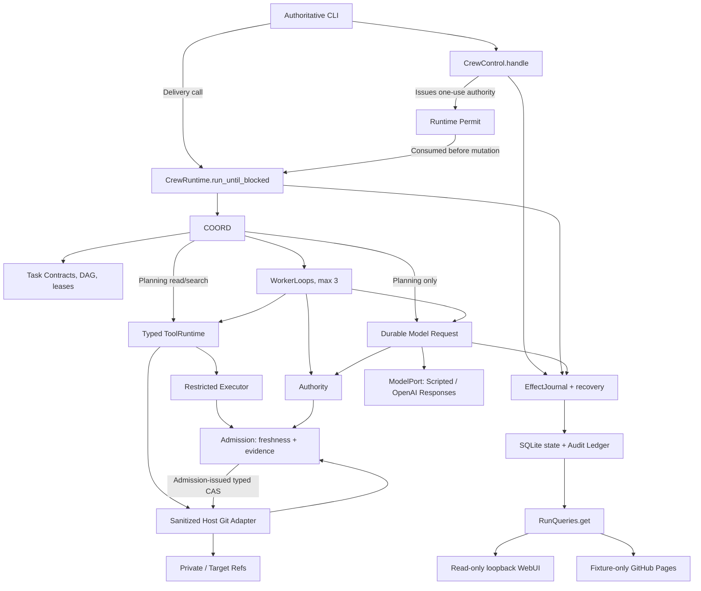

# ApexCrew Initialization Baseline

> Status: accepted initialization baseline, updated 2026-07-31. **Evidence-Driven Durable Crew is the only product mainline.** All three brainstorming rounds, A-Hybrid, independent specification review, final written-spec sign-off, the R3 `PLAN.md`, and the Stage 4 cold-start review are complete. A new M1 `PLAN.md` revision and its independent document review still gate retained implementation.

## 1. Product Thesis

**Accepted direction**: ApexCrew is a local-first, recoverable, evidence-driven collaboration harness for at most three coding Workers in one Git repository.

The value hypothesis is narrower than “multi-agent + long context + continuous cowork,” which existing projects already cover:

> During long-running dependent coding tasks, revision-bound context and verification evidence, dependency-aware invalidation, and durable recovery reduce stale handoffs and unverified integration compared with ordinary task/worktree orchestration.

This is falsifiable and is not a claim of global novelty. Bernstein, h5i, and other projects overlap many individual mechanisms, so ApexCrew's defensible contribution is a small, self-built combination of evidence validity and durable coordination. Adversarial acceptance and weak-oracle checks remain supporting experiments for evidence quality, not a second direction. See [ADR-0001](docs/adr/0001-evidence-driven-durable-crew.md) and [the primary-source landscape](docs/research/github-agent-landscape.md).

## 2. Course Boundary

The A-class submission must implement its own:

- **Coordinator loop**: advance a bounded task DAG, allocate leases, invalidate stale work, pause/resume safely, and serialize integration;
- **worker loop**: assemble context, make one model call, parse one structured action, execute a tool, return feedback, and stop;
- deterministic tool, feedback, governance, memory, stop, and configuration mechanisms.

`ScriptedMockLLM` is the first provider. The sole real v0.1 adapter exposes OpenAI Responses as a low-level single-completion interface through `ModelPort`. Codex, Claude Code, Gemini CLI, AutoGen, CrewAI, LangGraph, or another hosted agent runner may be an experiment only after the core is complete; none may implement or substantiate the assessed loops.

## 3. MVP Scope

The first usable slice supports one local user and host installation with exactly one configured repository, one target and runtime owner per Run plus short-lived locked CLI commands, at most three Workers, an explicit bounded task DAG plus promotion-hazard graph, declared read/dependency/write/check-input scopes, isolated detached workspaces, SQLite persistence, and serial integration. Python and TypeScript micro-repositories are the accepted fixture matrix. v0.1 rejects repositories with pre-existing linked Git worktrees, config includes, sparse/split indexes, grafts, shallow/partial history, alternates, or externally routed Git storage rather than following repository-controlled admin paths. A Run pins a direct local target branch before bounded read-only planning; the first planning command creates the sole locked Git-native Target Reservation that later `DRAFT` attempts reuse, and exact journaled terminal cleanup removes it before purge. The Run never rebases automatically.

Accepted runtime-driving commands issue one internal one-use Runtime Permit bound to the exact command, Audit position, phase, and runtime generation. `CrewRuntime.run_until_blocked` must consume it before mutation; an old begin/start/resume/Grant/integration replay cannot mint another permit, while a fresh exact `continue` closes only a genuine orphaned-runtime crash window.

Workers receive typed Context Capsules rather than full chat history. Checks use repository-declared structured `argv`; an immutable Evidence Receipt records the check and result against a prepared Verification Snapshot. A separate Freshness Assessment rejects capsules, receipts, and candidates whose dependency, contract, policy, or revision no longer applies; immutable historical records are not rewritten.

Risk policy returns `ALLOW`, `DENY`, or `REQUIRE_APPROVAL`. Workspace escape, symlink operations, and the fixed plus host-local Secret Path Set are hard denials. Plan and Policy freeze at `ACTIVE`; Budget and Model Configuration may change only through their explicit approved invalidation rules. An Approval Grant freezes one action/integration/purge manifest and binds its exact state, expiry, and one use; a separate Grant Validation determines whether it authorizes that pending effect.

Non-goals for v0.1: symbol-level ownership, arbitrary shell, automatic push/merge/release, vector memory, dynamic agent societies, more than three Workers, pre-existing linked-worktree compatibility, remote/multi-user execution, a writable WebUI, A2A, Kubernetes, plugin marketplace, production public execution, provider breadth, macOS/ARM support, or a hosted backend. Weak-oracle challenge is an experiment, not a mandatory alternate workflow.

## 4. Decisive Demonstrations

1. **Feedback correction**: a scripted Worker applies a wrong patch; a real check fails; structured evidence returns to the Worker; its next action fixes the patch; only fresh green evidence permits handoff.
2. **Coordination freshness**: two isolated detached Attempt workspaces execute dependent Task Contracts. Upstream integration invalidates the downstream capsule and evidence, forces refresh and revalidation, and prevents a stale candidate from entering the integration queue. Run the same scenario on Python and TypeScript fixtures.
3. **Governance and recovery**: workspace/read-scope escape is denied with zero side effects or content exposure; a risky-action Grant can settle only its exact persisted intent; pre-dispatch model reservations and injected crashes cannot duplicate an authoritative action or silently retry uncertainty. Closed `INDETERMINATE` choices never assert success.
4. **Supporting evidence-quality challenge**: a known flawed patch that passes visible checks is not described as proven correct; a bounded challenger may add a reproducible counterexample and measure its cost. This experiment cannot redefine the product mainline.

All mechanism demos run offline with `ScriptedMockLLM` and real temporary repositories/processes. Go/no-go conditions are objective: stale evidence is never accepted, unapproved dangerous actions have zero side effects, recorded actions are not replayed after restart, and no LLM-as-judge determines correctness.

## 5. Architecture Baseline

The approved **A-Hybrid** shape exposes only `CrewControl.handle`, `CrewRuntime.run_until_blocked`, and `RunQueries.get` for Run behavior. Coordinator plans and schedules; Admission exclusively validates/prepares candidates and issues typed private/target CAS requests; the sanitized host Git adapter only executes them. Control-issued Runtime Permits bind CLI delivery to exact runtime phases without becoming public continuation tokens. EffectJournal covers model requests as well as tool/ref/Target Reservation effects. Git, restricted commands, SQLite, credentials, and model providers remain adapters; provider SDKs and FastAPI never enter the domain core. Returned-model identity is validated before loop release, hostile Git config/includes/hooks/filters and sparse/split/graft/shallow metadata cannot execute, route external reads, or hide history, and terminal purge retains an administrative tombstone while invoking no Git operation. CLI may use all three Run interfaces, while WebUI/static delivery receives only `RunQueries`; auxiliary doctor/configuration/credential/UI-server flows have no Run or repository mutation authority. See [the system overview](docs/architecture/system-overview.md) and [ADR-0006](docs/adr/0006-use-a-hybrid-control-runtime-query-interfaces.md).

## 6. Documentation System

| Artifact | Purpose | Update trigger |
|---|---|---|
| `SPEC.md` | Single design truth and acceptance criteria | Approved requirement/design change |
| `PLAN.md` | Tasks, dependencies, red/green commands, commit hashes | Every task transition |
| `SPEC_PROCESS.md` | Three brainstorming iterations and cold-start defects | Each spec iteration/review |
| `AGENT_LOG.md` | Timestamped facts, prompts, failures, human fixes | Every agent task/session |
| `CONTEXT.md` | Canonical domain vocabulary only | A term is resolved or corrected |
| `docs/adr/` | Few hard-to-reverse trade-offs | A qualifying decision is accepted |
| `docs/architecture/` | Explanatory component and flow maps subordinate to SPEC | An accepted structural boundary changes |
| `docs/experiments/` | Falsifiable hypotheses, fixtures, measures, and results | Before and after each experiment |
| `docs/research/` | Primary-source landscape and value validation | Research checkpoint |
| `docs/learning/` | Interview explanations linked to code/tests | A mechanism reaches green/refactor |
| `README.md` / `SECURITY.md` | Operation, demo, and trust boundary | User-facing/security change |
| `REFLECTION.md` | Student-authored final critique | Final phase only |

Do not create parallel architecture truths. Learning notes explain concepts and link to the SPEC, ADRs, commits, and tests; they do not restate requirements.

## 7. Technical Baseline and Prerequisites

| Prerequisite | State on 2026-07-26 | Consequence |
|---|---|---|
| A-class project and direction | Accepted | Evidence-Driven Durable Crew is the only mainline. |
| Scope | Accepted | One repository, at most three Workers, Python + TypeScript fixtures. |
| Core ownership | Accepted | ApexCrew owns both loops; only low-level model completion APIs sit behind `ModelPort`. |
| LLM provider decision | Accepted | OpenAI Responses API with `gpt-5.6-terra`; every core gate remains offline under `ScriptedMockLLM`. The credential value is deferred to the provider slice. |
| Local toolchain | Ready, re-verified 2026-07-31 | Git 2.47.1, CPython 3.12.12 via uv, uv 0.9.29, Node 22.14, Make 4.4.1, Docker server 29.6.1 responding, and OS keyring resolving to `keyring.backends.Windows.WinVaultKeyring`. Keyring is required by `SPEC.md` section 5.3 for the Secret Path Set installation key and had not been verified before. Host Node is not required; Node 24 lives in the executor image. |
| Docker daemon | Verified | Local server 29.6.1 responded; image/build behavior is tested during scaffold and distribution stages. |
| Superpowers | Installed and enabled | `superpowers@openai-curated`, manifest 5.1.3, cache revision `11c74d6b`; required workflow skill directories are present. Start design in a session where the plugin skills are loaded. |
| Local Git baseline | Completed by this initialization | Branch `main`; governance and documentation only. |
| Public personal GitHub remote | Configured | `origin` is `https://github.com/Ztscream/ApexCrew.git`; it was verified empty before the first non-force publication. |
| Course submission remote | Resolved 2026-07-31 | No NJU/GitLab remote will be configured; GitHub is the sole remote and delivery channel. The course brief is inconsistent - section 4.7 mandates a public GitHub repository with GitHub Actions, section 5 describes an NJU Git link - and the owner resolved it in favour of GitHub. `.gitlab-ci.yml` with its exact `unit-test` job is still produced to satisfy deliverable 6 and frozen `SPEC.md` section 10.5, neither of which requires a GitLab remote. |
| License | Accepted | Original ApexCrew work uses Apache-2.0; `NOTICE` excludes course-provided requirement documents from relicensing. |
| LLM credential value | Not required yet | Interactive use requires OS keyring; CI may inject `APEXCREW_OPENAI_API_KEY`. An actual value is supplied only for the opt-in provider slice and is never committed. |
| Delivery schedule | Accepted | Deadline is assumed 2026-08-10 23:59 Asia/Shanghai; 25 hours/week yields approximately 53 hours. Optional scope is cut before required mechanisms or course artifacts. |
| Public WebUI | Accepted | GitHub Pages hosts only a sanitized deterministic fixture replay; real commands and credentials remain local and CLI-only. |

Approved operational defaults are Python 3.12, uv, Pydantic, stdlib SQLite, pytest, Ruff, mypy, FastAPI plus Jinja2 for a read-only UI, OS keyring, OpenAI's low-level SDK adapter, and a digest-pinned non-root Linux executor image with Python 3.12 and Node 24. Windows 11 and Ubuntu 24.04 x86_64 are supported; Ubuntu is the full-integration and performance reference.

No `src/`, tests, fixtures, or CI may be retained until the remaining planning and cold-start gates pass. `PLAN.md` is created by `writing-plans`, then becomes required input to the independent cold-start review and may be revised from its findings.

## 8. Stages and Gates

| Stage | Output | Exit gate |
|---|---|---|
| 0. Discovery (complete) | Landscape, value hypothesis, alternatives, vocabulary | User accepted one direction and non-goals |
| 1. Repository/process setup (complete) | Git/GitHub, Superpowers, license, ignore/security baseline, `AGENT_LOG.md` | GitHub `main` contains the verified governance baseline |
| 2. Specification (complete) | `SPEC.md`, `SPEC_PROCESS.md`, scenarios, state/data/threat/module model | Exact SHA-256 approved after zero-blocker independent review |
| 3. Planning (complete) | `PLAN.md` R3 with milestone-scoped implementation and Python/TypeScript fixture-construction tasks | Every task has dependencies, paths, a failing test, and red/green evidence |
| 4. Independent cold start (passed 2026-07-31) | Different agent type, fresh session, only SPEC/PLAN, no prior memory; attempt 1-2 tasks for about 1-2 hours and pause on ambiguity | Attempt 3 returned zero blockers; disposable code was destroyed without merge |
| 4b. M1 plan revision (next) | New exact M1 `PLAN.md` revision plus independent document review; superseded M0 plan archived | Review closes the Budget field-scope question and defines worktree/PR boundaries |
| 5. Scaffold | Package, Python/TypeScript fixture repositories, offline test harness, lint/type CI, `ScriptedMockLLM` | One red-green vertical smoke slice |
| 6. Core vertical slices | Worker feedback, contracts/leases, freshness gate, approval, recovery | Decisive demos pass offline on both fixtures |
| 7. Productization | WebUI, credentials, Docker, GitHub Actions, `.gitlab-ci.yml` `unit-test` | Fresh-machine run, public demo, and required CI pass |
| 8. Evaluation | Comparisons, docs, demo script, security review | Spec and quality reviews pass; student writes reflection |

## 9. Remaining External Inputs And Gates

GitHub publication, licensing, provider/model, credentials design, WebUI form, platform matrix, and schedule are resolved. The actual OpenAI secret/quota is neither needed nor accepted until the opt-in provider slice. The repository owner must later enable GitHub Pages/GHCR and any package trusted publisher.

The A-Hybrid architecture, independent review, and exact final `SPEC.md` digest are approved, completing Stage 2. Stage 3 must now create `PLAN.md` with `writing-plans`; the independent implementation cold-start review follows and must remove all blocking ambiguity before implementation is retained.

The NJU/GitLab question is closed: on 2026-07-31 the owner decided GitHub is the sole remote and delivery channel, while `.gitlab-ci.yml` with its exact `unit-test` job is still produced. The supplied course deadline omitted a time, so the plan assumes 23:59 Asia/Shanghai unless the user corrects it. No local scaffold prerequisite is missing; every `SPEC.md` section 10.5 host requirement was re-verified on 2026-07-31.

GitHub Pages and workflow write permissions are being enabled by the owner. Both are required before the M3 static replay and any container publication can run.
