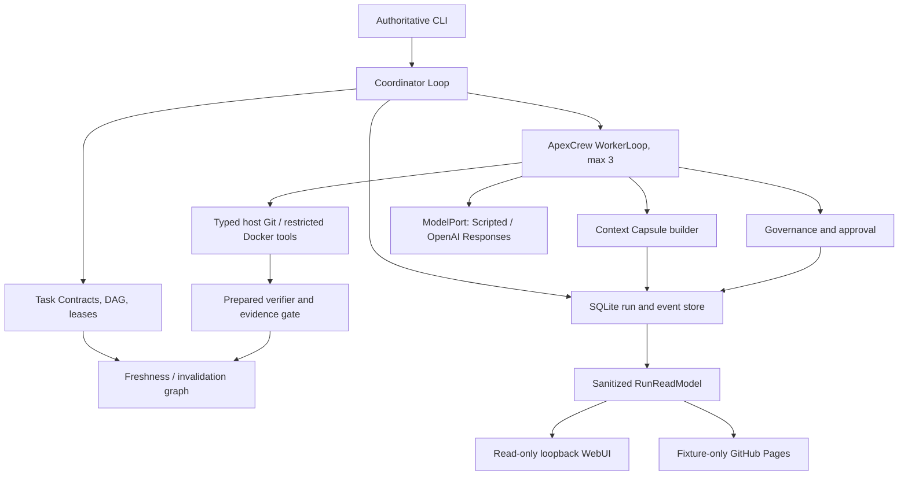

# ApexCrew Initialization Baseline

> Status: accepted discovery baseline, updated 2026-07-26. **Evidence-Driven Durable Crew is the only product mainline.** All three brainstorming rounds are approved; architecture comparison, final written-spec sign-off, planning, and cold-start review still gate implementation.

## 1. Product Thesis

**Accepted direction**: ApexCrew is a local-first, recoverable, evidence-driven collaboration harness for at most three coding Workers in one Git repository.

The value hypothesis is narrower than “multi-agent + long context + continuous cowork,” which existing projects already cover:

> During long-running dependent coding tasks, revision-bound context and verification evidence, dependency-aware invalidation, and durable recovery reduce stale handoffs and unverified integration compared with ordinary task/worktree orchestration.

This is falsifiable and is not a claim of global novelty. Bernstein, h5i, and other projects overlap many individual mechanisms, so ApexCrew's defensible contribution is a small, self-built combination of evidence validity and durable coordination. Adversarial acceptance and weak-oracle checks remain supporting experiments for evidence quality, not a second direction. See [ADR-0001](docs/adr/0001-evidence-driven-durable-crew.md) and [the primary-source landscape](docs/research/github-agent-landscape.md).

## 2. Course Boundary

The A-class submission must implement its own:

- **Coordinator loop**: advance a bounded task DAG, allocate leases, invalidate stale work, pause/resume safely, and serialize integration;
- **worker loop**: assemble context, make one model call, parse one structured action, execute a tool, return feedback, and stop;
- deterministic tool, feedback, governance, memory, stop, and configuration mechanisms.

`ScriptedMockLLM` is the first provider. A production adapter may later expose a low-level single-completion interface through `ModelPort`. Codex, Claude Code, Gemini CLI, AutoGen, CrewAI, LangGraph, or another hosted agent runner may be an experiment only after the core is complete; none may implement or substantiate the assessed loops.

## 3. MVP Scope

The first usable slice supports one local user, one repository, one process, at most three Workers, an explicit bounded task DAG, file/path-glob write sets, per-attempt Git worktrees, SQLite persistence, and serial integration. Python and TypeScript micro-repositories are the accepted fixture matrix.

Workers receive typed Context Capsules rather than full chat history. Checks use repository-declared structured `argv`; an immutable Evidence Receipt records the check and result against a prepared Verification Snapshot. A separate Freshness Assessment rejects capsules, receipts, and candidates whose dependency, contract, policy, or revision no longer applies; immutable historical records are not rewritten.

Risk policy returns `ALLOW`, `DENY`, or `REQUIRE_APPROVAL`. Workspace escape and secret access are hard denials. An immutable Policy Revision is versioned separately from the Plan Revision. An Approval Grant freezes the action and binds run, action digest, workspace revision, policy revision, expiry, and one use; a separate Grant Validation determines whether it still authorizes the pending effect.

Non-goals for v0.1: symbol-level ownership, arbitrary shell, automatic push/merge/release, vector memory, dynamic agent societies, more than three Workers, remote/multi-user execution, a writable WebUI, A2A, Kubernetes, plugin marketplace, production public execution, provider breadth, macOS/ARM support, or a hosted backend. Weak-oracle challenge is an experiment, not a mandatory alternate workflow.

## 4. Decisive Demonstrations

1. **Feedback correction**: a scripted Worker applies a wrong patch; a real check fails; structured evidence returns to the Worker; its next action fixes the patch; only fresh green evidence permits handoff.
2. **Coordination freshness**: two isolated worktrees execute dependent Task Contracts. Upstream integration invalidates the downstream capsule and evidence, forces refresh and revalidation, and prevents a stale candidate from entering the integration queue. Run the same scenario on Python and TypeScript fixtures.
3. **Governance and recovery**: workspace escape is denied with zero side effects; risky-action approval cannot be modified, replayed, or reused; injected crashes resume without duplicate action or integration. Uncertain external side effects enter `INDETERMINATE` for human resolution.
4. **Supporting evidence-quality challenge**: a known flawed patch that passes visible checks is not described as proven correct; a bounded challenger may add a reproducible counterexample and measure its cost. This experiment cannot redefine the product mainline.

All mechanism demos run offline with `ScriptedMockLLM` and real temporary repositories/processes. Go/no-go conditions are objective: stale evidence is never accepted, unapproved dangerous actions have zero side effects, recorded actions are not replayed after restart, and no LLM-as-judge determines correctness.

## 5. Architecture Baseline

The implementation architecture remains a pending post-Round-3 comparison. Every acceptable shape must keep both loops, contracts, transitions, freshness, evidence, policy, and budgets inside deep domain modules; Git/worktrees, restricted commands, SQLite, credentials, and model providers remain adapters. CLI is the sole command interface and WebUI is a read-only projection. Provider SDKs and FastAPI never enter the domain core. See [the system overview](docs/architecture/system-overview.md).

## 6. Documentation System

| Artifact | Purpose | Update trigger |
|---|---|---|
| `SPEC.md` | Single design truth and acceptance criteria | Approved requirement/design change |
| `PLAN.md` | Tasks, dependencies, red/green commands, commit hashes | Every task transition |
| `SPEC_PROCESS.md` | Three brainstorming iterations and cold-start defects | Each spec iteration/review |
| `AGENT_LOG.md` | Timestamped facts, prompts, failures, human fixes | Every agent task/session |
| `CONTEXT.md` | Canonical domain vocabulary only | A term is resolved or corrected |
| `docs/adr/` | Few hard-to-reverse trade-offs | A qualifying decision is accepted |
| `docs/architecture/` | Explanatory component and flow maps subordinate to SPEC | An accepted structural boundary changes |
| `docs/experiments/` | Falsifiable hypotheses, fixtures, measures, and results | Before and after each experiment |
| `docs/research/` | Primary-source landscape and value validation | Research checkpoint |
| `docs/learning/` | Interview explanations linked to code/tests | A mechanism reaches green/refactor |
| `README.md` / `SECURITY.md` | Operation, demo, and trust boundary | User-facing/security change |
| `REFLECTION.md` | Student-authored final critique | Final phase only |

Do not create parallel architecture truths. Learning notes explain concepts and link to the SPEC, ADRs, commits, and tests; they do not restate requirements.

## 7. Technical Baseline and Prerequisites

| Prerequisite | State on 2026-07-26 | Consequence |
|---|---|---|
| A-class project and direction | Accepted | Evidence-Driven Durable Crew is the only mainline. |
| Scope | Accepted | One repository, at most three Workers, Python + TypeScript fixtures. |
| Core ownership | Accepted | ApexCrew owns both loops; only low-level model completion APIs sit behind `ModelPort`. |
| LLM provider decision | Accepted | OpenAI Responses API with `gpt-5.6-terra`; every core gate remains offline under `ScriptedMockLLM`. The credential value is deferred to the provider slice. |
| Local toolchain | Partially ready | Git 2.47.1, Python 3.11.5 and uv-managed 3.14.2, uv 0.9.29, Node 22.14, Make 4.4.1, Docker 29.6.1, and WSL2 Ubuntu were observed. The selected Python 3.12 is not installed and MUST be added with `uv python install 3.12` before scaffold work. Host Node is not required; Node 24 lives in the executor image. |
| Docker daemon | Verified | Local server 29.6.1 responded; image/build behavior is tested during scaffold and distribution stages. |
| Superpowers | Installed and enabled | `superpowers@openai-curated`, manifest 5.1.3, cache revision `11c74d6b`; required workflow skill directories are present. Start design in a session where the plugin skills are loaded. |
| Local Git baseline | Completed by this initialization | Branch `main`; governance and documentation only. |
| Public personal GitHub remote | Configured | `origin` is `https://github.com/Ztscream/ApexCrew.git`; it was verified empty before the first non-force publication. |
| Course submission remote | Explicitly deferred | NJU/GitLab is not considered during current GitHub development but remains a final course-delivery dependency. |
| License | Accepted | Original ApexCrew work uses Apache-2.0; `NOTICE` excludes course-provided requirement documents from relicensing. |
| LLM credential value | Not required yet | Interactive use requires OS keyring; CI may inject `APEXCREW_OPENAI_API_KEY`. An actual value is supplied only for the opt-in provider slice and is never committed. |
| Delivery schedule | Accepted | Deadline is assumed 2026-08-10 23:59 Asia/Shanghai; 25 hours/week yields approximately 53 hours. Optional scope is cut before required mechanisms or course artifacts. |
| Public WebUI | Accepted | GitHub Pages hosts only a sanitized deterministic fixture replay; real commands and credentials remain local and CLI-only. |

Approved operational defaults are Python 3.12, uv, Pydantic, stdlib SQLite, pytest, Ruff, mypy, FastAPI plus Jinja2 for a read-only UI, OS keyring, OpenAI's low-level SDK adapter, and a digest-pinned non-root Linux executor image with Python 3.12 and Node 24. Windows 11 and Ubuntu 24.04 x86_64 are supported; Ubuntu is the full-integration and performance reference.

No `src/`, tests, fixtures, or CI may be retained until the remaining specification, planning, and cold-start gates pass. `PLAN.md` is created by `writing-plans` only after final `SPEC.md` sign-off, then becomes required input to the independent cold-start review and may be revised from its findings.

## 8. Stages and Gates

| Stage | Output | Exit gate |
|---|---|---|
| 0. Discovery (complete) | Landscape, value hypothesis, alternatives, vocabulary | User accepted one direction and non-goals |
| 1. Repository/process setup (complete) | Git/GitHub, Superpowers, license, ignore/security baseline, `AGENT_LOG.md` | GitHub `main` contains the verified governance baseline |
| 2. Brainstorming (in progress: 3/3 approved) | `SPEC.md`, `SPEC_PROCESS.md`, scenarios, state/data/threat model | Architecture comparison, independent review, and final written-spec sign-off complete the Stage 2 gate |
| 3. Planning | `PLAN.md` with 2-5 minute implementation and Python/TypeScript fixture-construction tasks | Every task has dependencies, paths, a failing test, and red/green evidence |
| 4. Independent cold start | Different Agent attempts 1-2 tasks from SPEC/PLAN only | Revisions remove all blocking ambiguity |
| 5. Scaffold | Package, Python/TypeScript fixture repositories, offline test harness, lint/type CI, `ScriptedMockLLM` | One red-green vertical smoke slice |
| 6. Core vertical slices | Worker feedback, contracts/leases, freshness gate, approval, recovery | Decisive demos pass offline on both fixtures |
| 7. Productization | WebUI, credentials, Docker, GitHub Actions, `.gitlab-ci.yml` `unit-test` | Fresh-machine run, public demo, and required CI pass |
| 8. Evaluation | Comparisons, docs, demo script, security review | Spec and quality reviews pass; student writes reflection |

## 9. Remaining External Inputs And Gates

GitHub publication, licensing, provider/model, credentials design, WebUI form, platform matrix, and schedule are resolved. The actual OpenAI secret/quota is neither needed nor accepted until the opt-in provider slice. The repository owner must later enable GitHub Pages/GHCR and any package trusted publisher.

Stage 2 still requires comparison of implementation architectures, independent review, and final human sign-off on the complete `SPEC.md`. Stage 3 then creates `PLAN.md`; the independent cold-start review follows planning and must remove all blocking ambiguity before implementation is retained.

The NJU/GitLab remote is explicitly deferred but remains a final course-delivery dependency. The supplied course deadline omitted a time, so the plan assumes 23:59 Asia/Shanghai unless the user corrects it. Python 3.12 installation is the only missing local scaffold prerequisite currently observed.
