# ApexCrew Specification

> Status: **DRAFT - INDEPENDENT SPECIFICATION REVIEW PASSED, FINAL SIGN-OFF PENDING, NOT IMPLEMENTATION-READY**. The user approved the A-Hybrid implementation architecture on 2026-07-26, and three independent cold reads found zero blockers. Final written-spec approval, `PLAN.md`, and the independent implementation cold-start review remain required before persistent implementation.

Normative terms such as Task Candidate and Run Candidate follow [CONTEXT.md](CONTEXT.md). `MUST`, `MUST NOT`, `SHOULD`, and `MAY` are used in their ordinary requirements sense.

## 1. Product Definition

ApexCrew is a local-first Coding Agent Harness for one developer delegating one hours-long, cross-module change in one existing Git repository. It coordinates at most three ApexCrew-owned Workers and admits code only when context, objective checks, policy, and human approval apply to the exact revision being advanced.

The primary failure is accepting a handoff or check result produced for an earlier dependency or repository revision. The value hypothesis is falsifiable: revision-bound evidence, dependency-aware invalidation, and mandatory revalidation should prevent stale-evidence admission in a scripted cross-module trajectory where an otherwise-identical freshness-disabled harness fails.

A successful Crew Run leaves the returning developer a frozen Run Candidate, fresh run-wide Evidence Bundle, event timeline, and concise summary. The user target ref is unchanged until one final human approval. ApexCrew never pushes.

## 2. Scope

### 2.1 v0.1 includes

- One local user and host installation with exactly one configured repository in v0.1; each Run has one target in that repository and one runtime owner, while short-lived CLI processes may submit exact locked commands.
- At most three logical Workers and one bounded, human-approved Plan Revision.
- ApexCrew-owned Coordinator and WorkerLoop using a low-level `ModelPort`.
- Typed repository actions, real objective checks, test-feedback correction, worktree isolation, write leases, and serial private promotion.
- SQLite durability, Git-based snapshots, crash reconciliation, revision-bound approvals, and inspectable events.
- Deterministic offline behavior through `ScriptedMockLLM` and Python plus TypeScript fixture repositories.
- A CLI-only command surface, a read-only local WebUI, a sanitized static public demonstration, and OpenAI Responses API plus `ScriptedMockLLM` adapters behind `ModelPort`.

### 2.2 v0.1 excludes

- Multiple users or configured repositories, a Run spanning repositories, remote execution, more than three Workers, dynamic agent societies, A2A, Kubernetes, a plugin marketplace, and a remotely writable WebUI.
- Arbitrary shell access, symbol-level ownership, vector memory, automatic push/release, and unbounded task creation.
- Codex, Claude Code, Gemini CLI, or a high-level Agent framework as the Coordinator, WorkerLoop, or evidence authority.
- An LLM-as-judge correctness gate or a claim that declared dependencies discover every semantic dependency.
- Target repositories whose required checks cannot run offline in the approved executor image and prepared worktree.

## 3. User Stories

1. **US-01 - Approve bounded work.** As a developer, I want the Coordinator to propose a finite Task DAG with dependencies, write scopes, and checks so that I can approve the exact work before any Worker writes.
2. **US-02 - Leave and resume.** As a developer, I want a Crew Run to continue or recover while I am absent so that ordinary failures do not require continuous supervision.
3. **US-03 - Reject old green evidence.** As a developer, I want a dependency change to invalidate affected context and checks so that a green result from an older revision cannot authorize promotion.
4. **US-04 - Correct from objective feedback.** As a developer, I want a Worker to receive structured failing-check evidence and revise its patch within the approved contract so that a normal red-green loop can complete without a new approval.
5. **US-05 - Inspect before integration.** As a developer, I want a frozen Run Candidate, exact evidence, timeline, and summary so that final approval is informed and bound to what will be integrated.
6. **US-06 - Constrain risky effects.** As a developer, I want hard-denied actions to have zero side effects and risky actions to require a frozen, one-use grant so that a vague confirmation cannot authorize changed work.
7. **US-07 - Recover without guessing.** As a developer, I want restart logic to reconcile observable state and pause on uncertain external effects so that recovery does not duplicate or invent success.

Each story is independently demonstrable with `ScriptedMockLLM`; together they form the primary end-to-end journey rather than seven unrelated product modes.

## 4. Architecture And Module Contracts

```mermaid
flowchart LR
    USER["Developer"] --> CLI["Authoritative CLI"]
    CLI --> CONTROL["CrewControl.handle"]
    CONTROL -->|"Issues one-use authority"| PERMIT["Runtime Permit"]
    CLI -->|"Delivery call"| RUNTIME["CrewRuntime.run_until_blocked"]
    PERMIT -->|"Consumed before mutation"| RUNTIME
    RUNTIME --> COORD
    COORD --> BOARD["Plan, Tasks, Leases, Budgets"]
    COORD -->|"Planning only"| MODELREQ["Durable Model Request"]
    COORD --> WORKERS["WorkerLoops, max 3"]
    WORKERS --> MODELREQ
    MODELREQ --> MODEL["ModelPort: Scripted / OpenAI Responses"]
    MODELREQ --> AUTH
    MODELREQ --> JOURNAL
    WORKERS --> AUTH["Authority"]
    COORD -->|"Planning read/search"| TOOLS["Typed ToolRuntime"]
    WORKERS --> TOOLS["Typed ToolRuntime"]
    TOOLS --> EXEC["Restricted Docker Executor"]
    EXEC --> ADMIT["Admission: Freshness + Evidence"]
    AUTH --> ADMIT
    ADMIT --> TASKGATE["Prepared Task Gate"]
    ADMIT -->|"Admission-issued typed ref request"| GIT["Sanitized Host Git Adapter"]
    GIT --> RUNREF["Private Run Branch"]
    RUNREF --> RUNGATE["Run Check Set on Frozen Candidate"]
    ADMIT --> RUNGATE
    RUNGATE --> HUMAN["Final Human Grant via CLI"]
    HUMAN --> CONTROL
    GIT --> TARGET["Target Ref CAS"]
    CONTROL --> JOURNAL["EffectJournal + Recovery"]
    RUNTIME --> JOURNAL
    JOURNAL --> STORE["SQLite State + Audit Ledger"]
    STORE --> QUERY["RunQueries.get"]
    QUERY --> LOCAL["Token-protected Local WebUI"]
    QUERY --> STATIC["Fixture-only GitHub Pages Export"]
```



| Module | Input | Required behavior | Output | Boundary and errors |
|---|---|---|---|---|
| `CrewControl` | Idempotent CLI `CommandEnvelope` with expected Audit sequence and applicable revisions | Apply exact human commands for Run creation, revision proposal/approval, planning/start/pause/resume, Grants, indeterminate resolution, final integration, cancellation, and purge | Typed `CommandOutcome` with resulting sequence and safe next action | MUST NOT run the autonomous loops or dispatch a model-selected tool; invalid, stale, denied, or conflicting commands have zero unauthorized effects |
| `CrewRuntime` | Any known Run ID, configured adapters, and an internally persisted one-use Runtime Permit for mutation | With a valid permit, reconcile unfinished intents and own Coordinator planning or Coordinator/WorkerLoop execution until blocked; without one, only report the current stop | `RunStop` carrying existing lifecycle state, reason, and last Audit sequence | Exposes no public tick/step interface; direct calls cannot mint authority, terminal calls without an exact cleanup permit and other non-runnable/no-permit calls have zero mutation, and one permitted invocation per Run holds runtime ownership while short state/ref locks preserve atomicity |
| `RunQueries` | Run ID and latest or exact Audit sequence | Build the one sequence-consistent sanitized projection from Tier 1, or the minimal tombstone projection after purge | `RunReadModel` for CLI, loopback WebUI, or static replay; delivery may select fields without another domain query | Strictly side-effect-free; never returns credentials, Grants/nonces, command tokens, Runtime Permits, Tier 2, or quarantined content; purged history is reported unavailable rather than reconstructed |
| Coordinator | Developer goal/constraints, pinned repository base, current approved revisions, and Run events | Run the bounded read-only planning phase; after Plan approval, advance ready Tasks, cap Workers at three, issue leases, invalidate affected work, serialize private promotions, and enforce stop states | Plan proposal or updated Run/Task state and scheduling decisions | Planning may use only its closed read/search/submit/fail schema; Coordinator MUST NOT call tools on a Worker's behalf or silently change a revision, and pauses on unknown change, exhausted budget, conflict, or uncertainty |
| WorkerLoop | Task Contract, current Context Capsule, model configuration | Make one low-level completion, validate one typed `ActionEnvelope`, journal and execute one action, return one structured result, repeat within budget | Worker Attempt events, repository changes, check evidence, or terminal status | MUST NOT schedule Workers, mutate its contract, use an external agent loop, or declare promotion success |
| Admission | Candidate change, current bindings, dependency graph, required checks, expected head/target | Exclusively validate and prepare candidates, build/check Verification Snapshots, calculate invalidation and Freshness Assessments, require complete Evidence Bundles, and issue serialized typed CAS requests | Promoted private Run Head or frozen/integrated Run Candidate | Unknown change falls back globally; moved heads, stale/incomplete evidence, failed checks, and conflicts reject admission; an invalid Grant denies only its command while a still-fresh Candidate remains available |
| Authority | Frozen action/candidate, Policy/Budget revisions, counters, applicable planning/lease/verification authorization, optional Grant | Classify actions, validate/consume exact Grants, allocate objective-progress tranches, and enforce scope/lease/budget limits | Authorization, allocation, pause, denial, or Grant Validation | Model self-report never earns budget; secret/path escape is hard denied; missing/invalid authority or Grant authorizes zero effects |
| EffectJournal | Domain transition or effect intent/result with expected version and idempotency key | Persist current state and Tier 1 events transactionally, record intent before effects, and reconcile unfinished effects from observable state | Committed sequence, prior idempotent result, or recovery decision | SQLite is not transactional with Git/provider/Docker; an unobservable outcome becomes `INDETERMINATE`, never guessed success |
| ToolRuntime | Validated action plus a planning read authorization, active lease, or Admission-issued verification authorization bound to a fixed snapshot | Perform the named scoped repository read/write/check action through the host Git adapter or restricted executor and capture structured feedback | Action result, digests, bounded redacted output, and observed post-state | Planning is read-only; execution has no arbitrary shell, host network, Docker socket, secret-bearing environment, or path outside approved canonical scopes |

### 4.1 Approved A-Hybrid implementation shape

The only Run-facing application interfaces are:

```python
CrewControl.handle(command: CommandEnvelope) -> CommandOutcome
CrewRuntime.run_until_blocked(run_id: RunId) -> RunStop
RunQueries.get(run_id: RunId, at_sequence: int | None = None) -> RunReadModel
```

`CommandEnvelope` contains a request/idempotency ID, expected Audit sequence, applicable revision digests, and exactly one closed payload: create a Run draft; propose or approve an exact Policy, Budget, or Model Configuration Revision when that revision class is mutable; begin planning; approve or reject an exact Plan Revision; start; continue an orphaned runnable Run; pause; resume an exact Run/Task pause cause; grant a frozen risky action; select an allowed resolution for one exact `INDETERMINATE` intent or a set-bound terminal resolution; reconcile terminal administrative cleanup; integrate an exact Run Candidate; cancel; prepare a terminal-Run purge; or confirm its exact frozen purge. The planning runtime, not a human command, submits Plan proposals. Unknown variants, extra fields, wrong-state commands, and mismatched bindings are rejected before effects. `CommandOutcome` is `ACCEPTED`, `INVALID`, `STALE`, `DENIED`, `CONFLICT`, `APPROVAL_REQUIRED`, or `INDETERMINATE`, with the resulting Audit sequence, failed invariant, and safe next action. The first transaction stores a canonical full-envelope digest beside the request ID and outcome. Before purge, reuse with the identical digest returns that committed outcome; reuse with any different payload/binding/expected sequence returns `CONFLICT/IDEMPOTENCY_KEY_REUSE` with no mutation, reconciliation, or runtime call. Delivery replay is governed by the one-use Runtime Permit below, never by request ID alone; section 10.4 defines the intentionally narrower post-purge receipt.

`RunStop` does not add lifecycle states; it wraps the existing Crew Run state, last Audit sequence, and exactly one reason: `AWAITING_PLAN_APPROVAL`, `AWAITING_ACTION_APPROVAL`, `AWAITING_FINAL_APPROVAL`, `PAUSED`, `INTERRUPTED`, `BUDGET_STOP`, `INDETERMINATE`, `TERMINAL`, `NO_RUNTIME_PERMIT`, or `ALREADY_RUNNING`. Approval stops include frozen pending IDs, never secrets/nonces. Failure to acquire runtime ownership returns immediately as `ALREADY_RUNNING`. A terminal or external-wait Run with no matching administrative/delivery authority returns its existing stop; an autonomously runnable Run with no valid permit returns `NO_RUNTIME_PERMIT`. All have zero mutation. A valid terminal-administrative permit is the sole exception that lets runtime reconcile Target Reservation cleanup while preserving the terminal Crew Run state. A permitted runtime never returns between intent persistence and either settlement or durable `INDETERMINATE` classification of the corresponding atomic action.

`CrewControl` is the Run command seam, `CrewRuntime` is the ApexCrew-owned autonomous-loop seam, and `RunQueries` is the read seam. An accepted CLI begin-planning, start, continue, reason-bound resume, indeterminate-resolution, final-integration, or terminal-administrative-cleanup command, and a successfully recorded Grant for a Pending Action, atomically issues one internal Runtime Permit. The permit contains its Run, unique permit generation, source command ID/full-envelope digest, issued Audit sequence, one allowed starting phase, and the expected monotonic runtime-progress generation. At most one permit may be unconsumed for a Run. Delivery then calls `CrewRuntime.run_until_blocked`; this sequencing is composition, not a second copy of domain rules. Runtime ownership acquisition atomically validates the source command, exact state/sequence/generation, absence of a later interrupt, and allowed phase, marks the permit consumed, and increments runtime progress before any reconciliation or new effect. Pause/cancel, another accepted control transition, or a mismatched state/sequence/generation invalidates an unconsumed permit.

If the process crashes after command commit but before permit consumption, an identical command replay may repeat delivery composition only while that original permit remains unconsumed and no later runtime/control progress exists. A different `continue` command cannot supersede that delivery obligation; it returns `CONFLICT/RUNTIME_DELIVERY_PENDING` and names replay of the source command as the safe next action. Once consumed, an old begin/start/resume/grant/integrate/resolution/cleanup command replay returns its prior `CommandOutcome` but cannot mint or invoke another permit; a new exact `continue` command is required only when the resulting phase is orphaned and autonomously runnable. Thus historical request IDs are not permanent resume capabilities, and a direct runtime call cannot bypass expected-sequence command authority. Local and static WebUI code receives only `RunQueries`.

The runtime-ownership lock rejects a second `run_until_blocked` invocation but does not hold the SQLite state lock for the whole journey. Runtime actions use short expected-sequence transactions, and Admission uses a short Run-ref lock for preparation/CAS. While runtime is active, `CrewControl` may transactionally append only an exact pause or cancel request; it cannot dispatch/reconcile another effect or change revisions. Committing the request closes the Run's interrupt gate immediately, so no new model/tool/ref intent starts, but it does not invalidate any already-journaled in-flight intent. Runtime waits for every in-flight intent across all Workers to settle or become durably `INDETERMINATE`, then applies the interrupt only if the Run remains a non-terminal safe state. An objectively completed target CAS records `COMPLETED`, and failure or uncertainty records its own state, in precedence to pause/cancel; cancellation can never relabel an integrated target as `CANCELLED`. Audit sequence/idempotency serializes races, and restart reconciles the complete in-flight set before evaluating the persisted interrupt. Other concurrent commands return `CONFLICT` with no effects.

Runtime ownership is a process-local mutex plus an OS-released exclusive per-Run file lock under the ApexCrew data root, paired with a durably recorded random owner ID. The open lock handle, not PID/heartbeat/time alone, is authority; process death releases it. After obtaining that handle, runtime first validates a matching Permit without mutation; only the transaction that consumes a valid Permit may clear a stale owner record, install the new owner ID, and increment runtime progress before reconciliation. A no-permit or wrong-phase call never changes owner or Run state. A live or hung owner is never time-stolen. Ownership paths are canonical, pre-created inside the private data root, and are not derived from repository text. This lock is distinct from the SQLite state transaction and Git ref locks.

When a pause takes effect, every still-active Attempt that has no unsettled intent becomes terminal `CANCELLED`, its lease is revoked, and its unfinished Task becomes `PAUSED`; resume creates a fresh Attempt and never extends the old lease. A Candidate already frozen before the pause remains historical but must pass a new Freshness Assessment before the prior candidate phase can resume. Cancellation likewise revokes all leases and makes every Pending Action/unconsumed Grant unusable; retained candidates and receipts have no authority under the terminal Run. These bookkeeping transitions occur in the same expected-sequence transaction that applies the interrupt.

The planned package shape is:

```text
src/apexcrew/
  application/   control.py, runtime.py, queries.py
  domain/        coordination.py, worker.py, admission.py,
                 authority.py, effects.py, tools.py, projection.py, model.py
  adapters/      model/, state/, repository/, executor/, credentials/
  delivery/      cli/, web/
```

Files under `domain/` are internal deep modules, not a menu exposed to delivery. Coordinator owns bounded planning plus scheduling, leases, and the decision to request promotion; WorkerLoop owns one-turn decision/action/feedback; Admission alone owns candidate validation, preparation, and private/target CAS issuance; Authority co-locates policy, Grants, budgets, and lease authorization; EffectJournal owns intent/result durability and recovery, including model requests; Projection owns Tier 1 sanitization. The host Git adapter executes only Admission-issued typed ref requests, and the CLI only submits commands. The design deliberately rejects both a single giant implementation behind `execute/read` and a public interface for every rule helper.

The CLI composition root validates host/repository configuration, selects adapters, and injects one object graph shared by the three interfaces; it owns no domain decision. `doctor`, non-Run local configuration, hidden credential lifecycle, and local UI serving are explicitly auxiliary bootstrap/delivery use cases: they may access only their dedicated host adapters, cannot mutate Run/repository/target state, create a Grant, or dispatch a model/tool action, and never place credential values in a `CommandEnvelope`. `CrewControl.handle` uses only short state transactions to validate/persist commands, interrupts, Grants, resolution strategies, and Runtime Permits; it never invokes Run/model/repository effect reconciliation or Coordinator/WorkerLoop. After acquiring ownership, `CrewRuntime.run_until_blocked` MUST validate and consume a Permit before it invokes `EffectJournal` reconciliation, then it evaluates scheduling only if recovery closes. A live-runtime pause/cancel follows the interrupt protocol above. The tombstone-backed purge transaction is the bounded administrative exception defined in section 10.4 and still invokes no Run/repository/model effect. `RunQueries.get` never reconciles or mutates; until permitted recovery runs it projects the recorded pending/recovery-required condition. A reconciliation that cannot establish the observed post-state returns `INDETERMINATE` before new work.

Provider SDKs, Git, SQLite, Docker, FastAPI, keyring, clocks, IDs, and OS calls remain behind internal seams. `ModelPort` is the true-external seam with OpenAI and `ScriptedMockLLM` adapters. SQLite/memory, Git/fault-injecting temporary repositories, restricted Docker/deterministic executor, keyring/memory, and system/deterministic clock-ID pairs are local-substitutable adapters. In-process state machines, validation, admission rules, and projection do not receive speculative ports.

Acceptance tests exercise `CrewControl`, `CrewRuntime`, and `RunQueries`; focused tests exercise each internal deep module through its own interface; adapter pairs share contract tests. Delivery and tests MUST NOT coordinate Coordinator, WorkerLoop, Admission, or recovery ordering themselves.

## 5. Domain And Mechanism Design

### 5.1 Mechanism matrix and primary contribution

| Required dimension | v0.1 coded mechanism | Deterministic minimum proof |
|---|---|---|
| Decision | Coordinator planning/execution state machine plus the one-action WorkerLoop; low-level model output is data, not control flow | `ScriptedMockLLM` emits malformed plans/actions, failing, correcting, and terminal actions; tests assert exact transitions and stop decisions |
| Tools/actions | Typed scoped read, search, patch, declared-check, risky-action proposal, and finish dispatch with fixed workspace and structured results | Direct dispatcher tests prove schema/scope rejection, lease/write-set enforcement, and result feedback without a real model |
| Memory/context | SQLite-backed immutable facts, Context Capsules, provenance, dependency fingerprints, and Freshness Assessments | Restart and invalidation tests prove current facts survive, stale facts remain audit history, and stale facts never enter a new request |
| Governance | Immutable Policy Revisions, hard denials, Workspace Leases, frozen Approval Grants, Grant Validation, and durable budget authorization | Tests prove escape denial has zero side effects, altered/replayed grants fail, overlapping leases do not run, and budget reservation fails closed |
| Feedback | Real checks produce Evidence Receipts; failed results feed the next Worker turn; Task/Run gates require current Evidence Bundles | Both fixtures prove red-to-correction behavior and reject old green evidence under an identical freshness-disabled ablation |
| Configuration | Validated repository identity, Plan/Policy/Budget/Model Configuration revisions, Task Contracts/scopes, checks, and delivery settings | Invalid or unknown fields fail closed; serialized configuration can drive the offline end-to-end scenario |

The **feedback/admission dimension** is the mechanism-dense primary contribution: objective results are not merely returned to one Worker, but bound to prospective Git revisions, invalidated through declared dependencies, excluded from stale context, and revalidated at Task and Run admission gates. Decision, memory, and governance support this claim; they are required foundations rather than competing product directions.

The four coding-domain mechanisms are therefore explicit: typed repository actions, deterministic check feedback, code-enforced risky-action interception/HITL, and durable provenance-bearing context. Removing the real LLM leaves each mechanism executable and testable.

### 5.2 Plan, Task Contract, Policy, budget, and lease

A Plan Revision is immutable and contains a finite Task execution DAG, a promotion-hazard graph, plus an exact Run Check Set. Each Task Contract contains a stable Task ID; dependency Task IDs; declared read globs `R`, dependency globs `D`, and allowed write globs `W`; required checks as structured `argv` with declared input globs `Q`; and supplied constraints. Every Run check likewise declares structured `argv` and input globs. A Plan proposal binds the goal, repository instance, pinned target base OID, glob-matcher version, and current Policy, Budget, and Model Configuration Revision digests. The Coordinator may propose checks by inspecting tracked repository and CI configuration, but a check becomes authoritative only inside the approved Plan Revision. Policy, Budget, and Model Configuration Revisions are independently versioned and human-approved. None is edited in place. When a Run reaches `ACTIVE`, its approved Plan and Policy Revisions are frozen and proposal/approval of a replacement is invalid for that Run; scope or policy change requires cancellation and a new Run. Approved Budget and Model Configuration replacements remain possible only under their explicit invalidation and resume rules. Non-relaxable hard denials and host administrative caps sit outside Policy and apply to every revision.

All planning and Task scopes use one versioned matcher over canonical Git tree paths. v0.1 accepts only valid UTF-8 paths normalized to Unicode NFC, represented with `/`, compared case-sensitively, and composed of non-empty ordinary segments. It rejects absolute or drive-qualified paths, `.`/`..`, backslashes, C0/C1 controls, colon/NTFS alternate-stream syntax, Windows-forbidden `< > " | ? *` path characters, segments ending in a dot or space, non-NFC aliases, and any pair whose NFC case-folded forms collide. A segment's ASCII case-insensitive basename before the first dot MUST NOT be `CON`, `PRN`, `AUX`, `NUL`, `CLOCK$`, `CONIN$`, `CONOUT$`, `COM1`-`COM9`, `LPT1`-`LPT9`, or `COM`/`LPT` followed by U+00B9, U+00B2, or U+00B3. Protected-name checks use NFC case-folded segment identity on every platform, so `.GIT` and `.ApexCrew` cannot bypass `.git`/`.apexcrew` denial. Patterns match the whole path: `*` matches zero or more otherwise-valid code points within one segment, including a leading `.`, while a complete `**` segment matches zero or more complete segments; no dotfile special case exists. `?`, classes, braces, negation, and escapes are invalid. A validator must prove pattern inclusion/disjointness under this grammar; unknown proof is overlap/rejection.

Before and after every host materialization/write, the adapter walks from a pre-opened canonical workspace root without following links/reparse points, opens the final object, and verifies by OS file identity/final path that every ancestor and the regular file remain inside that same root. Scope, protected-name, and Secret Path Set checks are repeated against the canonical Git path before OS mapping; an OS alias/collision or identity mismatch is hard denial with zero content exposure. Negative tests cover drive-relative `D:outside`, UNC/device paths, ADS, trailing dot/space, mixed-case/trailing `.git` aliases, DOS devices, Unicode/case collisions, 8.3/final-path aliases, and symlink/junction/reparse swaps on Windows and their POSIX counterparts. `W` MUST be covered by `R`, protected paths are forbidden, and every check MUST declare inputs. Git mode `120000` entries are unsupported: they are never followed or materialized, planning fails before a provider request if one falls inside its authorized manifest, Plan validation rejects any Task/Run scope whose snapshot would contain one, and patch validation denies creation or modification of one. Existing symlinks outside every materialized scope remain unobserved.

Plan validation treats any overlap it cannot disprove as overlap and derives promotion hazards before approval. If `W_u` may overlap `R_v`, `D_v`, or `Q_v`, the graph contains `u -> v`; tasks with potentially overlapping write globs MUST also have one explicitly proposed promotion order. Hazard edges constrain promotion, not execution readiness, so speculative independent Attempts may still run. The union of execution dependencies and promotion hazards MUST be acyclic. A missing write order, mutual read/write requirement, or any resulting cycle rejects the proposal. Thus a Candidate may wait on an unfinished writer, but cannot promote before that writer and later rely on rewritten input.

The Coordinator schedules only execution-dependency-ready Tasks. Two concurrently active Workspace Leases MUST NOT have potentially overlapping write globs. A lease binds the Crew Run, Task Contract digest, Worker Attempt, base Run Head, write globs, monotonic generation, issue/expiry times, and status. Its sensitivity scope is `R ∪ D ∪ W ∪ Q`.

An `ACTIVE` lease remains admissible through a later Run Head only when every intervening promoted change is completely classified outside its sensitivity scope and all Task dependencies remain satisfied. Admission records that admissibility through the new head. An affected or unclassifiable change lets the current atomic action settle, then revokes the lease and makes the Attempt terminal `STALE`; an unaffected lease remains active. A write is authorized only when this assessment reaches the latest Run Head, the lease is unexpired and generation-matched, and the canonical target path remains inside both the configured worktree and `W`.

The default Workspace Lease lifetime is 15 minutes. The Coordinator may renew it only between atomic actions after revalidating the same Attempt, generation, latest admissible Run Head, contract, and non-overlapping write set; renewal never makes an expired/revoked lease active again. A long check may settle after expiry under the atomic-action rule, but the Attempt then terminates `FAILED` and any retry uses a new Attempt ID and lease generation.

### 5.3 Bootstrap planning protocol

`CrewControl` creates a `DRAFT` Run from immutable goal, constraints, acceptance criteria, repository-instance identity, target ref, and target base OID, together with proposed Policy, Budget, and Model Configuration Revisions. In the same SQLite transaction it allocates and persists one immutable random Target Reservation ID, canonical private data-root path, and `ALLOCATED` ownership row, but performs no Git effect. The target MUST be a direct canonical local branch under `refs/heads/`, not a symbolic or remote-tracking ref, and MUST not be checked out in the configured main worktree. v0.1 rejects a repository with any pre-existing linked-worktree admin entry before invoking Git; ApexCrew execution workspaces are detached and are not Git linked worktrees. Partial/promisor repositories, missing reachable objects, an in-progress Git operation, or an unsafe target registration fail before Run creation. The base OID and target-safety binding are pinned for the life of the Run. No provider request occurs until a human has approved the exact three bootstrap revisions; selecting a real provider additionally requires credential presence, although credential material is never part of a revision.

The first exact begin-planning command has Admission journal and issue creation of the Run's preallocated locked, `--no-checkout` Target Reservation worktree under the private ApexCrew data root, registered to the exact target branch/OID. Hooks/filters remain disabled and no tracked repository file is populated. If Plan rejection or another pre-activation transition later returns the same Run to `DRAFT`, a subsequent begin command MUST validate and reuse that same reservation ID, path, registration, and lock; it neither allocates nor adds another worktree. Git's own branch-occupancy check then rejects ordinary checkout/worktree-add of that target elsewhere; removal, relocation, or force override requires an explicit out-of-band force operation by the trusted operator and is outside the cooperative v0.1 concurrency guarantee. Creation recovery classifies the exact absent, registered-unlocked, and registered-locked states: it may replay add only from complete absence and may lock only the exact owned registration; a mixed or third state pauses with no provider request. Only after the reservation is the sole target registration, locked, and exact does runtime move the Run to `PLANNING`; failure remains `DRAFT` with no provider request.

The approved Policy Revision contains the Planning Read Authorization: positive globs under the canonical matcher; hard-denied path classes; and maximum manifest entries/bytes, per-file bytes, cumulative returned bytes, and search matches/bytes. Missing fields fail validation. Policy may lower but never exceed the v0.1 caps of 2,000/128 KiB for manifest entries/bytes, 128 KiB per file, 2 MiB cumulative returned content, and 200/64 KiB matches/bytes per search. The initial model context may receive only goal/constraints and the bounded in-scope tracked-regular-file path manifest; file content appears only through an authorized read/search action. The authorization binds the Policy digest, repository instance, and pinned base OID to every planning tool intent and result. Manifest overflow returns to `DRAFT` before a provider request and requires a narrower newly approved Policy Revision. Out-of-scope, ignored/untracked, symlink, protected, or effective-secret path names and content are neither enumerated nor returned.

The effective Secret Path Set is evaluated before any manifest, read, search, patch, check snapshot, diff, log, or model context is built. It is the union of the non-removable `secret-path-defaults-v1` rules and operator-supplied positive globs stored only in user-permissioned host configuration outside the repository and ApexCrew state/artifact stores. The fixed rules are `**/.env`, `**/.env.*`, `**/.netrc`, `**/.npmrc`, `**/.pypirc`, `**/.ssh/**`, `**/.gnupg/**`, `**/.aws/**`, `**/.azure/**`, `**/.config/gcloud/**`, `**/.kube/**`, `**/.docker/config.json`, `**/*.pem`, `**/*.key`, `**/*.p12`, `**/*.pfx`, `**/id_rsa`, `**/id_dsa`, `**/id_ecdsa`, `**/id_ed25519`, `**/*.tfstate`, `**/*.tfstate.*`, `**/credentials.json`, and `**/service-account*.json`. User globs use the section 5.2 matcher, can only add denials, and are sorted/deduplicated after normalization. `SecretPathPolicyDigest` is HMAC-SHA-256 over canonical JSON containing matcher/default versions and those normalized globs, using a random installation key kept only in OS keyring or a test-only in-memory adapter. The Policy Revision binds only the versions, opaque HMAC, and user-rule count, never literal user paths or the key.

The host recomputes that digest at Run creation, begin-planning, start, and every manifest/snapshot/tool/check boundary. Missing key/configuration, unreadable/invalid rules, key rotation, or mismatch closes dispatch before any further path enumeration or content access. Before `ACTIVE` a change stales the proposal and requires a newly approved Policy; during `ACTIVE` the frozen-Policy Run cannot resume and must be cancelled in favor of a new Run. Secret matching is deliberately stricter than ordinary scope matching: every default and host rule is evaluated against both the canonical path and NFC case-folded path/pattern on every platform, so `.ENV`, `TOKEN.KEY`, and mixed-case user-rule aliases are denied consistently on Windows and Linux. A match overrides every planning or `R`/`D`/`W`/`Q` scope. Raw user globs and matching path names/content MUST NOT enter model requests, executor input, `CommandEnvelope`, SQLite, Tier 1 or Tier 2, WebUI, or exports. If model output itself names a matching path, ingress retains only its response/action digest and a bounded `SECRET_PATH_DENIED` result; it drops/quarantines the path-bearing payload and never echoes the path. Only default/matcher versions, rule count, opaque HMAC, and the generic denial reason may cross the host-local configuration seam. Negative tests cover upper/mixed-case defaults and user rules and show that exported HMAC/count pairs cannot be matched against a low-entropy dictionary without the unavailable installation key.

During `PLANNING`, the Coordinator owns a separate one-action loop; no Worker, Worker Attempt, Task Contract, or Workspace Lease exists. Every turn uses the durable model-request protocol and accepts exactly one planning action: read tracked file, search tracked content, submit Plan, or fail. Read/search operates on a sanitized snapshot of the pinned base OID under the approved planning read scope and secret-path denials. Patch, check, risky-action, process, network, and ref actions are invalid and have zero side effects.

Planning is limited to eight model requests including retries across the entire Run. The counter is monotonic and is not reset by returning to `DRAFT`, Plan rejection, revision replacement, pause/resume, or restart. Requests consume the global call, token, time, and cost budgets but no Task tranche. Malformed or invalid submissions receive bounded structured feedback within that ceiling. A valid submission contains an acyclic DAG of at most 12 complete Task Contracts plus the exact Run Check Set, passes the scope/hazard/check validators, and binds the current goal, base OID, and approved bootstrap revisions; it moves the Run to `AWAITING_PLAN_APPROVAL`.

Every other planning stop is exact: reaching eight requests pauses `PLANNING_REQUEST_LIMIT` and permits only cancel/new Run; mandatory context overflow returns to `DRAFT` with counters preserved and requires a changed approved bootstrap binding before begin-planning can succeed; a bootstrap revision change returns to `DRAFT`; target movement/unsafe registration pauses and, after exact restoration, resumes to `DRAFT`; the Coordinator's explicit `fail` pauses `PLANNING_FAILED` and permits only cancel/new Run; global budget/provider stops follow their reason-bound section 10 rules; and an uncertain provider outcome enters `INDETERMINATE` for that Model Request Intent. Plan rejection also returns to `DRAFT` with counters preserved. None creates a Worker, Attempt, lease, private ref, or Task effect.

Exact Plan approval moves the Run to `READY_TO_START`, but dispatches nothing. The subsequent start command atomically verifies the expected Audit sequence; current approved Plan, Policy, Budget, and Model Configuration digests; repository identity, unchanged pinned target, and exact Target Reservation; the reserved `refs/apexcrew/runs/<run-id>` ref is absent and un-checked-out; no unfinished recovery or `INDETERMINATE` intent; real-provider credential presence; and required adapter/doctor prerequisites. Failure creates no Worker, Attempt, lease, model-request intent, or repository effect. On success, runtime first has Admission journal and issue the recoverable absent-to-pinned-base CAS that initializes the private ref; no Worker, lease, or model intent may exist until that CAS settles at the exact base. A definite CAS failure with the ref objectively still absent closes that intent and pauses `PRIVATE_REF_INIT_FAILED`; exact resume revalidates the complete start guard and creates a new initialization intent, never a replay. A pre-existing/third-state ref is never adopted or overwritten: it pauses `PRIVATE_REF_CONFLICT`, and exact resume is valid only after observation proves the reserved ref absent. A proposal-binding change requires a fresh planning pass rather than silently reusing the Plan.

### 5.4 Durable model requests

Every `ModelPort` invocation, in planning or a WorkerLoop, is an external effect. Before dispatch, one SQLite transaction revalidates state, revisions, target, credential presence, and remaining budgets; allocates a logical model-turn ID and provider-attempt ID; persists a Model Request Intent with request digest and idempotency key; and reserves one call, bounded input/output tokens, and worst-case cost under the approved pricing snapshot. Concurrent reservations serialize against the global counters. No adapter request occurs if that transaction fails.

A completion is not released to Coordinator or WorkerLoop until a second transaction records logical-turn/retry identity, provider response ID and digest, requested and returned model IDs, usage, outcome class, and the bounded normalized typed output required for restart, then settles the reservation. The approved Model Configuration contains one requested canonical model ID plus a finite exact returned-ID/alias allowlist, and the Budget pricing snapshot covers every allowed ID; missing or ambiguous mappings make either revision invalid before dispatch. After a response, the adapter must supply a returned model ID and ApexCrew must match it exactly before normalizing or releasing operational output. An absent or unexpected ID is durably recorded as `RETURNED_MODEL_MISMATCH`, consumes reported token usage and the full reserved cost or, when usage is unusable, the full call/token/cost reservation; it records unpriced provider exposure, releases no output to either loop, starts no tool action, is never silently aliased or automatically retried, and pauses for an approved Model Configuration/Budget decision. Only allowlisted metadata and digests enter Tier 1; the normalized operational payload is local restricted state, is never a query/export/evidence source, and remains until its action is terminal. Reported usage for an approved ID consumes actual amounts and releases unused reservation; missing or unusable usage consumes the full reservation.

Each retry uses a new provider-attempt ID, intent, call count, and reservation under the same logical turn. SDK/HTTP automatic retries are disabled so every wire attempt has its own durable intent. ApexCrew retry is allowed only after a durably recorded response proves that the previous attempt produced no usable completion and is closed; an explicit provider rejection may qualify, while timeout or connection loss after possible dispatch does not. Any unsettled intent at restart or unknown external outcome conservatively consumes its call and full reservation, enters `INDETERMINATE`, and is never silently retried. Recovery may continue without another provider request only from a fully committed normalized completion whose returned-model, tool-schema, and revision checks passed.

### 5.5 One-action WorkerLoop

For each turn ApexCrew:

1. Builds a current Context Capsule and normalized low-level model request; repository facts are limited to `R ∪ D`, provenance-bound, and included in the dependency fingerprint.
2. Uses section 5.4 to reserve, persist, dispatch, and settle exactly one schema-constrained completion.
3. Rejects malformed output without executing a tool.
4. Validates exactly one typed action against contract scope, lease, and policy.
5. Persists the tool-action intent, idempotency key, expected pre-state, policy decision, and any Grant consumption before the side effect.
6. Executes one tool action and persists its structured result and observed post-state.
7. Adds bounded feedback to the next request or enters a terminal/pause state.

The execution action set is repository read/search, patch application, declared check execution, risky-action proposal, and finish/fail. Path reads must be canonical regular files inside `R ∪ D`; search runs only over a pre-enumerated in-scope file set, and an out-of-scope request or adapter result is rejected before path/content exposure. Search results are deterministically ordered by canonical path then byte offset and truncated only at the approved match/byte cap with an explicit truncation marker. Task checks receive a sanitized snapshot containing only `Q ∪ W` plus fixed executor metadata. Each observed read/result path and digest enters the dependency fingerprint. Insufficient scope returns `SCOPE_EXPANSION_REQUIRED`, closes new dispatch, and pauses the Run; because the approved Plan is frozen, widening `R`, `D`, `W`, or `Q` requires cancelling and creating a new Run with a newly approved Plan. Git promotion is Coordinator-scheduled and Admission-executed. A completion cannot contain an action batch or launch another autonomous agent loop.

When Authority returns `REQUIRE_APPROVAL`, WorkerLoop persists a Pending Action containing the normalized typed action, expected pre-state, Run/Task/Attempt, lease/head, revision digests, and action digest, but creates no effect intent and consumes no Grant. The Attempt moves to `WAITING_APPROVAL`; the first pending action closes the ordinary scheduling gate, already in-flight intents settle under the barrier in section 4.1, and runtime returns `ACTIVE` with `AWAITING_ACTION_APPROVAL`. Multiple pending IDs may exist, but each is independently frozen and grantable only while the Run is still `ACTIVE`, its Attempt is still `WAITING_APPROVAL`, and the separate interrupt gate remains open.

An accepted Grant opens no global gate. It creates a one-transaction aperture for only its Pending ID to bypass the closed ordinary scheduling gate and atomically persist that one consumed-Grant/effect intent. The interrupt gate, lease, state, and every binding still apply. Other Pending Actions keep ordinary scheduling closed; when the last Pending Action is consumed or invalidated, ordinary scheduling reopens only if no other stop cause exists.

An exact Grant command records an immutable Grant for one still-current Pending Action, then delivery re-enters runtime without a new model request. An identical replay may repeat delivery composition only while the original Grant-issued Permit is unconsumed and no later control/runtime progress exists; after Permit consumption it returns the prior `CommandOutcome` without invoking runtime, as required by section 4.1. Before execution, WorkerLoop revalidates `ACTIVE`/`WAITING_APPROVAL` state, an open interrupt gate and exact one-intent aperture, target/base, current head, Task/frozen-Policy and applicable Budget/Model Configuration bindings, remaining authority, lease expiry/admissibility, action/pre-state, and Grant. In one transaction it then consumes the Grant, creates the exact effect intent, and moves the Attempt back to `RUNNING`; only then may ToolRuntime dispatch. Audit-sequence CAS orders a competing pause/cancel: if the interrupt commits first, Grant validation fails and no intent begins; if Grant consumption plus intent commits first, that intent settles before the interrupt. A stale/expired binding or lease produces no effect, makes the Pending Action and Grant unusable, and terminates the Attempt `STALE` or `FAILED`; any retry uses a fresh Attempt/model decision. An expired unconsumed Grant may be replaced only while the Pending Action itself remains exact and current. A malformed, altered, wrong-nonce, wrong-revision, or otherwise invalid supplied Grant returns `DENIED` or `STALE` without changing a still-current Pending Action/Candidate and may be corrected by a new command.

### 5.6 Dependency invalidation and context freshness

The dependency graph version includes Task edges, `R`/`D`/`W`/`Q` scopes, and check definitions. After a private promotion, ApexCrew compares the old and new Run Heads and maps changed paths to graph inputs.

- If every change maps unambiguously, ApexCrew invalidates the affected nodes and downstream closure; unaffected active leases receive an admissibility assessment through the new Run Head.
- An unknown path, rename that cannot be classified, or graph/Plan digest mismatch conservatively invalidates all non-terminal capsules, receipts/candidates at gates, and active work. Unknown changes may resume only after objective reclassification under the same Plan; a Plan mismatch, Policy/Secret-Path-Set binding mismatch, or required scope change cannot be repaired in the same v0.1 Run. A frozen Policy cannot be replaced; fixed hard denials still apply even if the old binding is restored.
- A running affected Attempt lets its current atomic action settle, transitions to terminal `STALE`, releases/revokes its lease, and cannot hand off. A new Attempt starts from the latest Run Head.
- A Task Candidate may remain `READY` while a promotion-hazard predecessor is unfinished, but cannot enter `PROMOTING`. Any predecessor promotion changes its parent/input binding and makes that waiting Candidate terminal `STALE` before admission; it must be freshly prepared and checked on the new head.
- Immutable Evidence Receipts and Context Capsules remain historical records. Freshness Assessment, not record mutation, determines whether each applies now.
- Stale facts and receipts MUST NOT be injected into a Worker context or counted in an Evidence Bundle.
- A Budget Revision change does not make objective repository facts or receipts false. Newly approved lower ceilings apply before the next action and may pause work; raising a ceiling permits allocation but never revives a terminal Attempt or bypasses a freshness gate.

Declared dependencies are an optimization with a conservative fallback. They cannot prove that every semantic dependency was declared, so final run-wide checks are mandatory.

The initial private Run Head is derived from the pinned target base OID. At planning/model/tool action boundaries, lease issue/renewal, private promotion, Run preparation, approval, and final CAS, the user target ref MUST still equal that OID, remain the same direct local branch, have the exact locked Target Reservation as the sole linked-worktree admin entry, and remain absent from the configured main-worktree checkout. OID movement triggers `TARGET_MOVED`; missing/altered reservation, main-worktree checkout, or any additional admin entry triggers `TARGET_UNSAFE`. Either lets the current atomic action settle, makes active/approval-waiting Attempts terminal `STALE`, revokes leases, invalidates Pending Actions and unconsumed Grants, stales every non-terminal Candidate, globally invalidates non-terminal Capsules/Receipts, and pauses. v0.1 supports only objectively restoring the exact pinned OID/sole reservation followed by fresh Attempts, Candidates, Bundles, and Grants, or cancelling and creating a new Run at the new base; it rejects an in-Run base change and performs no automatic rebase, checkout/reset of a user worktree, or Run Head reconstruction.

### 5.7 Two-level prepared-commit gates

**Task gate:** preparation does not hold the Run-ref lock. Admission records current Run Head `H`, applies the Worker change in a neutral detached workspace to create prepared commit `P` whose parent is `H`, runs the current Task checks on `P`, and may leave the Candidate `READY` while a promotion-hazard predecessor is unfinished. Promotion then acquires only the short Run-ref lock, verifies the direct `refs/apexcrew/runs/<run-id>` ref is not checked out in any registered worktree, all hazard predecessors are promoted, no unfinished independent Task may write the Candidate input scope, current Run Head still equals `P`'s parent, and every evidence/contract/scope/frozen-Policy binding remains current; only then does Admission issue the private-ref CAS. Lease validation at this gate is provenance, not a requirement that the lease remain `ACTIVE`: Admission proves each write and Candidate preparation occurred while that generation was active, unexpired, and admissible through its then-current head, and that no later change invalidated its inputs. Normal `RELEASED` status or later wall-clock expiry after Attempt success does not stale the Candidate. Any predecessor promotion necessarily changes `H`, so an early prepared Candidate becomes `STALE` and must be prepared/checked again. A known CAS failure with the private ref objectively still at `H` closes that intent as failed, returns a still-fresh Candidate from `PROMOTING` to `READY`, and pauses `PRIVATE_CAS_FAILED`; an exact later resume may create a new CAS intent only after every gate is revalidated. Checks never run while the ref lock is held.

**Run gate:** after all Tasks are promoted, Admission asserts that the user target still equals pinned base OID `T0` and satisfies the direct-local-branch/sole-reservation guard, materializes the complete Run change as prepared commit `R` against `T0`, and runs the non-optional run-wide acceptance suite without a ref lock. It freezes the Run Candidate/Bundle and obtains a human Grant bound to `R`, `T0`, the target-safety digest, evidence, Plan, and frozen Policy digests. Admission then takes the short target-ref lock, revalidates every binding, consumes the Grant with a CAS intent whose pre-state includes ref kind/OID and a target-safety digest derived from the ref identity, reservation ID/lock, and checkout registrations, and issues the typed host-adapter CAS from `T0` to `R`. The only checkout is the empty ApexCrew reservation, so CAS can stale no user index/worktree; ordinary concurrent checkout is rejected by Git. A known CAS failure with the target objectively still at `T0` and every safety binding exact closes the intent as failed, returns the Run/Candidate from `APPLYING` to `READY_FOR_APPROVAL`, and makes the consumed Grant unusable; only a new final Grant/integration command may create a new CAS intent. Target mismatch invokes `TARGET_MOVED` or `TARGET_UNSAFE`; v0.1 never prepares against a newer target, updates a user worktree, or pushes.

A semantic Run-check failure makes that Candidate `REJECTED` and pauses with `RUN_CHECK_FAILED`. Because all Task work and the Plan are frozen, v0.1 cannot ask a Worker to change code in that Run; the safe next step is cancel and create a new Run whose Plan includes corrective work. Infrastructure uncertainty creates no Receipt and may rerun the exact check on the same `R` within budget; after retry exhaustion, an exact resume is allowed only after the environment prerequisite is objectively restored and never changes `R`.

The Target Reservation remains locked through every non-terminal and paused state. Its ownership authority is the Run-owned Target Reservation row persisted before any Git effect, not a filesystem marker; the reservation directory may contain only Git's exact `.git` gitfile. Creation recovery changes that row from `ALLOCATED` to `REGISTERED_LOCKED` only after the exact path/admin/lock post-state is observed, so a crash before, during, or after add/lock is classified solely from the row plus the two Git components. After target CAS success, or after the Run otherwise reaches `FAILED`/`CANCELLED`, EffectJournal journals an administrative cleanup phase, revalidates the exact registration/admin entry/path/ownership row and empty content, issues exact `worktree unlock <path>` when still locked, revalidates again, then issues the single intent-bound `worktree remove --force <path>` and marks the ownership row `CLEANUP_SETTLED`. `--force` is required because a no-checkout worktree for a non-empty tree appears dirty from its absent index/files; it is allowed only after unlock and both identity/content validations, never while locked, for a user worktree, as a generic form, or with a second `--force`. Generic `prune` remains forbidden. Objective target CAS success still records `COMPLETED` in precedence to cleanup failure; cleanup state is administrative and never changes a terminal Crew Run. Queries expose `TARGET_RESERVATION_CLEANUP_REQUIRED` until it settles, and `prepare purge` then returns `DENIED` with `reconcile terminal administrative cleanup` as the safe next command.

Cleanup recovery observes the registration/admin entry and external reservation path independently against the pre-existing ownership row. If both are absent, it marks that row `CLEANUP_SETTLED`. If both remain exact, recovery resumes the journaled unlock/revalidate/forced-remove sequence. If only the exact path remains, the adapter may remove only the intent-bound `.git` gitfile and resulting empty directory by validated OS identity. If only the exact owned admin entry remains, it may remove only that reservation-ID entry after every recorded file, digest, back-reference, and path-absence check passes. It never invokes `worktree prune` or inspects/deletes another worktree entry. Any extra content, altered identity/back-reference, malformed component, or unobservable third state records `TARGET_RESERVATION_CLEANUP_CONFLICT` with zero deletion; a new exact cleanup command may retry observation after operator repair. Purge remains blocked until the cleanup intent and ownership row are durably settled; the row itself is deleted only by the later Purge Manifest.

### 5.8 Recovery and indeterminate resolution

On restart, an intent without a committed result is reconciled by action class before any new command or runtime work:

- Model requests follow section 5.4. A fully committed normalized completion continues without a second request; an unsettled provider outcome consumes the full reservation and becomes `INDETERMINATE` unless an authoritative provider lookup objectively retrieves that exact response.
- Read/search actions have no authoritative side effect. An unfinished intent MUST replay only against the same still-current fixed snapshot/scope and commit the deterministically ordered bounded result; if that binding changed, it closes `STALE` and exposes no previously read content.
- File/patch actions compare expected content/tree digests. Already-achieved post-state MUST record success; unchanged pre-state MUST automatically replay only the exact journaled intent with the same idempotency key; any third state is a conflict.
- Checks MUST rerun the exact check because their repository side effect is non-authoritative; duplicate attempts collapse under the receipt idempotency key.
- Private Git ref updates compare the recorded repository identity, direct reserved ref, checkout-registration digest, and old/prepared/current OIDs. Prepared MUST record success; an exact old un-checked-out pre-state MUST automatically replay only the journaled CAS; a third state or newly checked-out private ref is conflict with no replay. Target CAS pre-state additionally includes the target-safety digest. Prepared OID still records objective success, but old OID is replayable only while every target-safety field remains exact. If OID is old but the target branch is now checked out or registration changed, recovery proves the CAS did not occur, closes the consumed intent `STALE` with no replay, invalidates its Candidate/Grant, and pauses `TARGET_UNSAFE`; it never updates that worktree.

These observable replay rules run before any new command, including a persisted pause/cancel, because intent commitment is the point at which the already-approved atomic effect became durable. `RETRY_SAME_INTENT` is not a choice during normal pre-state recovery; it is available only after a prior observation was unavailable and the Run entered `INDETERMINATE`, then a later authoritative observation proves the exact pre-state and replay-safe class. Model requests and any effect without authoritative pre/post observation are never automatically replayed.

Grant consumption and effect-intent persistence occur in one transaction. Consumption forbids every new intent, but the exact already-journaled intent retains settlement authority for objectively safe reconciliation or retry. The journaled intent likewise retains only its captured lease/scope/policy authority for that settlement; later lease expiry or revocation blocks new intents and is evaluated immediately after settlement. Once the intent is closed, abandoned, or classified non-retryable, the old Grant/lease authority authorizes nothing; any new risky intent requires a newly frozen Grant and any new Worker action requires a current lease.

`INDETERMINATE` owns a durable unresolved-intent set and digest because up to three Workers may cross an uncertainty boundary before the dispatch barrier closes. `RECONCILE_OBSERVED`, `RETRY_SAME_INTENT`, and `ABANDON_INTENT` bind one exact intent ID, its recovery generation, and the current set digest. Reconciliation succeeds only from authoritative observed post-state; retry additionally requires authoritative pre-state plus a recovery-classified replay-safe action. Abandon is permitted only when observation proves no authoritative repository/ref effect from that intent remains. Resolving one member records its owning entity transition but leaves the Run `INDETERMINATE` and dispatch closed while any member remains.

Class-specific abandon outcomes are closed: a planning/model/read/tool intent fails its owning turn or Attempt and leaves a later `PAUSED` recovery cause; private-ref initialization returns to `PAUSED/PRIVATE_REF_INIT_ABANDONED` with no Worker; private promotion returns its still-fresh Candidate to `READY` and pauses `PRIVATE_CAS_ABANDONED`; target CAS returns a still-fresh Run Candidate to `READY_FOR_APPROVAL`, and its consumed Grant is unusable so a new final Grant is required. A reservation-creation/cleanup intent may be abandoned only after observation proves respectively that no reservation exists or that cleanup is already complete. `FAIL_RUN` and `CANCEL_RUN` instead bind the complete unresolved-set digest and may atomically close the set only when recovery proves every member can leave no authoritative repository/ref effect; otherwise they are denied.

After the last member closes, objective target integration wins and records `COMPLETED`; otherwise a persisted cancel/pause request applies next; otherwise the class-specific successor above applies, with all other recoveries conservatively entering `PAUSED` before new runtime work. An unknown file/ref/CAS outcome therefore remains `INDETERMINATE` until observable and cannot be converted to a terminal label or purged. The human selects a strategy, never supplies an effect outcome. Human text or assertion cannot create a model response, Evidence Receipt, passing check, successful CAS, fresh Candidate, or admission decision.

ApexCrew promises recoverable and explainable state, not universal exactly-once execution across external systems.

## 6. State Model

### 6.1 Crew Run

| From | Event/guard | To |
|---|---|---|
| `DRAFT` | Exact begin-planning command passes approved bootstrap and pinned-target guards | `PLANNING` |
| `PLANNING` | Coordinator submits a valid bounded Plan proposal under current bindings | `AWAITING_PLAN_APPROVAL` |
| `PLANNING` | Bootstrap binding changes or Planning Read Authorization/manifest validation fails | `DRAFT` with no provider request under the changed binding |
| `PLANNING` | Mandatory planning context cannot fit before dispatch | `DRAFT` with counters preserved; begin requires a changed approved bootstrap binding |
| `PLANNING` | Eighth planning request settles without a valid Plan | `PAUSED` with `PLANNING_REQUEST_LIMIT`; only cancellation/new Run |
| `PLANNING` | Coordinator submits exact `fail` | `PAUSED` with `PLANNING_FAILED`; only cancellation/new Run |
| `PLANNING` | Target moves or reservation/checkout registration becomes unsafe | `PAUSED` with `TARGET_MOVED`/`TARGET_UNSAFE`; exact restoration resumes only to `DRAFT` |
| `PLANNING` | Known provider/global budget stop | Reason-bound `PAUSED` under section 10; no Worker or repository effect |
| `AWAITING_PLAN_APPROVAL` | Human approves the exact Plan and every proposal binding remains current | `READY_TO_START` |
| `AWAITING_PLAN_APPROVAL` | Human rejects the exact proposal | `DRAFT` |
| `AWAITING_PLAN_APPROVAL` | Any proposal-bound revision/repository/target fact changes | `DRAFT` with the Plan stale |
| `READY_TO_START` | Exact start command passes the complete start guard | `ACTIVE` |
| `READY_TO_START` | Any proposal-bound revision/repository/target fact changes | `DRAFT` with the Plan stale |
| `ACTIVE` with no initialized private ref/Worker | Private-ref initialization CAS definitely fails and ref remains absent | `PAUSED` with `PRIVATE_REF_INIT_FAILED`; exact resume reruns the full start guard and creates a new CAS intent |
| `ACTIVE` | Every Task promoted and no unresolved invalidation | `VERIFYING_RUN` |
| `VERIFYING_RUN` | Frozen Run Candidate has a complete fresh run-wide Bundle | `READY_FOR_APPROVAL` |
| `VERIFYING_RUN` | A semantic Run check fails | `PAUSED` with `RUN_CHECK_FAILED`; only cancellation/new Run can change code |
| `VERIFYING_RUN` | Infrastructure uncertainty exhausts its bounded retries | `PAUSED`; exact resume may rerun only the same check on the same frozen revision |
| `READY_FOR_APPROVAL` | Exact Grant validates and target still matches | `APPLYING` |
| `APPLYING` | Target equals prepared OID after CAS/reconciliation | `COMPLETED` |
| `APPLYING` | CAS is known failed and target remains exact old OID/safety state | `READY_FOR_APPROVAL`; consumed Grant unusable and a new final Grant required |
| Any non-terminal safe state | Dispatch closed and every in-flight intent settled after manual pause, budget exhaustion, unknown change, or immutable-Plan insufficiency | `PAUSED` |
| `PAUSED` | Human resolves cause and all affected gates are rerun | Prior safe active phase, never directly `APPLYING` |
| Any executing state | Unobservable side-effect outcome | `INDETERMINATE` |
| `INDETERMINATE` | One exact member settles or is guardedly abandoned while another unresolved member remains | `INDETERMINATE`; dispatch remains closed and only that member's owning entity changes |
| `INDETERMINATE` | Objective reconciliation or guarded same-intent retry settles the last member | Class-specific objectively proven successor, including `COMPLETED`, or `PAUSED` when fresh authority is required, after interrupt precedence |
| `INDETERMINATE` | Guarded `ABANDON_INTENT` closes the last member with no authoritative effect | Class-specific successor in section 5.8, normally `PAUSED`, `READY` Candidate, or `READY_FOR_APPROVAL` Candidate, after interrupt precedence |
| `INDETERMINATE` | Recovery proves no authoritative repository/ref effect can remain and human selects `FAIL_RUN` or `CANCEL_RUN` | `FAILED` or `CANCELLED` |
| Any non-terminal safe state with no in-flight intent | Unrecoverable failure / human cancellation | `FAILED` / `CANCELLED` |

`COMPLETED`, `FAILED`, and `CANCELLED` are terminal and recovery never changes them; an uncertain authoritative effect cannot enter one of those states. A `PAUSED` cause is resumable only through an exact command bound to its recorded reason/counters after that guard is objectively cleared, without changing the frozen Plan or Policy. `SCOPE_EXPANSION_REQUIRED`, Worker mandatory `CONTEXT_OVERFLOW`, a Plan/Policy/Secret-Path-Set digest mismatch after activation, or exhausted per-Task hard Attempts/calls/stale-refresh caps permits only cancellation and a new Run. Planning context overflow instead follows the pre-activation `DRAFT` rule above.

The Run remains `ACTIVE` while one or more Attempts are `WAITING_APPROVAL`; `AWAITING_ACTION_APPROVAL` is a `RunStop` reason, not a second lifecycle state. Granting a Pending Action re-enters runtime directly, whereas `resume` is valid only for a `PAUSED` Run. When a pause or cancel request takes effect before Grant consumption, every `WAITING_APPROVAL` Attempt becomes terminal `CANCELLED`, its Pending Action becomes unusable, and all of its unconsumed Grants are invalidated atomically; pause therefore resumes with a fresh Attempt and can never execute a delayed Grant. If Grant consumption and effect-intent persistence won the sequence race, that one in-flight intent settles first under section 4.1.

After a process crash with no live runtime, an exact `continue` command may issue a fresh Runtime Permit only when no prior unconsumed permit remains and the recorded phase is orphaned and autonomously runnable: `PLANNING`, ordinary `ACTIVE` (including Candidate `PROMOTING`), `VERIFYING_RUN`, or recovery from `APPLYING`. An `ACTIVE` Pending-Action wait or `READY_FOR_APPROVAL` final wait may continue only in the narrow crash window where a still-current unconsumed exact Grant is already committed but its source permit was consumed before the Grant/effect-intent transaction; otherwise it remains an external wait and needs the corresponding Grant/integration command. Reconciliation runs before new work and may change the phase to its objectively observed successor. `continue` is invalid for `DRAFT`, `READY_TO_START`, ordinary approval waits, `PAUSED`, `INDETERMINATE`, or terminal state; those require begin, start, Grant/integrate, reason-bound resume, resolution, or terminal-cleanup commands respectively. `status`, `inspect`, WebUI, and queries never continue or resume work implicitly.

### 6.2 Task and Worker Attempt

A Task follows these legal transitions:

| From | Event/guard | To |
|---|---|---|
| `BLOCKED` | Every dependency Task is `PROMOTED` and its inputs are current | `READY` |
| `READY` | Coordinator issues a non-overlapping active lease and creates an Attempt | `ACTIVE` |
| `ACTIVE` | Attempt succeeds and emits a Task Candidate | `CANDIDATE_READY` |
| `ACTIVE` | Attempt fails/stales and immutable contract plus budget permit retry | `READY` with a new Attempt ID |
| `CANDIDATE_READY` | Candidate CAS promotion succeeds | `PROMOTED` |
| `CANDIDATE_READY` | Candidate becomes stale/conflicted/rejected and correction budget remains | `READY` with structured gate feedback and a new Attempt ID |
| Any non-terminal Task | Budget exhausted / unrecoverable failure / Plan cancellation | `PAUSED` or terminal `FAILED` / `CANCELLED` |
| `PAUSED` | Exact reason-bound human resume passes its objective guard and hard caps remain | `READY` with counters preserved and a new Attempt ID |

A promoted Task is not silently rewritten. v0.1 cannot supersede its Plan or contract inside the same Run; changed scope/work requires cancellation and a new Run from the then-current target base.

A Worker Attempt follows these legal transitions:

| From | Event/guard | To |
|---|---|---|
| `CREATED` | Valid lease issued | `LEASED` |
| `LEASED` | Current Capsule built and first action authorized | `RUNNING` |
| `RUNNING` | Exact risky action is frozen with no effect intent | `WAITING_APPROVAL` |
| `WAITING_APPROVAL` | Exact Grant and every binding validate; Grant consumption plus effect intent commit | `RUNNING` without another model request |
| `WAITING_APPROVAL` | Pending action, lease, head, target, or revision becomes invalid | Terminal `STALE` or `FAILED` with zero effect |
| `WAITING_APPROVAL` | Run pause/cancel takes effect before Grant consumption | Terminal `CANCELLED`; Pending Action and every unconsumed Grant become unusable |
| `RUNNING` | Worker finishes and requests contract verification | `VERIFYING` |
| `VERIFYING` | Attempt-workspace checks pass and output is complete | `SUCCEEDED` plus a new Task Candidate |
| `LEASED` / `RUNNING` / `VERIFYING` | Deterministic error, invalidation, or cancellation | Terminal `FAILED`, `STALE`, or `CANCELLED` respectively |
| `LEASED` / `RUNNING` / `VERIFYING` | Uncertain side-effect outcome | Suspended `INDETERMINATE` |
| `INDETERMINATE` | Exact intent settles objectively and lease/admissibility still holds | Recorded prior active phase |
| `INDETERMINATE` | Exact intent closes but lease/admissibility no longer holds, or guarded abandon is selected | Terminal `FAILED` or `STALE` |

`INDETERMINATE` is a suspension, not success or a terminal outcome, and authorizes no unrelated action. No terminal Attempt resumes. Retry after a terminal outcome means a new Attempt ID, Context Capsule, and lease generation; `SUCCEEDED` does not itself authorize promotion.

### 6.3 Candidate and lease

A Task Candidate follows:

| From | Event/guard | To |
|---|---|---|
| `PREPARING` | Prepared commit has expected Run Head parent | `VERIFYING` |
| `VERIFYING` | Complete current Task Evidence Bundle passes | `READY` |
| `READY` | Lock acquired, hazard predecessors are promoted, and expected Run Head/bindings still match | `PROMOTING` |
| `PROMOTING` | Private ref CAS/reconciliation equals prepared OID | `PROMOTED` |
| `PROMOTING` | CAS is known failed with private ref still at exact old OID, or guarded abandon proves no ref effect | `READY`; Run pauses and any later promotion uses a new intent after revalidation |
| Any non-terminal state | Binding changed / checks denied admission / merge or CAS third-state | Terminal `STALE` / `REJECTED` / `CONFLICT` |

A Run Candidate follows:

| From | Event/guard | To |
|---|---|---|
| `PREPARING` | Complete Run change is materialized against expected target | `VERIFYING` |
| `VERIFYING` | Mandatory run-wide Evidence Bundle is complete and fresh | `READY_FOR_APPROVAL` |
| `READY_FOR_APPROVAL` | Exact Grant Validation passes and target still matches | `APPLYING` |
| `APPLYING` | Target CAS/reconciliation equals prepared OID | `INTEGRATED` |
| `APPLYING` | CAS is known failed with target still at exact old OID/safety state, or guarded abandon proves no ref effect | `READY_FOR_APPROVAL`; consumed Grant unusable and a new final Grant required |
| `READY_FOR_APPROVAL` | Supplied Grant is malformed, altered, expired, replayed, or otherwise invalid while Candidate bindings remain fresh | Remains `READY_FOR_APPROVAL`; command is `DENIED`/`STALE` with zero effect |
| Any non-terminal state | Candidate binding changed / checks reject the Candidate / merge or CAS third-state | Terminal `STALE` / `REJECTED` / `CONFLICT` |

A fresh preparation creates a new candidate rather than mutating a terminal candidate.

A Workspace Lease follows:

| From | Event/guard | To |
|---|---|---|
| `ACTIVE` | Attempt finishes normally | Terminal `RELEASED` |
| `ACTIVE` | Deadline observed at an action boundary | Terminal `EXPIRED` |
| `ACTIVE` | Affected/unknown intervening change, contract/head invalidation, cancellation, or policy denial | Terminal `REVOKED` |

An unrelated classified promotion leaves the lease `ACTIVE` only after its admissibility is recorded through the new Run Head. A terminal lease never reactivates and its generation is never reused. Recovery may record the already-observed terminal transition but may not extend a lease implicitly.

## 7. Logical Data Model

| Entity | Identity and essential bindings | Relationships |
|---|---|---|
| Crew Run | Run ID, goal/constraints/acceptance, repo instance, target ref and pinned base OID, current Run Head, current Plan/Policy/Budget/Model Configuration revisions, lifecycle state, runtime-progress generation | Owns planning, Tasks, candidates, approvals, intents, Runtime Permits, events, and artifacts |
| Target Reservation | Preallocated Reservation ID, exact target ref/OID, canonical data-root path, no-checkout registration/admin identities, ownership and cleanup phases | Run-owned row exists before Git; one Git-native branch-occupancy registration is reused until terminal cleanup and contains no tracked repository files |
| Runtime Permit | Run ID, unique permit generation, source command ID/full-envelope digest, issued Audit sequence, allowed starting phase, expected runtime-progress generation, state | At most one unconsumed per Run; consumed with runtime ownership before mutation, invalidated by later control progress, and never exposed through queries/exports |
| Command Receipt | Repository/request ID, canonical full-envelope digest, committed outcome/resulting sequence, optional permit generation | Run-owned idempotency authority before purge; only the exact purge-confirmation receipt survives inside the tombstone |
| Plan Revision | Immutable digest, approved DAG, Task Contract digests, Run Check Set digest | Exactly one approved Plan freezes at `ACTIVE`; v0.1 mismatch requires cancellation/new Run |
| Policy Revision | Immutable digest, Secret Path Set digest/count, planning authority, action rules, and approval metadata | Freezes with the approved Plan at `ACTIVE`; fixed hard denials remain external and non-relaxable |
| Budget Revision | Immutable limits, allocation rules, pricing snapshot, and approval metadata | Independently versioned; governs Run and Task allocation without changing Plan structure |
| Model Configuration Revision | Immutable approved provider/request settings, requested canonical model, exact returned-ID/alias set, and tool-schema digest; excludes credentials | Planning/Attempt provenance; changing it stales a proposal or active Attempts but does not rewrite objective receipts |
| Task Contract | Task ID/revision, dependencies, `R`/`D`/`W`/`Q` globs, structured check definitions, constraints | Belongs to a Plan Revision; has many Attempts and validated hazard edges |
| Worker Attempt | Attempt ID, Task digest, base Run Head, state, budget counters | Has one Capsule/lease generation and many actions; may emit one candidate |
| Model Request Record | Logical turn/provider-attempt IDs, request/idempotency digests, reservation, response/provenance/usage, normalized-output state | Belongs to planning or one Attempt; every provider dispatch has one durable record |
| Effect Record | Effect/idempotency ID, intent, expected pre-state, policy decision, optional consumed Grant, result/post-state | Belongs to planning, an Attempt, a Candidate, or the Run; append-only recovery/audit facts |
| Pending Action | Immutable Pending ID, normalized action/digest, expected pre-state, policy decision, Attempt/lease generation/head, revision digests, approval-display digest, lease-bound expiry, terminal disposition | Attempt-owned authority source; grantable only during its exact `ACTIVE`/`WAITING_APPROVAL` state, with zero or more rejected Grants and at most one consumed Grant/effect intent; pause/cancel makes it unusable |
| Verification Snapshot | Repo instance/object format, prepared commit and expected parent OIDs, plan/task/graph/policy and Execution Fingerprint digests | Subject of receipts and candidates |
| Evidence Receipt | Receipt ID, snapshot/check digests, structured argv, exit/result/output digests, timing | Immutable member of Evidence Bundles |
| Freshness Assessment | Subject digest, assessed head/target and version digests, `FRESH`/`STALE`, reasons | Recomputed at each gate; does not rewrite its subject |
| Task/Run Candidate | Candidate ID, prepared snapshot, change/evidence digests, lifecycle state | Task promotion advances Run Head; Run integration advances target |
| Approval Grant | Grant ID, frozen action/candidate digest, expected target/run, evidence/policy digests, expiry, nonce, consumed-by-intent ID | Immutable; consumption authorizes settlement only for that exact journaled intent |
| Workspace Lease | Lease ID/generation, Attempt, base head, sensitivity/write globs, admissible-through head, expiry, state | At most one active non-overlapping authorization per write region |
| Purge Manifest | Manifest digest, repository/Run identity, terminal state, last Audit sequence/head digest, and exact state/artifact inventory counts/digests | Side-effect-free frozen preview; one exact manifest may receive one Purge Grant |
| Purge Tombstone | Repository/Run and purge-confirmation request ID/envelope digest/outcome, terminal state/sequence, manifest/Grant digests, purge phase, timestamps, removed counts | Repository-scoped administrative record outside Run-owned data; survives purge and makes only purge recovery, minimal query, and confirmation replay authoritative |
| Audit Event | Monotonic sequence, correlation IDs, event type, allowlisted payload, timestamp | Authoritative chronological input to read projections and sanitized exports |
| Restricted Artifact | Artifact ID, Run/Attempt/Action correlation, redaction/quarantine state, size, retention deadline | Local diagnostic content only; never satisfies an Evidence Bundle |

SQLite stores transactional current-state rows and append-only Audit Events in the same database transaction. Git commit/tree/blob OIDs identify code state. The restricted artifact store contains only redacted local diagnostics. Neither store contains raw model API secrets, and Git branch names or worktree paths are not evidence identity.

## 8. Deterministic Fixtures And Evaluation

### 8.1 Python money-unit drift

At base `PY-C0`, `fee(12000)` returns integer cents. Task B adds receipt formatting that divides by 100 and passes its focused pytest check. Independently, Task A changes `fee()` to return decimal dollars and is promoted first. The changes merge without text conflict, but their combination renders `$0.03` instead of `$3.00`.

The pricing dependency fingerprint change MUST make B's old Capsule/Receipt inadmissible. Refreshing B on the new Run Head MUST expose the deterministic failure; scripted feedback removes the duplicate conversion; a new prepared snapshot and receipt then pass. Replaying the old receipt MUST return a revision/freshness mismatch.

### 8.2 TypeScript timestamp-unit drift

At base `TS-C0`, session expiry uses epoch milliseconds. Task B adds a countdown and passes Vitest. Task A changes the schema/session API to epoch seconds and is promoted first. Both units remain TypeScript `number`, so `tsc --noEmit` and text merge can succeed while the combined countdown returns `0` instead of `60`.

Changing either declared schema/session input MUST invalidate the old Capsule/Receipt. The refreshed Capsule MUST contain seconds and exclude the verified-fact claim for milliseconds. A focused test fails deterministically before scripted correction and passes only under a new snapshot. An unrelated Markdown change MUST NOT trigger targeted `DEPENDENCY_CHANGED`; an unclassifiable change MUST trigger global fallback.

### 8.3 Primary comparison

Run the identical scripted trajectory, actions, fixtures, checks, and budgets twice. The treatment enables revision binding, dependency invalidation, and mandatory revalidation. The ablation disables those rules and trusts the old green task result. The primary measure is stale candidate admission (expected 0 in treatment and at least 1 in ablation), with extra model turns, checks, and elapsed time reported as costs.

## 9. Approved Acceptance Invariants

- Worker-tip green evidence cannot satisfy a gate for a different prepared parent/revision.
- Planning sends no provider request before exact Policy/Budget/Model Configuration approval, and Plan approval alone creates no Worker or effect before the guarded start command.
- Every provider dispatch has a prior durable reservation/intent; an unknown outcome consumes the call/full reservation and becomes `INDETERMINATE` rather than an automatic retry.
- A returned model ID outside the exact approved set is charged but never released to Coordinator/WorkerLoop and cannot start an action; provider SDK retries cannot bypass per-attempt journaling.
- Plan and Policy are frozen at `ACTIVE`; only approved Budget/Model Configuration replacement follows its explicit invalidation rules, and no revision can weaken fixed hard denials or host caps.
- Unknown change triggers global invalidation; classified change invalidates the affected downstream closure.
- Promotion-hazard cycles are rejected, and a Candidate cannot promote while an unfinished predecessor may write one of its declared inputs.
- A Worker read/search/check cannot reveal a path outside its approved scope; scope expansion pauses and requires a newly approved Plan in a new Run.
- An active lease remains valid through a later Run Head only when every intervening delta is classified outside `R ∪ D ∪ W ∪ Q`; normal release after Candidate creation does not invalidate its proven write provenance.
- Same tree with a different parent or same OID in a different repository instance is rejected.
- Stale Capsule facts never enter the next model request.
- Mandatory context overflow pauses before a provider call; it never silently drops policy, contract, revision, provenance, or latest objective feedback.
- A failed objective check is returned as structured feedback and can drive a bounded correction.
- A hard-denied action has zero side effects; symlink entries and effective secret paths are never followed/exposed; a modified, expired, wrong-revision, or already-bound Grant cannot authorize a new intent, while recovery may settle only its exact consumed intent.
- A risky model action freezes one Pending Action and stops externally; its exact Grant re-enters runtime and executes only that action without a second model request.
- Pause/cancel before Grant consumption makes every approval-waiting Attempt/Pending Action/Grant unusable; a committed Grant may close its delivery crash window only while the Run remains `ACTIVE` and exact.
- Observed target drift, target checkout, or registration change at any Run boundary globally pauses the pinned-base Run; recovery never replays a target CAS into a newly checked-out branch.
- Crash after Git ref update but before SQLite result commit reconciles to one promotion/integration.
- Crash after a check but before receipt commit may rerun the check, but the Bundle counts one idempotent receipt.
- `INDETERMINATE` resolution is a closed, objectively guarded strategy over the current unresolved-set digest; settling one member cannot reopen dispatch while another remains, and human assertion never manufactures provider output, evidence, successful CAS, or admission.
- Every core acceptance test runs offline with `ScriptedMockLLM`; no LLM judges correctness.
- A Run Candidate is verified only by the exact approved Run Check Set under its bound Execution Fingerprint; Task-check union or CI discovery alone cannot satisfy the Run gate.
- A hard budget ceiling stops new model/tool actions after the current atomic action settles; only an approved Budget Revision may raise it.
- Runtime ownership rejects a second loop but never blocks an exact pause/cancel request; one-use Runtime Permits prevent direct calls and old command replays from restarting work, while the request closes new dispatch and applies only after all in-flight intents settle, with objectively proven terminal/indeterminate outcomes taking precedence.
- Host Git operations use sanitized, non-extensible plumbing plus only the exact Target Reservation porcelain forms in section 10.3 over bound storage; local config, sparse-checkout state, and worktree-admin records are safely rejected/parsed before reservation add, and malicious hooks, filters, includes, alternates, attributes, or environment cannot execute, read an external route, or escape.
- Raw credentials never enter model input, executor environment, Audit Events, restricted artifacts, WebUI responses, or exports.
- The public WebUI contains only sanitized deterministic fixture data and has no command, credential, approval, or repository-execution path.

## 10. Operations, Security, And Delivery

### 10.1 Model provider, provenance, and credentials

The sole real v0.1 adapter uses the OpenAI Responses API with `gpt-5.6-terra`. It implements the same single-completion `ModelPort` interface as `ScriptedMockLLM`; it does not schedule work, call tools, retry requests or semantic errors internally, or decide correctness. Requests use the approved model settings and typed action schema, set provider-side storage off when the API supports it, and record requested and returned model IDs, response ID, token usage, inference parameters, and tool-schema digest. The initial configuration accepts only the exact returned ID `gpt-5.6-terra`; a dated/provider alias must be added explicitly to a new approved Model Configuration and priced in the Budget snapshot before its output is usable. Codex, Claude Code, Gemini CLI, and agent frameworks remain prohibited in the assessed runtime.

Each request is capped at 32,000 input tokens and 4,096 output tokens in addition to the global token ceilings. Capsule reduction is deterministic: preserve system/policy/schema, Task Contract, current revision/provenance, latest objective feedback, and explicitly required repository facts; discard superseded/redundant optional material before lower-priority fresh context. Stale material is never a truncation candidate because it is excluded earlier. If all mandatory material cannot fit, no model request is sent and the Task pauses with a structured `CONTEXT_OVERFLOW` reason.

Interactive credentials live in the OS keyring under an ApexCrew provider/profile identity. `apexcrew credentials set` uses hidden input; `status` reports only source/presence; `clear` and replacement require explicit CLI commands. The first attempt to select the OpenAI adapter without a credential stops before any request and directs the user through the hidden keyring flow; the Mock demonstration never requires a key. Headless CI MAY supply `APEXCREW_OPENAI_API_KEY` through its secret store; other headless use MUST inject it through a supervisor or secret manager, never an interactive shell command. Environment values remain visible to the trusted host and potentially to same-user processes, so the adapter reads the value only at request time and never forwards it to child processes. Repository `.env` files are deliberately not loaded because the repository and its scripts are untrusted. Credential values MUST NOT be persisted, logged, displayed, sent to a Worker context, or mounted into the executor.

An approved Model Configuration Revision contains provider, base-origin identity without secrets, requested canonical model, exact acceptable returned IDs/alias mapping, inference settings, and tool-schema digest. Changing it stales an awaiting Plan proposal; during execution an exact approved replacement lets the current atomic action settle, makes active or `WAITING_APPROVAL` Attempts terminal `STALE`, invalidates their Pending Actions/Grants, and starts new Attempts with fresh Capsules. It does not invalidate already-promoted code or objective Evidence Receipts whose own bindings remain current. A Policy replacement has no corresponding active-Run path.

An Evidence Receipt's Execution Fingerprint includes repository instance and prepared OIDs, check definition digest, executor image digest, platform/architecture, relevant tool versions, environment-allowlist digest, structured `argv`, working directory, and timeout. Any mismatch prevents receipt reuse. Provider identity is provenance for model actions, not proof that a check passed.

### 10.2 Adaptive budget and deterministic stopping

The initial approved Budget Revision uses these values, which are also non-raiseable v0.1 administrative maxima:

| Resource | Ceiling |
|---|---:|
| Cumulative active Run time (human-wait and paused states excluded) | 8 hours |
| Tasks in the approved DAG | 12 |
| Planning model requests, including retries | 8 |
| Model calls | 240 |
| Input / output tokens | 2,000,000 / 200,000 |
| Worst-case cost reserve | USD 10 |
| Concurrent Workers | 3 |

The pricing snapshot maps every approved returned model ID to the 2026-07-26 standard `gpt-5.6-terra` rates observed during design: USD 2.50 per million input tokens and USD 15 per million output tokens. The initial exact-ID set has one member. The token ceilings therefore reserve USD 8 without assuming cached-input discounts and leave USD 2 headroom. Before every real call, ApexCrew reserves projected worst-case cost; missing usage/pricing data, exhausted reserve, or increased provider pricing pauses the Run before another call. A human-approved Budget Revision may lower any table value or restore a previously lowered value up to the table maximum and may replace an allowed-ID price mapping, but it cannot exceed 8 hours, 12 Tasks, 8 planning requests, 240 calls, 2,000,000/200,000 tokens, USD 10, or three Workers in the same v0.1 Run.

Each Task receives a 16-call bootstrap as two eight-call tranches. After bootstrap, another eight calls are allocated only when the immediately preceding tranche shows objective progress. Progress means a strictly larger fresh-pass set, a strictly smaller failure set with no regression, or deterministic lifecycle advance to `VERIFYING`/`CANDIDATE_READY`; model self-report is never progress. A Task is limited to 48 calls, five Attempts, and three stale refreshes. During bootstrap, two consecutive no-progress tranches pause the Task; after bootstrap, one no-progress tranche denies renewal and pauses it. Two identical `tree_oid + check-set digest` checkpoints or three repeated identical invalid actions likewise pause the Task. An invalid action still fails its current Attempt, but automatic rescheduling cannot bypass the Task pause.

At 80 percent of any global ceiling ApexCrew emits a warning. At 100 percent the current atomic action settles and is journaled, then no new model/tool action starts and the affected Task or Run enters `PAUSED`. Ordinary actions time out after two minutes and declared checks after ten minutes. A known-closed transient provider rejection receives at most two retries with recorded backoff; timeout, disconnect after possible dispatch, or another unknown outcome follows section 5.4 instead. Every actual provider request, including a retry, consumes one call and its own reservation; reported usage consumes actual token/cost budgets, while missing usage or uncertainty consumes the full pre-call reservation. A declared-check timeout produces structured infrastructure uncertainty, cannot produce a passing Receipt, and may retry only within budget. An ordinary action whose external outcome cannot be observed becomes `INDETERMINATE`; ApexCrew never converts timeout or uncertainty into semantic failure or success.

Any unfinished Task pause closes Run dispatch, waits for the in-flight barrier, and pauses the Run with the exact Task/reason/counters. `NO_PROGRESS`, repeated-checkpoint/invalid-action, or objectively repaired infrastructure causes may be resumed by an exact human command only while all hard caps remain; at most two such manual Task resumes are allowed per Task for the entire Run. Resume allocates at most one next tranche, creates a fresh Attempt, and never resets calls, tokens, cost, attempts, stale refreshes, failures, or checkpoint history. A ceiling previously set below the table maximum requires an approved higher Budget Revision plus exact resume; reaching a table maximum requires cancellation/new Run. The per-Task limits of 48 calls, five Attempts, three stale refreshes, and two manual resumes are likewise non-raiseable v0.1 administrative caps; reaching one, Worker mandatory context overflow, scope expansion, or semantic Run-check failure requires cancellation/new Run.

### 10.3 Threat model, action policy, and containment

Protected assets are host credentials, files outside the configured repository, the user target ref/history, approved Plan/Policy/Budget/Model Configuration revisions and Grants, and Evidence/Audit integrity. Repository text, model output, dependency scripts, and check output are untrusted. The single operator, host OS, ApexCrew control plane, Docker daemon, OS keyring, and TLS implementation are trusted. A compromised host/kernel/Docker daemon, a malicious same-user local process, availability attacks beyond the hard resource ceilings, and provider confidentiality for content deliberately sent to it are explicit non-goals.

The control plane, Git adapter, SQLite, keyring, and approvals run on the trusted host. Repository commands run only in an ephemeral Linux container pinned by image digest, as non-root, with a read-only root filesystem, a default maximum of two CPUs, 2 GiB memory, 256 PIDs, a 512 MiB temporary scratch area, dropped capabilities, `no-new-privileges`, `network=none`, no Docker socket, and no host credentials. The host adapter materializes only approved regular Git blobs in the planning/Task/check scope of the exact action or Verification Snapshot, without `.git`, ignored/untracked files, symlink entries/targets, or effective secret paths; only that snapshot is mounted read-only as input. The executor copies it into bounded temporary storage, runs the command there, and discards all command-created files, so a repository script cannot mutate the host workspace or another Worker. The executor resource profile belongs to the frozen Policy Revision and cannot exceed host-configured administrative caps. The host passes a minimal allowlisted environment. Coordinator schedules promotion, Admission exclusively validates/prepares and issues the typed private/target ref request, the host Git adapter only executes it, and CLI only submits the Grant/integrate command.

The Git adapter invokes one configured absolute Git executable through a closed command/argument allowlist, primarily plumbing, with explicit repository paths, literal path handling, bounded output, and deterministic pre/post OID checks. The only porcelain forms are exact Target Reservation operations: `worktree list --porcelain -z`, `worktree add --no-checkout <validated-empty-data-root-path> <exact-target-ref>`, `worktree lock --reason <bounded-run-id> <that-path>`, `worktree unlock <that-path>`, and `worktree remove --force <that-exact-empty-path>`; unlock/forced-remove are available only to the journaled terminal-cleanup state after the two exact identity and empty-content validations in section 5.7. Generic checkout/add/remove/unlock/prune/force variants, double force, and force against a locked worktree are invalid. Each form records and verifies exact registration, lock, HEAD/ref, path ownership, and pre/post state for recovery. The adapter starts from a closed `GIT_*` environment, clears routing, credential, askpass, SSH, pager, editor, signing, index, alternate-object, shallow, and external-diff variables, and disables system/global config through trusted empty files. Explicit overrides force `core.sparseCheckout=false`, `core.sparseCheckoutCone=false`, `index.sparse=false`, `core.splitIndex=false`, `core.commitGraph=false`, `commitGraph.readChangedPaths=false`, `core.multiPackIndex=false`, and `pack.useBitmap=false`; they also disable prompts, replace refs, optional locks, fsmonitor, signing, external diff/textconv, and hooks through a trusted empty hooks directory. The adapter never invokes a remote, submodule, shell, user merge driver, clean/smudge filter, or filter-driven checkout/add path. Object enumeration, materialization, diffing, tree construction, and detached workspace population use validated blob/tree data directly, so repository `.gitattributes` cannot execute a host process. Partial/promisor/shallow repositories and any missing object fail closed rather than lazy-fetching.

Repository-instance validation also binds the canonical physical worktree root, in-root `.git` directory, local-config and index identities/digests, forbidden shared-index/sparse/graft/shallow metadata locations, object format, files-ref/object-store locations, common-dir `worktrees` administration root/entries/locks/logs, and every ref-effect reflog directory/file/lock that Git may touch. v0.1 rejects a bare repository, a configured root whose `.git` is a file or external/common Git directory, object alternates, partial-clone/promisor/shallow configuration or metadata, a non-files ref backend, split/sparse index or sparse-checkout state, graft metadata, and any symlink/reparse traversal or routed external location for the configured Git directory, common directory, object store, ref store, reflog store, config, index, info, or worktree-administration store. The adapter does not honor repository routing config or acceleration metadata for reachability decisions.

Before the first Git subprocess and immediately before every later invocation under the repository-instance lock, a bounded non-Git parser opens the in-root `.git/config` by no-follow handle, verifies its physical identity/digest, and parses the complete local Git-config grammar. Malformed syntax, any `include.path` or `includeIf.*.path`, `extensions.worktreeConfig`, `core.sparseCheckout`, `core.sparseCheckoutCone`, `index.sparse`, `core.splitIndex`, `core.commitGraph`, `commitGraph.*`, `core.multiPackIndex`, or `pack.useBitmap` key, a worktree-specific config file, external/reparse config storage, or a pre/post identity change fails before Git starts. The guard rejects the existence of `.git/info/sparse-checkout`, `.git/info/grafts`, `.git/shallow`, their lock companions, and any `.git/sharedindex.*` path without opening one. If `.git/index` exists, a bounded non-Git index validator reads only that exact in-root handle, verifies header/version/count/checksum and all entry/extension bounds, and rejects mode-`040000` sparse-directory entries, the split-index `link` extension, and unknown required extensions; it never resolves a companion named by index bytes. An absent index is recorded as such and is valid only when no in-progress Git operation exists. Only after those checks may sanitized `git ls-files --stage --sparse -z` run with sparse/split settings forced off, and it MUST independently show no mode-`040000` entry. Any failure, malformed output, or pre/post config/index identity change closes the Run. These guards prevent config expansion, `copy_sparse_checkout()`, split-index loading, graft replacement, and shallow routing from reading or substituting an external path before normal command post-checks. Harmless local values may remain, but every routing/executable option is explicitly overridden as above. Negative tests include unconditional and conditional UNC/device includes; sparse-checkout and shared-index paths linked/reparsed to external sentinels; sparse/split index entries; graft/shallow metadata; local-config/index replacement races; hooks, filters, textconv/external-diff drivers, aliases, environment redirects, and missing-object fetch paths; and prove that no sentinel host process, network attempt, or external config/metadata read occurs around reservation, materialization, preparation, private CAS, or target CAS.

Every ancestry, reachability, and publication-secret operation uses the same closed environment with replace refs, commit-graph, changed-path Bloom filters, multi-pack-index, and pack bitmaps disabled. It starts from the bound files-ref tips and hash-verifies each raw annotated-tag, commit, tree, and blob edge it consumes; missing, corrupt, multiply routed, or accelerator-dependent results fail closed. Deterministic tests plant a graft that would hide a secret-bearing ancestor and deceptive commit-graph/bitmap metadata, and prove the raw reachable set and secret-scan result remain unchanged or the operation fails before exposure/admission.

Before `worktree list` or any other Git subprocess, the same non-Git guard enumerates direct children of the bound in-root `.git/worktrees` administration directory without following links. Before reservation creation, any entry fails `UNSUPPORTED_LINKED_WORKTREE` with no Git process. During the Run, exactly one entry may exist: the recorded Target Reservation entry. The guard parses its bounded regular required `gitdir`, `commondir`, and `HEAD` records plus optional `locked`; it requires `gitdir` text to equal the ownership row's preallocated trusted reservation `.git` path, resolves `commondir` only within the bound in-root common directory, and matches the exact target/ref/lock/identity inventory. It never opens a path learned from an admin record. Any extra, missing, duplicate, malformed, UNC/device/drive-relative, symlink/reparse, stale, or mismatched entry fails `TARGET_UNSAFE` before Git can interpret it. The reservation intent additionally binds every temporary/lock/log path plus the external data-root directory. That directory is newly empty before add and may contain only the exact Git-generated `.git` gitfile afterward; no marker or other file is allowed. Support for pre-existing linked user worktrees is deliberately deferred, and generic prune is never allowed.

Every CAS intent declares whether its exact ref log already exists, the validated in-root log/lock identity, and a bounded deterministic ApexCrew reflog message; adapter overrides control reflog creation and author fields. A ref plus any companion reflog update is one observed Git transaction: known initialization failure follows `PRIVATE_REF_INIT_FAILED`, known private/target failure follows the explicit `PROMOTING`/`APPLYING` rollback transitions in sections 5.7 and 6.3, and prepared ref OID remains the authoritative result during reconciliation. Fault tests use alternate object stores, external `gitdir`/`commondir`, malformed worktree records, extra linked-worktree entries, and symlink/reparse ref/object/reflog/worktree-admin paths and prove zero read/write outside the bound repository instance and exact reservation data-root directory.

Plan validation rejects any Task or Run check that needs network access, a shell string, an executable absent from the pinned image, an unpinned dependency installation, or more writable scratch space than the approved profile. v0.1 therefore supports only repositories whose approved checks can run offline from a disposable copy of the prepared worktree and the executor image. Adding dependencies means building and approving a new image digest outside the Crew Run; a Worker cannot install them from the network.

The default Policy Revision classifies actions as follows:

| Decision | Default action classes |
|---|---|
| `ALLOW` | Repository read/search within the approved planning authorization or Task `R ∪ D`; create or update regular files inside the active lease/`W`; execute an exact approved Task or Run check over its sanitized input scope; finish/fail |
| `REQUIRE_APPROVAL` | Delete or rename tracked files; change executable bits; modify `.github/workflows/**` or `.gitlab-ci.yml`; final target-ref CAS |
| `DENY` | Canonical path/write-set escape; any symlink entry/create/update; `.git/**`, `.apexcrew/**`, or effective secret path; raw shell; host process/network access; Docker socket/privileged mounts; push; reset/clean/force; any target-ref mutation outside the final Admission gate |

Every approval freezes the typed action, expected pre-state, Run/Task, applicable revisions, expiry, and nonce. Grants expire after ten minutes by default; a different lifetime requires the approved Policy Revision and may not exceed 30 minutes in v0.1. Grant Validation and consumption occur in the same transaction that persists the exact effect intent, immediately before dispatch. Modified, expired, already-bound-to-another-intent, wrong-revision, or wrong-target Grants authorize zero new effects. A consumed Grant carries settlement authority only for its bound journaled intent under section 5.8. The single forced-remove form above is an internal terminal-administrative cleanup capability, not a model-selectable Policy action and not an exception to the `DENY` row. Each in-scope threat MUST map to a preventive control plus a deterministic negative or fault-injection test; human approval is not accepted as a substitute for containment.

### 10.4 Audit, redaction, retention, and export

The Tier 1 Audit Ledger is the authoritative, append-only, allowlisted event stream. Each event has a monotonic sequence, UTC timestamp, Run/Task/Attempt/Action correlation IDs, applicable revision IDs, event/result class, digests, timing, and budget deltas. Free text is excluded unless a field is explicitly bounded and redacted. A declared-check result may include a bounded redacted failure excerpt as an explicitly untrusted Tier 1 field so the next Worker turn receives objective feedback; quarantine replaces the excerpt with a structured reason. The CLI, local WebUI, Run read model, Evidence Bundle inspection, and exports read only Tier 1.

Every untrusted text field preserves its trust label through `RunReadModel`. CLI rendering replaces ESC, C0/C1/DEL, bidirectional overrides/isolates, and other non-printing format controls with visible escaped notation and never enables ANSI/OSC interpretation. HTML rendering uses contextual text/attribute encoding with autoescape always on; untrusted values can never become markup, a URL, CSS, script, event handler, template source, or a `safe`/raw fragment. Local and static pages use only same-origin versioned assets with no inline handlers. Local responses set a CSP at least as strict as `default-src 'none'; script-src 'self'; style-src 'self'; img-src 'self'; connect-src 'none'; object-src 'none'; base-uri 'none'; form-action 'none'; frame-ancestors 'none'`; the GitHub Pages export embeds the corresponding CSP meta policy except unsupported `frame-ancestors`, and contains no authority or private data. Tests inject ANSI/OSC title/clipboard sequences, bidi spoofing, HTML/script/SVG/event-handler payloads, and quote-breaking attributes and prove approval text, terminal state, DOM, and network observations remain unchanged.

Tier 2 Restricted Transcripts MAY store locally redacted prompts/responses, diffs, and bounded stdout/stderr for diagnosis. They are distinct from section 5.4's required bounded normalized operational payload, which exists only to settle the current action: it is removed after terminal settlement and commitment of its allowlisted result/digest, or retained with an unresolved intent until that intent settles and the Run later becomes purge-eligible. Before persistence, the redactor replaces all credential values known from keyring/environment and scans for common token, private-key, and credential patterns. Unparseable or suspicious content becomes `QUARANTINED`, exposes only metadata/digests, and cannot enter an Evidence Bundle. Stored prompt and response previews are each capped at 128 KiB, diffs at 256 KiB, and stdout/stderr at 64 KiB each while preserving original byte length and content digest.

Tier 1 remains until an exact Run is explicitly purged. Each Tier 2 payload expires 30 days after persistence regardless of Run state, and content has a hard 1 GiB per-repository cap. Before accepting content that would cross the cap, ApexCrew removes expired payloads and then the oldest terminal-Run artifacts; if that is insufficient, it persists only metadata, length, digest, and a `DROPPED_BY_RETENTION` reason for the new artifact. Non-expired active-Run content is not deleted merely to admit newer diagnostics, so Tier 2 remains bounded and best-effort. No remote telemetry, analytics, or crash reporting is enabled in v0.1. A sanitized export contains Tier 1 plus specifically allowlisted evidence previews; Tier 2 and quarantined content are always excluded.

Purge is an administrative retention operation, not a Run lifecycle transition. A side-effect-free `prepare purge` command is valid only for `COMPLETED`, `FAILED`, or `CANCELLED` when no runtime owner, in-flight/unsettled/recovery-required authoritative intent, `INDETERMINATE` outcome, live Pending Action, active lease, usable unconsumed Grant or Grant-delivery obligation, or Target Reservation cleanup remains. If reservation cleanup is outstanding it returns `DENIED/TARGET_RESERVATION_CLEANUP_REQUIRED` and names the exact terminal-cleanup command; prepare itself never runs Git or cleanup. Invalidated, expired, or rejected historical Grants do not block purge and are included in its deletion inventory. A valid prepare freezes a Purge Manifest bound to the exact terminal state, last Audit sequence and ledger-head digest, repository/Run identity, and the IDs/digests/counts/byte totals of ApexCrew database rows and local artifacts to remove. Non-terminal, approval-waiting, paused, uncertain, or incompletely reconciled Runs return `DENIED` with zero deletion.

The confirming command requires the displayed confirmation code and creates/consumes an unexpired one-use Approval Grant bound to the exact Purge Manifest digest, expected Audit sequence, and request/idempotency ID. Before deletion, one administrative transaction outside the Run-owned ledger persists Grant consumption, the confirmation envelope digest/outcome, and a `PURGING` Purge Tombstone. Recovery can then continue only that exact manifest. It removes only manifested ApexCrew state and validated local artifact paths under the configured data root; it never invokes repository commands, deletes Git objects, changes a worktree, or creates, updates, or deletes any Git ref, including the private Run ref and user target. Completion atomically marks the tombstone `PURGED`; a crash leaves `PURGING` and idempotently resumes the remaining manifest. After tombstone creation, an identical confirmation request ID/digest returns that committed outcome, the same ID with another digest returns `CONFLICT/IDEMPOTENCY_KEY_REUSE`, and every other command for the Run, including replay of an older pre-purge request ID, returns `DENIED/RUN_ALREADY_PURGED`. The tombstone lookup precedes ordinary command-receipt lookup. The minimal tombstone and Run ID are never purged or reused and contain no path, repository content, transcript, credential, Runtime Permit, or Grant nonce.

Before purge, `RunQueries.get(run_id, at_sequence)` returns the exact Tier 1 projection at any retained valid sequence. Once a tombstone exists, latest queries return a minimal sanitized tombstone variant whose availability is `PURGING` or `PURGED` and which contains only Run ID, original terminal state/sequence, purge phase/time, and removed counts. Exact historical queries return the same minimal variant with `HISTORY_PURGED` and the requested sequence; they never pretend to reconstruct deleted Audit state. An unknown Run ID remains `RUN_NOT_FOUND`. Static fixture exports are never sourced from a purged live Run.

### 10.5 User surfaces, design workflow, distribution, and CI

The CLI is the only command-bearing surface. All Run mutations cross `CrewControl`; status/inspect/export read `RunQueries`, and begin-planning/start/continue/resume, Pending-Action Grant delivery, indeterminate resolution, final integration, and terminal cleanup compose control then runtime under one-use Runtime Permits. Doctor, non-Run local configuration, hidden credential lifecycle, and local UI serving are the auxiliary bootstrap/delivery flows defined in section 4.1 and cannot dispatch Run/model/repository effects. The CLI covers exact Plan/Policy/Budget/Model Configuration approval, risky-action Grants, `INDETERMINATE` resolution, final integration, cleanup, and purge. Approval commands show the exact action or Candidate, target/pre-state, revisions, evidence digest, expiry, and a short confirmation code; a generic yes/no prompt is insufficient.

The local WebUI is read-only and displays Run timeline, Workers/Tasks, budgets, Evidence Bundles, policy decisions, and pause/indeterminate reasons through a sanitized `RunReadModel`. It binds only to `127.0.0.1`; startup emits a one-use bootstrap URL, valid for 60 seconds, that establishes an `HttpOnly`, `SameSite=Strict` session valid until server exit or eight hours. v0.1 refuses non-loopback binding. Credentials and mutation endpoints do not exist. FastAPI serves server-rendered Jinja2 templates and minimal framework-independent assets; the same read model and renderer generate static pages.

The public URL is a GitHub Pages site built in CI from deterministic `ScriptedMockLLM` fixture records. It is clearly labeled as a sanitized recorded run, contains no backend or real repository/model data, and replays the ordered Audit Ledger through the same `RunReadModel`. Users can play/pause, step, scrub by event sequence, filter by Worker/Task, and inspect the projected state and evidence at the selected event; none of these controls starts, approves, or executes work.

Open Design is a development-time design workbench only. The workflow is pinned for reproducibility to `open-design-v0.16.1` at commit `276b4d8e970bc143d7ad060181a89a834e3d9caf`. The selected design system is a custom import named **ApexCrew Operational**, authored with the catalogued `design-md` skill; Neutral Modern is a reference, not copied source. The initial prototype uses the `dashboard` template/skill with realistic Run data, followed by the `design-review` skill and before/after screenshots. Any later approved change to information architecture, design tokens, or represented Run states repeats that prototype/review gate; copy edits and defect fixes do not. Generated HTML is disposable: implementation manually transfers approved information architecture and original tokens into the shared Jinja renderer. ApexCrew maintains `DESIGN.md`, page briefs, screenshots, and critique records. Open Design, its daemon, agent CLIs, generated source, and private workspace packages are not runtime or CI dependencies. Any copied upstream asset requires Apache-2.0 attribution and source pinning.

The supported host matrix is Windows 11 x86_64 with Docker Desktop and Ubuntu 24.04 x86_64 with Docker Engine. macOS and non-x86_64 hosts are unsupported in v0.1. The CLI targets Python 3.12 and package-manager installation through a versioned wheel, with `uv tool install apexcrew==0.1.0` as the release command. The separate Linux executor image contains the pinned Python and Node 24 fixture tools and is published to GHCR by immutable version and digest; ApexCrew resolves the configured tag to the expected digest before use. Required host prerequisites are Python 3.12, Git 2.43 or newer, a responsive compatible Docker daemon, and keyring support. `apexcrew doctor` fails closed with actionable remediation when they are absent.

Python 3.12 was selected for one typed cross-platform host implementation, mature Git/process/keyring libraries, deterministic pytest tooling, and wheel distribution. Pydantic validates untrusted typed actions at ingress; stdlib SQLite provides single-process transactions and recovery without another service; Git OIDs provide the exact revision identity the main mechanism needs. FastAPI plus Jinja2 keeps one server/static renderer and avoids a second SPA state model. The low-level OpenAI Responses adapter supplies structured single completions and usage metadata without importing an agent loop, while `gpt-5.6-terra` is the budget-aligned general coding choice behind a provider-independent `ModelPort`. The wheel plus digest-pinned GHCR image matches the trusted-host/restricted-Linux-executor split; `uv` supplies reproducible Python installation and locking.

GitHub Actions runs on every push: `quality` (format/lint/type/docs), offline `unit` on Ubuntu and Windows, full Docker/security/fixture `integration` on Ubuntu, distribution `build`, sanitized `pages`, and release-only GHCR/wheel publication. Windows performance is reported but is not a release gate. The course compatibility `.gitlab-ci.yml` contains a job named exactly `unit-test` invoking the same offline suite. CI never calls a real model. Releases and Pages deploy only from protected/tagged revisions after all required jobs pass.

### 10.6 Non-functional acceptance thresholds

`make secret-scan` is a required offline PR, protected-branch, release, and final-course gate using a version/digest-pinned scanner and ruleset. Under the raw reachability rules above, it scans every file in the exact candidate tracked tree and every path, blob, commit message, and annotated-tag message reachable from all local files refs, equivalent in content reachability to acceleration-free `git rev-list --objects --all`. A shallow/grafted/incomplete repository, missing/unreadable object, scanner error, or fixed Secret Path Set match fails closed. Passing requires zero findings; repository-controlled suppression or waiver is not allowed. The recorded evidence contains only scanner/rules digests, candidate OID, scanned ref/object counts, and result digest, never matched bytes or secret-bearing paths.

Deterministic negative tests create disposable Git repositories and prove separately that the gate rejects a reserved fake credential in the current tracked tree and the same class of fake credential committed and then deleted so it exists only in reachable history. They assert that output does not reproduce the planted value. No real credential or production-shaped live token is used.

Performance gates use a GitHub-hosted `ubuntu-24.04` reference runner and a deterministic maximum-shape sample with 12 Tasks, 240 model calls, and 10,000 Audit Events:

- warmed `status` and `inspect` commands: p95 at or below 750 ms;
- cold restart through recovered state and rebuilt read model: at or below 3 seconds, excluding external check reruns;
- offline core suite: at or below 90 seconds; all required pull-request CI: at or below 10 minutes wall-clock from the first job start through required completion, including executor image pulls;
- local WebUI first response: p95 at or below 1 second; compressed static demonstration assets: at or below 2 MiB.

From a supported machine where `apexcrew doctor` passes, the README path to the deterministic MockLLM demonstration MUST take at most ten minutes. CLI errors identify the failed invariant and a safe next action. The WebUI meets WCAG 2.2 AA, scores at least 95 in Lighthouse Accessibility, is fully keyboard navigable, does not rely on color alone, and passes Playwright checks at 360 and 1440 CSS pixels without overlap or clipped controls.

## 11. Objective Acceptance, Schedule, And Risks

### 11.1 Acceptance matrix

| Capability | Required objective evidence |
|---|---|
| Bounded planning | No request occurs before exact Policy/Budget/Model Configuration approval; only read/search/submit/fail is accepted for at most eight requests; the approved Plan has at most 12 immutable Tasks/checks, and exact start guards precede every Worker/effect |
| Feedback correction | A real fixture check fails, its structured result reaches the next scripted turn, the next action changes, and only a new fresh green Receipt permits admission |
| Freshness contribution | Python and TypeScript treatment runs admit zero stale candidates; the identical freshness-disabled ablation admits at least one, with extra calls/checks/time reported |
| Work isolation | Hazard cycles fail Plan validation; future-writer Candidates cannot CAS; only fully disjoint intervening promotions preserve a lease; overlapping writes and out-of-scope read/search/check, linked-worktree/config/sparse-state routing, symlink, secret, or container escapes have zero prohibited effects/exposure |
| Human governance | Risky output persists as a no-effect Pending Action; exact Grant re-entry performs no second model call; altered, replayed, expired, already-bound, or wrong-revision Grants fail; one consumed Grant settles only its journaled intent; final CAS has a separate Grant |
| Recovery | Fault injection around Runtime Permit delivery, model requests, Grant consumption, file/check effects, private-ref initialization/promotion, target CAS, and every Target Reservation cleanup component reconciles without false success or duplicate authoritative effect; closed multi-intent `INDETERMINATE` variants cannot assert success |
| Run gate | The target remains the pinned base throughout the Run; exact Run Check Set passes on the frozen prepared commit and produces a complete fresh Bundle; drift, failed checks, and infrastructure uncertainty do not pass or trigger automatic rebase |
| Provider/credentials | Concurrent pre-call intents cannot oversubscribe budgets; known-closed retry, committed-response resume, and unknown-outcome full charge/stop are deterministic; offline suite uses no network; opt-in smoke proves the low-level adapter; credential lifecycle never exposes the key |
| A-Hybrid interfaces | Run-facing exports contain only control, runtime, and query interfaces; direct/no-Permit and consumed-command replay have zero mutation; a second runtime conflicts while revision-bound pause/cancel closes dispatch and waits for every in-flight intent; auxiliary/Web flows cannot dispatch effects |
| Audit and replay | Tier 2 preview and repository caps hold under oversized/active-Run inputs; exports exclude restricted/quarantined content; static play, pause, step, scrub, filter, and reload preserve event order and match the recorded `RunReadModel`; post-purge reads expose only the tombstone variant |
| Secret paths and purge | Fixed plus host-local secret denials fail closed under their bound digest without disclosure; current-tree and deleted-history planted secrets fail the publication gate; purge waits for settled reservation cleanup, rejects every non-terminal/uncertain Run, recovers idempotently through its tombstone, and invokes no Git operation |
| Delivery | Wheel and pinned executor build; fresh supported-host walkthrough passes; GitHub and required GitLab jobs are green within the section 10.6 bounds; public Pages URL exposes only the sanitized read-only fixture replay |
| Non-functional | Performance, ten-minute onboarding, accessibility, responsive-layout, secret-scan, and artifact-size gates in section 10.6 pass |

### 11.2 Delivery timebox

The course deadline is treated as 2026-08-10 23:59 Asia/Shanghai because only the date was supplied. At 25 hours per week from 2026-07-26, the available implementation and delivery budget is approximately 53 hours:

| Workstream | Timebox |
|---|---:|
| Final specification and TDD planning gates | 3 h |
| Scaffold and one-action loop | 8 h |
| Evidence, freshness, coordination, and prepared gates | 18 h |
| Security, approval, and recovery | 8 h |
| Read-only UI, static demo, and distribution | 8 h |
| Evaluation, documentation, and contingency | 8 h |

Optional weak-oracle/challenger experiments, provider breadth, writable WebUI, macOS/ARM, hosted backend, and full Open Design integration are cut before any required workstream or contingency is consumed.

### 11.3 Risks and remaining external inputs

| Risk/input | Handling |
|---|---|
| Declared dependencies miss semantic coupling | Conservative unknown-change invalidation plus mandatory final Run Check Set; the residual limitation is stated, not hidden |
| Malicious code escapes a container/runtime defect | Digest-pinned least-privilege container and no secrets/network/socket reduce impact; Docker/host compromise remains out of scope |
| Redaction misses an unknown secret form | Allowlisted Tier 1, exact known-credential replacement, pattern scanning, quarantine, no Tier 2 export, and negative tests; universal detection is not claimed |
| Windows mount/path semantics diverge from Linux CI | Windows path/Git suite plus a documented local Docker smoke; Ubuntu remains the performance/reference executor |
| Provider availability, quota, model ID, or pricing changes | Offline core remains authoritative; real calls pause closed; user supplies a credential and confirms current quota/pricing during the provider slice |
| Static public demo is mistaken for a live agent | Persistent labeling, fixture provenance, README architecture, and separate local live instructions; no claim of public execution |
| Deadline pressure | Preserve core mechanism, deterministic fixtures, safety, CI, and course artifacts; cut only the optional items listed above |
| External publication setup | GitHub Pages/GHCR and optional package trusted publishing need repository-owner enablement; NJU/GitLab remote remains deferred but is required before final course submission |

No credential value is needed for the current repository's specification/implementation planning or offline core work; a future real-provider Crew Run, including its bootstrap planning phase, requires keyring credential presence before dispatch. A-Hybrid and independent specification review are complete; final written-spec approval is the remaining Stage 2 gate. Only then may `writing-plans` create `PLAN.md`; implementation remains prohibited until the subsequent independent implementation cold-start review closes blocking ambiguity.
