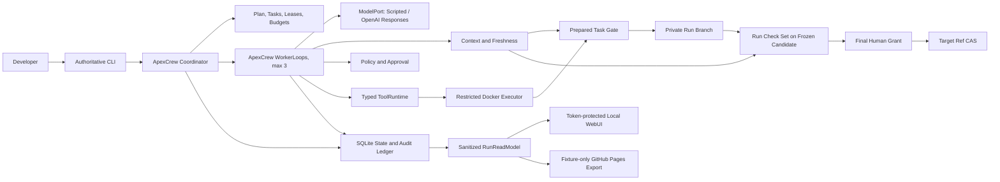

# ApexCrew Specification

> Status: **DRAFT - ALL THREE BRAINSTORMING ROUNDS APPROVED, NOT IMPLEMENTATION-READY**. The user approved Round 3 operations and acceptance requirements on 2026-07-26. Architecture comparison, independent specification review, final written-spec approval, `PLAN.md`, and the independent cold-start review remain required before persistent implementation.

Normative terms such as Task Candidate and Run Candidate follow [CONTEXT.md](CONTEXT.md). `MUST`, `MUST NOT`, `SHOULD`, and `MAY` are used in their ordinary requirements sense.

## 1. Product Definition

ApexCrew is a local-first Coding Agent Harness for one developer delegating one hours-long, cross-module change in one existing Git repository. It coordinates at most three ApexCrew-owned Workers and admits code only when context, objective checks, policy, and human approval apply to the exact revision being advanced.

The primary failure is accepting a handoff or check result produced for an earlier dependency or repository revision. The value hypothesis is falsifiable: revision-bound evidence, dependency-aware invalidation, and mandatory revalidation should prevent stale-evidence admission in a scripted cross-module trajectory where an otherwise-identical freshness-disabled harness fails.

A successful Crew Run leaves the returning developer a frozen Run Candidate, fresh run-wide Evidence Bundle, event timeline, and concise summary. The user target ref is unchanged until one final human approval. ApexCrew never pushes.

## 2. Scope

### 2.1 v0.1 includes

- One local user, process, configured repository, and target ref.
- At most three logical Workers and one bounded, human-approved Plan Revision.
- ApexCrew-owned Coordinator and WorkerLoop using a low-level `ModelPort`.
- Typed repository actions, real objective checks, test-feedback correction, worktree isolation, write leases, and serial private promotion.
- SQLite durability, Git-based snapshots, crash reconciliation, revision-bound approvals, and inspectable events.
- Deterministic offline behavior through `ScriptedMockLLM` and Python plus TypeScript fixture repositories.
- A CLI-only command surface, a read-only local WebUI, a sanitized static public demonstration, and OpenAI Responses API plus `ScriptedMockLLM` adapters behind `ModelPort`.

### 2.2 v0.1 excludes

- Multiple users or repositories, remote execution, more than three Workers, dynamic agent societies, A2A, Kubernetes, a plugin marketplace, and a remotely writable WebUI.
- Arbitrary shell access, symbol-level ownership, vector memory, automatic push/release, and unbounded task creation.
- Codex, Claude Code, Gemini CLI, or a high-level Agent framework as the Coordinator, WorkerLoop, or evidence authority.
- An LLM-as-judge correctness gate or a claim that declared dependencies discover every semantic dependency.
- Target repositories whose required checks cannot run offline in the approved executor image and prepared worktree.

## 3. User Stories

1. **US-01 - Approve bounded work.** As a developer, I want the Coordinator to propose a finite Task DAG with dependencies, write scopes, and checks so that I can approve the exact work before any Worker writes.
2. **US-02 - Leave and resume.** As a developer, I want a Crew Run to continue or recover while I am absent so that ordinary failures do not require continuous supervision.
3. **US-03 - Reject old green evidence.** As a developer, I want a dependency change to invalidate affected context and checks so that a green result from an older revision cannot authorize promotion.
4. **US-04 - Correct from objective feedback.** As a developer, I want a Worker to receive structured failing-check evidence and revise its patch within the approved contract so that a normal red-green loop can complete without a new approval.
5. **US-05 - Inspect before integration.** As a developer, I want a frozen Run Candidate, exact evidence, timeline, and summary so that final approval is informed and bound to what will be integrated.
6. **US-06 - Constrain risky effects.** As a developer, I want hard-denied actions to have zero side effects and risky actions to require a frozen, one-use grant so that a vague confirmation cannot authorize changed work.
7. **US-07 - Recover without guessing.** As a developer, I want restart logic to reconcile observable state and pause on uncertain external effects so that recovery does not duplicate or invent success.

Each story is independently demonstrable with `ScriptedMockLLM`; together they form the primary end-to-end journey rather than seven unrelated product modes.

## 4. Architecture And Module Contracts

| Module | Input | Required behavior | Output | Boundary and errors |
|---|---|---|---|---|
| Coordinator | Developer goal, approved Plan Revision, Run events | Advance ready Tasks, cap Workers at three, issue leases, invalidate affected work, serialize private promotions, enforce stop states | Updated Run/Task state and scheduling decisions | MUST NOT call tools on a Worker's behalf or silently change a Plan, Policy, Budget, or Model Configuration Revision; pauses on unknown change, exhausted budget, conflict, or uncertainty |
| WorkerLoop | Task Contract, current Context Capsule, model configuration | Make one low-level completion, validate one typed `ActionEnvelope`, journal and execute one action, return one structured result, repeat within budget | Worker Attempt events, repository changes, check evidence, or terminal status | MUST NOT schedule Workers, mutate its contract, use an external agent loop, or declare promotion success |
| Budget/Progress | Approved Budget Revision, counters, checkpoints, receipts, lifecycle events | Allocate bounded Task tranches, classify objective progress, warn and stop at deterministic limits | Allocation, warning, pause, or exhaustion decision with reason | MUST NOT accept model self-assessment as progress or exceed a hard ceiling without a new approved Budget Revision |
| Context/Freshness | Current Run Head or target, Plan/Policy/graph revisions, immutable artifacts | Build bounded capsules, compute dependency fingerprints, classify changes, produce Freshness Assessments | Fresh capsule or FRESH/STALE assessment with reasons | Unknown or unclassifiable change requires conservative global invalidation; stale facts MUST NOT enter model input |
| Policy/Approval | Frozen action/candidate, repository and policy state | Return `ALLOW`, `DENY`, or `REQUIRE_APPROVAL`; validate exact, unexpired, unused grants | Policy decision or Grant Validation | Workspace escape and secret-path access are hard denials; invalid grants have zero authorized side effects |
| ToolRuntime | Validated action, active lease, fixed workspace | Perform the named repository read/write/check action through the host Git adapter or restricted executor and capture structured feedback | Action result, digests, bounded redacted output, and observed post-state | No arbitrary shell, host network, Docker socket, secret-bearing environment, or path outside the canonical worktree/write set |
| Verification/Promotion | Candidate change, expected head, current contracts/checks/policy | Prepare an immutable commit, run required checks, assess freshness, then use lock plus CAS | Promoted private Run Head or frozen Run Candidate | A moved head, incomplete Bundle, stale assessment, conflict, or failed check rejects admission without changing the protected target |
| DurableStore | Domain commands and action intents/results | Atomically persist current state plus allowlisted audit events, enforce idempotency keys, and keep restricted transcripts separate | Recoverable projections, chronological events, and quarantined/local artifacts | SQLite is not a transaction with Git or external systems; recovery MUST reconcile those effects; restricted transcripts MUST NOT become admission evidence or public exports |
| Delivery | User commands or sanitized read-model queries | Expose all mutation, approval, credential, pause, and recovery commands through CLI; expose inspection through local/static WebUI | Command result or read-only Run timeline, Tasks, budgets, and evidence views | WebUI MUST NOT mutate Run state or receive credentials; delivery MUST NOT own alternate domain rules |

Provider SDKs, Git, SQLite, Docker, FastAPI, and OS calls remain behind adapters. Domain modules own state transitions and admission rules.

## 5. Domain And Mechanism Design

### 5.1 Mechanism matrix and primary contribution

| Required dimension | v0.1 coded mechanism | Deterministic minimum proof |
|---|---|---|
| Decision | Coordinator state machine plus the one-action WorkerLoop; low-level model output is data, not control flow | `ScriptedMockLLM` emits malformed, failing, correcting, and terminal actions; tests assert exact transitions and stop decisions |
| Tools/actions | Typed read, search, patch, declared-check, risky-action proposal, and finish dispatch with fixed workspace and structured results | Direct dispatcher tests prove schema rejection, lease/write-set enforcement, and result feedback without a real model |
| Memory/context | SQLite-backed immutable facts, Context Capsules, provenance, dependency fingerprints, and Freshness Assessments | Restart and invalidation tests prove current facts survive, stale facts remain audit history, and stale facts never enter a new request |
| Governance | Immutable Policy Revisions, hard denials, Workspace Leases, frozen Approval Grants, Grant Validation, and candidate CAS | Tests prove escape denial has zero side effects, altered/replayed grants fail, overlapping leases do not run, and target drift blocks integration |
| Feedback | Real checks produce Evidence Receipts; failed results feed the next Worker turn; Task/Run gates require current Evidence Bundles | Both fixtures prove red-to-correction behavior and reject old green evidence under an identical freshness-disabled ablation |
| Configuration | Validated repository identity, Plan/Policy revisions, Task Contracts, checks, budgets, provider settings, and delivery settings | Invalid or unknown fields fail closed; serialized configuration can drive the offline end-to-end scenario |

The **feedback/admission dimension** is the mechanism-dense primary contribution: objective results are not merely returned to one Worker, but bound to prospective Git revisions, invalidated through declared dependencies, excluded from stale context, and revalidated at Task and Run admission gates. Decision, memory, and governance support this claim; they are required foundations rather than competing product directions.

The four coding-domain mechanisms are therefore explicit: typed repository actions, deterministic check feedback, code-enforced risky-action interception/HITL, and durable provenance-bearing context. Removing the real LLM leaves each mechanism executable and testable.

### 5.2 Plan, Task Contract, Policy, budget, and lease

A Plan Revision is immutable and contains a finite Task DAG plus an exact Run Check Set. Each Task Contract contains a stable Task ID, dependency Task IDs, declared read/dependency path globs, allowed write path globs, required checks as structured `argv`, supplied constraints, and a Budget Revision reference. The Coordinator may propose checks by inspecting repository and CI configuration, but a Run Check Set becomes authoritative only as part of the approved Plan Revision. Policy and Budget Revisions are independently versioned and human-approved. None of these revisions is edited in place.

The Coordinator schedules only dependency-ready Tasks. Two concurrently active Workspace Leases MUST NOT have potentially overlapping write globs; ambiguous overlap is treated as overlap. A lease binds the Crew Run, Task Contract digest, Worker Attempt, base Run Head, write globs, monotonic generation, issue/expiry times, and status.

A write is authorized only when the lease is `ACTIVE`, unexpired, generation-matched, based on the current admissible Run Head, and the canonical target path remains inside both the configured worktree and allowed write set. Expiry or invalidation during an atomic action does not kill that action. Its observed result is journaled, then the lease becomes unusable and no next write/model action begins.

The default Workspace Lease lifetime is 15 minutes. The Coordinator may renew it only between atomic actions after revalidating the same Attempt, generation, Run Head, contract, and non-overlapping write set; renewal never makes an expired/revoked lease active again. A long check may settle after expiry under the atomic-action rule, but the Attempt then terminates `FAILED` and any retry uses a new Attempt ID and lease generation.

### 5.3 One-action WorkerLoop

For each turn ApexCrew:

1. Builds a current Context Capsule and low-level model request.
2. Requests one schema-constrained completion from `ModelPort`.
3. Rejects malformed output without executing a tool.
4. Validates exactly one typed action against contract, lease, and policy.
5. Persists the action intent, idempotency key, expected pre-state, and policy decision before any side effect.
6. Executes one tool action and persists its structured result and observed post-state.
7. Adds bounded feedback to the next request or enters a terminal/pause state.

The initial typed set is repository read/search, patch application, declared check execution, risky-action proposal, and finish/fail. Git promotion is Coordinator-owned. A completion cannot contain an action batch or launch another autonomous agent loop.

### 5.4 Dependency invalidation and context freshness

The dependency graph version includes Task edges, declared read/write globs, and check definitions. After a private promotion, ApexCrew compares the old and new Run Heads and maps changed paths to graph inputs.

- If every change maps unambiguously, ApexCrew invalidates the affected nodes and downstream closure.
- An unknown path, rename that cannot be classified, graph mismatch, Plan Revision change, or Policy Revision change conservatively invalidates all non-terminal capsules, receipts/candidates at gates, and active affected work; the Run pauses when human confirmation or replanning is required.
- A running affected Attempt lets its current atomic action settle, transitions to terminal `STALE`, releases/revokes its lease, and cannot hand off. A new Attempt starts from the latest Run Head.
- Immutable Evidence Receipts and Context Capsules remain historical records. Freshness Assessment, not record mutation, determines whether each applies now.
- Stale facts and receipts MUST NOT be injected into a Worker context or counted in an Evidence Bundle.
- A Budget Revision change does not make objective repository facts or receipts false. Newly approved lower ceilings apply before the next action and may pause work; raising a ceiling permits allocation but never revives a terminal Attempt or bypasses a freshness gate.

Declared dependencies are an optimization with a conservative fallback. They cannot prove that every semantic dependency was declared, so final run-wide checks are mandatory.

### 5.5 Two-level prepared-commit gates

**Task gate:** under the Run lock, read current Run Head `H`; apply the Worker change in a neutral worktree to create prepared commit `P` whose parent is `H`; run the current Task Contract checks on `P`; reassess all bindings; then CAS the private Run ref from `H` to `P`. A CAS miss or changed contract/check/policy makes the Task Candidate stale and prevents promotion.

**Run gate:** after all Tasks are promoted, read expected user target `T`; materialize the complete Run change as prepared commit `R` against `T`; run the non-optional run-wide acceptance suite on `R`; freeze the Run Candidate and Evidence Bundle; obtain a human Approval Grant bound to `R`, `T`, evidence, plan, and policy digests; revalidate and CAS the target from `T` to `R`. Target movement rejects the operation and requires preparation, checks, and approval again. No step pushes a ref.

### 5.6 Recovery protocol

On restart, an intent without a committed result is reconciled by action class:

- File/patch actions compare expected content/tree digests. Already-achieved post-state is recorded as success; unchanged pre-state may be retried with the same idempotency key; any third state is a conflict.
- Checks may rerun because their repository side effect is non-authoritative; duplicate attempts collapse under the receipt idempotency key.
- Git ref updates compare the recorded old/prepared/current OIDs. Old means retry is possible, prepared means record success, and a third OID means stale/conflict.
- An effect whose outcome cannot be observed reliably enters `INDETERMINATE` and requires human resolution. It is never automatically replayed.

ApexCrew promises recoverable and explainable state, not universal exactly-once execution across external systems.

## 6. State Model

### 6.1 Crew Run

| From | Event/guard | To |
|---|---|---|
| `DRAFT` | Bounded Plan Revision proposed | `AWAITING_PLAN_APPROVAL` |
| `AWAITING_PLAN_APPROVAL` | Exact Plan Revision approved | `ACTIVE` |
| `ACTIVE` | Every Task promoted and no unresolved invalidation | `VERIFYING_RUN` |
| `VERIFYING_RUN` | Frozen Run Candidate has a complete fresh run-wide Bundle | `READY_FOR_APPROVAL` |
| `READY_FOR_APPROVAL` | Exact Grant validates and target still matches | `APPLYING` |
| `APPLYING` | Target equals prepared OID after CAS/reconciliation | `COMPLETED` |
| Any non-terminal safe state | Manual pause, budget exhaustion, unknown change, or required replan | `PAUSED` |
| `PAUSED` | Human resolves cause and all affected gates are rerun | Prior safe active phase, never directly `APPLYING` |
| Any executing state | Unobservable side-effect outcome | `INDETERMINATE` |
| `INDETERMINATE` | Human records resolution | `PAUSED`, a safe active phase, or `FAILED` |
| Any non-terminal state | Unrecoverable failure / human cancellation | `FAILED` / `CANCELLED` |

`COMPLETED`, `FAILED`, and `CANCELLED` are terminal. Recovery may finish recording an already-completed CAS but cannot otherwise leave a terminal state.

### 6.2 Task and Worker Attempt

A Task follows these legal transitions:

| From | Event/guard | To |
|---|---|---|
| `BLOCKED` | Every dependency Task is `PROMOTED` and its inputs are current | `READY` |
| `READY` | Coordinator issues a non-overlapping active lease and creates an Attempt | `ACTIVE` |
| `ACTIVE` | Attempt succeeds and emits a Task Candidate | `CANDIDATE_READY` |
| `ACTIVE` | Attempt fails/stales and immutable contract plus budget permit retry | `READY` with a new Attempt ID |
| `CANDIDATE_READY` | Candidate CAS promotion succeeds | `PROMOTED` |
| `CANDIDATE_READY` | Candidate becomes stale/conflicted and retry remains permitted | `READY` |
| Any non-terminal Task | Budget exhausted / unrecoverable failure / Plan cancellation | `PAUSED` or terminal `FAILED` / `CANCELLED` |

A promoted Task is not silently rewritten. A new Plan Revision that supersedes its contract explicitly creates replacement work and invalidates affected downstream results.

A Worker Attempt follows these legal transitions:

| From | Event/guard | To |
|---|---|---|
| `CREATED` | Valid lease issued | `LEASED` |
| `LEASED` | Current Capsule built and first action authorized | `RUNNING` |
| `RUNNING` | Worker finishes and requests contract verification | `VERIFYING` |
| `VERIFYING` | Worker-branch checks pass and output is complete | `SUCCEEDED` plus a new Task Candidate |
| `LEASED` / `RUNNING` / `VERIFYING` | Deterministic error, invalidation, cancellation, or uncertain side effect | Terminal `FAILED`, `STALE`, `CANCELLED`, or `INDETERMINATE` respectively |

No terminal Attempt resumes. Retry means a new Attempt ID, Context Capsule, and lease generation; `SUCCEEDED` does not itself authorize promotion.

### 6.3 Candidate and lease

A Task Candidate follows:

| From | Event/guard | To |
|---|---|---|
| `PREPARING` | Prepared commit has expected Run Head parent | `VERIFYING` |
| `VERIFYING` | Complete current Task Evidence Bundle passes | `READY` |
| `READY` | Lock acquired and expected Run Head still matches | `PROMOTING` |
| `PROMOTING` | Private ref CAS/reconciliation equals prepared OID | `PROMOTED` |
| Any non-terminal state | Binding changed / checks denied admission / merge or CAS third-state | Terminal `STALE` / `REJECTED` / `CONFLICT` |

A Run Candidate follows:

| From | Event/guard | To |
|---|---|---|
| `PREPARING` | Complete Run change is materialized against expected target | `VERIFYING` |
| `VERIFYING` | Mandatory run-wide Evidence Bundle is complete and fresh | `READY_FOR_APPROVAL` |
| `READY_FOR_APPROVAL` | Exact Grant Validation passes and target still matches | `APPLYING` |
| `APPLYING` | Target CAS/reconciliation equals prepared OID | `INTEGRATED` |
| Any non-terminal state | Binding changed / checks or Grant reject / merge or CAS third-state | Terminal `STALE` / `REJECTED` / `CONFLICT` |

A fresh preparation creates a new candidate rather than mutating a terminal candidate.

A Workspace Lease follows:

| From | Event/guard | To |
|---|---|---|
| `ACTIVE` | Attempt finishes normally | Terminal `RELEASED` |
| `ACTIVE` | Deadline observed at an action boundary | Terminal `EXPIRED` |
| `ACTIVE` | Contract/head invalidation, cancellation, or policy denial | Terminal `REVOKED` |

It never reactivates and its generation is never reused. Recovery may record the already-observed terminal transition but may not extend a lease implicitly.

## 7. Logical Data Model

| Entity | Identity and essential bindings | Relationships |
|---|---|---|
| Crew Run | Run ID, repo instance, target ref/base OID, current Run Head, current Plan/Policy/Budget/Model Configuration revisions, state | Owns Tasks, candidates, approvals, events, and artifacts |
| Plan Revision | Immutable digest, approved DAG, Task Contract digests, Run Check Set digest | One active per Run; supersession invalidates affected work |
| Policy Revision | Immutable digest and approval metadata | Independently versioned; governs actions and grants |
| Budget Revision | Immutable limits, allocation rules, pricing snapshot, and approval metadata | Independently versioned; governs Run and Task allocation without changing Plan structure |
| Model Configuration Revision | Immutable provider/model/request settings and tool-schema digest; excludes credentials | Attempt provenance; changing it stales active Attempts but does not rewrite objective receipts |
| Task Contract | Task ID/revision, dependencies, read/write globs, check definitions, constraints | Belongs to a Plan Revision; has many Attempts |
| Worker Attempt | Attempt ID, Task digest, base Run Head, state, budget counters | Has one Capsule/lease generation and many actions; may emit one candidate |
| Action Record | Action/idempotency ID, intent, expected pre-state, policy decision, result/post-state | Ordered within an Attempt; append-only audit facts |
| Verification Snapshot | Repo instance/object format, prepared commit and expected parent OIDs, plan/task/graph/policy and Execution Fingerprint digests | Subject of receipts and candidates |
| Evidence Receipt | Receipt ID, snapshot/check digests, structured argv, exit/result/output digests, timing | Immutable member of Evidence Bundles |
| Freshness Assessment | Subject digest, assessed head/target and version digests, `FRESH`/`STALE`, reasons | Recomputed at each gate; does not rewrite its subject |
| Task/Run Candidate | Candidate ID, prepared snapshot, change/evidence digests, lifecycle state | Task promotion advances Run Head; Run integration advances target |
| Approval Grant | Grant ID, frozen action/candidate digest, expected target/run, evidence/policy digests, expiry, nonce, consumption | Immutable; checked through separate Grant Validation |
| Workspace Lease | Lease ID/generation, Attempt, base head, write globs, expiry, state | At most one active non-overlapping authorization per write region |
| Audit Event | Monotonic sequence, correlation IDs, event type, allowlisted payload, timestamp | Authoritative chronological input to read projections and sanitized exports |
| Restricted Artifact | Artifact ID, Run/Attempt/Action correlation, redaction/quarantine state, size, retention deadline | Local diagnostic content only; never satisfies an Evidence Bundle |

SQLite stores transactional current-state rows and append-only Audit Events in the same database transaction. Git commit/tree/blob OIDs identify code state. The restricted artifact store contains only redacted local diagnostics. Neither store contains raw model API secrets, and Git branch names or worktree paths are not evidence identity.

## 8. Deterministic Fixtures And Evaluation

### 8.1 Python money-unit drift

At base `PY-C0`, `fee(12000)` returns integer cents. Task B adds receipt formatting that divides by 100 and passes its focused pytest check. Independently, Task A changes `fee()` to return decimal dollars and is promoted first. The changes merge without text conflict, but their combination renders `$0.03` instead of `$3.00`.

The pricing dependency fingerprint change MUST make B's old Capsule/Receipt inadmissible. Refreshing B on the new Run Head MUST expose the deterministic failure; scripted feedback removes the duplicate conversion; a new prepared snapshot and receipt then pass. Replaying the old receipt MUST return a revision/freshness mismatch.

### 8.2 TypeScript timestamp-unit drift

At base `TS-C0`, session expiry uses epoch milliseconds. Task B adds a countdown and passes Vitest. Task A changes the schema/session API to epoch seconds and is promoted first. Both units remain TypeScript `number`, so `tsc --noEmit` and text merge can succeed while the combined countdown returns `0` instead of `60`.

Changing either declared schema/session input MUST invalidate the old Capsule/Receipt. The refreshed Capsule MUST contain seconds and exclude the verified-fact claim for milliseconds. A focused test fails deterministically before scripted correction and passes only under a new snapshot. An unrelated Markdown change MUST NOT trigger targeted `DEPENDENCY_CHANGED`; an unclassifiable change MUST trigger global fallback.

### 8.3 Primary comparison

Run the identical scripted trajectory, actions, fixtures, checks, and budgets twice. The treatment enables revision binding, dependency invalidation, and mandatory revalidation. The ablation disables those rules and trusts the old green task result. The primary measure is stale candidate admission (expected 0 in treatment and at least 1 in ablation), with extra model turns, checks, and elapsed time reported as costs.

## 9. Approved Acceptance Invariants

- Worker-tip green evidence cannot satisfy a gate for a different prepared parent/revision.
- Unknown change triggers global invalidation; classified change invalidates the affected downstream closure.
- Same tree with a different parent or same OID in a different repository instance is rejected.
- Stale Capsule facts never enter the next model request.
- Mandatory context overflow pauses before a provider call; it never silently drops policy, contract, revision, provenance, or latest objective feedback.
- A failed objective check is returned as structured feedback and can drive a bounded correction.
- A hard-denied action has zero side effects; a modified, expired, consumed, or wrong-revision grant does not authorize execution.
- Target drift after checks or approval causes CAS failure and requires a new candidate, Bundle, and Grant.
- Crash after Git ref update but before SQLite result commit reconciles to one promotion/integration.
- Crash after a check but before receipt commit may rerun the check, but the Bundle counts one idempotent receipt.
- Every core acceptance test runs offline with `ScriptedMockLLM`; no LLM judges correctness.
- A Run Candidate is verified only by the exact approved Run Check Set under its bound Execution Fingerprint; Task-check union or CI discovery alone cannot satisfy the Run gate.
- A hard budget ceiling stops new model/tool actions after the current atomic action settles; only an approved Budget Revision may raise it.
- Raw credentials never enter model input, executor environment, Audit Events, restricted artifacts, WebUI responses, or exports.
- The public WebUI contains only sanitized deterministic fixture data and has no command, credential, approval, or repository-execution path.

## 10. Operations, Security, And Delivery

### 10.1 Model provider, provenance, and credentials

The sole real v0.1 adapter uses the OpenAI Responses API with `gpt-5.6-terra`. It implements the same single-completion `ModelPort` interface as `ScriptedMockLLM`; it does not schedule work, call tools, retry semantic errors, or decide correctness. Requests use the approved model settings and typed action schema, set provider-side storage off when the API supports it, and record requested and returned model IDs, response ID, token usage, inference parameters, and tool-schema digest. Codex, Claude Code, Gemini CLI, and agent frameworks remain prohibited in the assessed runtime.

Each request is capped at 32,000 input tokens and 4,096 output tokens in addition to the global token ceilings. Capsule reduction is deterministic: preserve system/policy/schema, Task Contract, current revision/provenance, latest objective feedback, and explicitly required repository facts; discard superseded/redundant optional material before lower-priority fresh context. Stale material is never a truncation candidate because it is excluded earlier. If all mandatory material cannot fit, no model request is sent and the Task pauses with a structured `CONTEXT_OVERFLOW` reason.

Interactive credentials live in the OS keyring under an ApexCrew provider/profile identity. `apexcrew credentials set` uses hidden input; `status` reports only source/presence; `clear` and replacement require explicit CLI commands. The first attempt to select the OpenAI adapter without a credential stops before any request and directs the user through the hidden keyring flow; the Mock demonstration never requires a key. Headless CI MAY supply `APEXCREW_OPENAI_API_KEY` through its secret store; other headless use MUST inject it through a supervisor or secret manager, never an interactive shell command. Environment values remain visible to the trusted host and potentially to same-user processes, so the adapter reads the value only at request time and never forwards it to child processes. Repository `.env` files are deliberately not loaded because the repository and its scripts are untrusted. Credential values MUST NOT be persisted, logged, displayed, sent to a Worker context, or mounted into the executor.

A Model Configuration Revision contains provider, base-origin identity without secrets, requested model, inference settings, and tool-schema digest. Changing it lets the current atomic action settle, makes active Attempts terminal `STALE`, and starts new Attempts with fresh Capsules. It does not invalidate already-promoted code or objective Evidence Receipts whose own bindings remain current.

An Evidence Receipt's Execution Fingerprint includes repository instance and prepared OIDs, check definition digest, executor image digest, platform/architecture, relevant tool versions, environment-allowlist digest, structured `argv`, working directory, and timeout. Any mismatch prevents receipt reuse. Provider identity is provenance for model actions, not proof that a check passed.

### 10.2 Adaptive budget and deterministic stopping

The initial approved Budget Revision has these hard Run ceilings:

| Resource | Ceiling |
|---|---:|
| Cumulative active Run time (human-wait and paused states excluded) | 8 hours |
| Tasks in the approved DAG | 12 |
| Model calls | 240 |
| Input / output tokens | 2,000,000 / 200,000 |
| Worst-case cost reserve | USD 10 |
| Concurrent Workers | 3 |

The pricing snapshot uses the 2026-07-26 standard `gpt-5.6-terra` rates observed during design: USD 2.50 per million input tokens and USD 15 per million output tokens. The token ceilings therefore reserve USD 8 without assuming cached-input discounts and leave USD 2 headroom. Before every real call, ApexCrew reserves projected worst-case cost; missing usage/pricing data, exhausted reserve, or increased provider pricing pauses the Run before another call. Changing any ceiling or pricing snapshot requires a new human-approved Budget Revision.

Each Task receives a 16-call bootstrap as two eight-call tranches. After bootstrap, another eight calls are allocated only when the immediately preceding tranche shows objective progress. Progress means a strictly larger fresh-pass set, a strictly smaller failure set with no regression, or deterministic lifecycle advance to `VERIFYING`/`CANDIDATE_READY`; model self-report is never progress. A Task is limited to 48 calls, five Attempts, and three stale refreshes. During bootstrap, two consecutive no-progress tranches pause the Task; after bootstrap, one no-progress tranche denies renewal and pauses it. Two identical `tree_oid + check-set digest` checkpoints or three repeated identical invalid actions likewise pause the Task. An invalid action still fails its current Attempt, but automatic rescheduling cannot bypass the Task pause.

At 80 percent of any global ceiling ApexCrew emits a warning. At 100 percent the current atomic action settles and is journaled, then no new model/tool action starts and the affected Task or Run enters `PAUSED`. Ordinary actions time out after two minutes, declared checks after ten minutes, and transient provider failures receive at most two retries with recorded backoff. Every actual provider request, including a retry, consumes one call; reported usage consumes token/cost budgets, and missing usage conservatively consumes the pre-call reservation. A declared-check timeout produces structured infrastructure uncertainty, cannot produce a passing Receipt, and may retry only within budget. An ordinary action whose external outcome cannot be observed becomes `INDETERMINATE`; ApexCrew never converts timeout or uncertainty into semantic failure or success.

### 10.3 Threat model, action policy, and containment

Protected assets are host credentials, files outside the configured repository, the user target ref/history, approved Plan/Policy/Budget revisions and Grants, and Evidence/Audit integrity. Repository text, model output, dependency scripts, and check output are untrusted. The single operator, host OS, ApexCrew control plane, Docker daemon, OS keyring, and TLS implementation are trusted. A compromised host/kernel/Docker daemon, a malicious same-user local process, availability attacks beyond the hard resource ceilings, and provider confidentiality for content deliberately sent to it are explicit non-goals.

The control plane, Git/worktree adapter, SQLite, keyring, and approvals run on the trusted host. Repository commands run only in an ephemeral Linux container pinned by image digest, as non-root, with a read-only root filesystem, a default maximum of two CPUs, 2 GiB memory, 256 PIDs, a 512 MiB temporary scratch area, dropped capabilities, `no-new-privileges`, `network=none`, no Docker socket, and no host credentials. The host adapter materializes the exact action or Verification Snapshot without `.git`, ignored/untracked files, or known secret paths; only that snapshot is mounted read-only as input. The executor copies it into bounded temporary storage, runs the command there, and discards all command-created files, so a repository script cannot mutate the host worktree or another Worker. The executor resource profile belongs to the Policy Revision; changing it requires approval and cannot exceed host-configured administrative caps. The host passes a minimal allowlisted environment. Git ref operations are Coordinator-owned typed host operations, never repository commands.

Plan validation rejects any Task or Run check that needs network access, a shell string, an executable absent from the pinned image, an unpinned dependency installation, or more writable scratch space than the approved profile. v0.1 therefore supports only repositories whose approved checks can run offline from a disposable copy of the prepared worktree and the executor image. Adding dependencies means building and approving a new image digest outside the Crew Run; a Worker cannot install them from the network.

The default Policy Revision classifies actions as follows:

| Decision | Default action classes |
|---|---|
| `ALLOW` | Repository read/search; create or update regular files inside the active lease/write set; execute an exact approved Task or Run check in the restricted executor; finish/fail |
| `REQUIRE_APPROVAL` | Delete or rename tracked files; create symlinks; change executable bits; modify `.github/workflows/**` or `.gitlab-ci.yml`; final target-ref CAS |
| `DENY` | Canonical path/write-set escape; `.git/**`, `.apexcrew/**`, or known secret paths; raw shell; host process/network access; Docker socket/privileged mounts; push; reset/clean/force; any target-ref mutation outside the final Coordinator gate |

Every approval freezes the typed action, expected pre-state, Run/Task, applicable revisions, expiry, and nonce. Grants expire after ten minutes by default; a different lifetime requires the approved Policy Revision and may not exceed 30 minutes in v0.1. Grant Validation occurs immediately before the effect and consumes the Grant once. Modified, expired, consumed, wrong-revision, or wrong-target Grants authorize zero side effects. Each in-scope threat MUST map to a preventive control plus a deterministic negative or fault-injection test; human approval is not accepted as a substitute for containment.

### 10.4 Audit, redaction, retention, and export

The Tier 1 Audit Ledger is the authoritative, append-only, allowlisted event stream. Each event has a monotonic sequence, UTC timestamp, Run/Task/Attempt/Action correlation IDs, applicable revision IDs, event/result class, digests, timing, and budget deltas. Free text is excluded unless a field is explicitly bounded and redacted. A declared-check result may include a bounded redacted failure excerpt as an explicitly untrusted Tier 1 field so the next Worker turn receives objective feedback; quarantine replaces the excerpt with a structured reason. The CLI, local WebUI, Run read model, Evidence Bundle inspection, and exports read only Tier 1.

Tier 2 Restricted Transcripts MAY store locally redacted prompts/responses, diffs, and bounded stdout/stderr for diagnosis. Before persistence, the redactor replaces all credential values known from keyring/environment and scans for common token, private-key, and credential patterns. Unparseable or suspicious content becomes `QUARANTINED`, exposes only metadata/digests, and cannot enter an Evidence Bundle. Stored prompt and response previews are each capped at 128 KiB, diffs at 256 KiB, and stdout/stderr at 64 KiB each while preserving original byte length and content digest.

Tier 1 remains until an exact Run ID is explicitly purged through a confirming CLI command. Each Tier 2 payload expires 30 days after persistence regardless of Run state, and content has a hard 1 GiB per-repository cap. Before accepting content that would cross the cap, ApexCrew removes expired payloads and then the oldest terminal-Run artifacts; if that is insufficient, it persists only metadata, length, digest, and a `DROPPED_BY_RETENTION` reason for the new artifact. Non-expired active-Run content is not deleted merely to admit newer diagnostics, so Tier 2 remains bounded and best-effort. No remote telemetry, analytics, or crash reporting is enabled in v0.1. A sanitized export contains Tier 1 plus specifically allowlisted evidence previews; Tier 2 and quarantined content are always excluded.

### 10.5 User surfaces, design workflow, distribution, and CI

The CLI is the only command interface. It owns doctor/configuration, credential lifecycle, Plan/Policy/Budget approval, Run start/status/inspect/pause/resume, risky-action Grant, `INDETERMINATE` resolution, final integration, purge, local UI start, and demo export. Approval commands show the exact action or Candidate, target/pre-state, revisions, evidence digest, expiry, and a short confirmation code; a generic yes/no prompt is insufficient.

The local WebUI is read-only and displays Run timeline, Workers/Tasks, budgets, Evidence Bundles, policy decisions, and pause/indeterminate reasons through a sanitized `RunReadModel`. It binds only to `127.0.0.1`; startup emits a one-use bootstrap URL, valid for 60 seconds, that establishes an `HttpOnly`, `SameSite=Strict` session valid until server exit or eight hours. v0.1 refuses non-loopback binding. Credentials and mutation endpoints do not exist. FastAPI serves server-rendered Jinja2 templates and minimal framework-independent assets; the same read model and renderer generate static pages.

The public URL is a GitHub Pages site built in CI from deterministic `ScriptedMockLLM` fixture records. It is clearly labeled as a sanitized recorded run, contains no backend or real repository/model data, and replays the ordered Audit Ledger through the same `RunReadModel`. Users can play/pause, step, scrub by event sequence, filter by Worker/Task, and inspect the projected state and evidence at the selected event; none of these controls starts, approves, or executes work.

Open Design is a development-time design workbench only. The workflow is pinned for reproducibility to `open-design-v0.16.1` at commit `276b4d8e970bc143d7ad060181a89a834e3d9caf`. The selected design system is a custom import named **ApexCrew Operational**, authored with the catalogued `design-md` skill; Neutral Modern is a reference, not copied source. The initial prototype uses the `dashboard` template/skill with realistic Run data, followed by the `design-review` skill and before/after screenshots. Any later approved change to information architecture, design tokens, or represented Run states repeats that prototype/review gate; copy edits and defect fixes do not. Generated HTML is disposable: implementation manually transfers approved information architecture and original tokens into the shared Jinja renderer. ApexCrew maintains `DESIGN.md`, page briefs, screenshots, and critique records. Open Design, its daemon, agent CLIs, generated source, and private workspace packages are not runtime or CI dependencies. Any copied upstream asset requires Apache-2.0 attribution and source pinning.

The supported host matrix is Windows 11 x86_64 with Docker Desktop and Ubuntu 24.04 x86_64 with Docker Engine. macOS and non-x86_64 hosts are unsupported in v0.1. The CLI targets Python 3.12 and package-manager installation through a versioned wheel, with `uv tool install apexcrew==0.1.0` as the release command. The separate Linux executor image contains the pinned Python and Node 24 fixture tools and is published to GHCR by immutable version and digest; ApexCrew resolves the configured tag to the expected digest before use. Required host prerequisites are Python 3.12, Git 2.43 or newer, a responsive compatible Docker daemon, and keyring support. `apexcrew doctor` fails closed with actionable remediation when they are absent.

Python 3.12 was selected for one typed cross-platform host implementation, mature Git/process/keyring libraries, deterministic pytest tooling, and wheel distribution. Pydantic validates untrusted typed actions at ingress; stdlib SQLite provides single-process transactions and recovery without another service; Git OIDs provide the exact revision identity the main mechanism needs. FastAPI plus Jinja2 keeps one server/static renderer and avoids a second SPA state model. The low-level OpenAI Responses adapter supplies structured single completions and usage metadata without importing an agent loop, while `gpt-5.6-terra` is the budget-aligned general coding choice behind a provider-independent `ModelPort`. The wheel plus digest-pinned GHCR image matches the trusted-host/restricted-Linux-executor split; `uv` supplies reproducible Python installation and locking.

GitHub Actions runs on every push: `quality` (format/lint/type/docs), offline `unit` on Ubuntu and Windows, full Docker/security/fixture `integration` on Ubuntu, distribution `build`, sanitized `pages`, and release-only GHCR/wheel publication. Windows performance is reported but is not a release gate. The course compatibility `.gitlab-ci.yml` contains a job named exactly `unit-test` invoking the same offline suite. CI never calls a real model. Releases and Pages deploy only from protected/tagged revisions after all required jobs pass.

### 10.6 Non-functional acceptance thresholds

Performance gates use a GitHub-hosted `ubuntu-24.04` reference runner and a deterministic maximum-shape sample with 12 Tasks, 240 model calls, and 10,000 Audit Events:

- warmed `status` and `inspect` commands: p95 at or below 750 ms;
- cold restart through recovered state and rebuilt read model: at or below 3 seconds, excluding external check reruns;
- offline core suite: at or below 90 seconds; all required pull-request CI: at or below 10 minutes wall-clock from the first job start through required completion, including executor image pulls;
- local WebUI first response: p95 at or below 1 second; compressed static demonstration assets: at or below 2 MiB.

From a supported machine where `apexcrew doctor` passes, the README path to the deterministic MockLLM demonstration MUST take at most ten minutes. CLI errors identify the failed invariant and a safe next action. The WebUI meets WCAG 2.2 AA, scores at least 95 in Lighthouse Accessibility, is fully keyboard navigable, does not rely on color alone, and passes Playwright checks at 360 and 1440 CSS pixels without overlap or clipped controls.

## 11. Objective Acceptance, Schedule, And Risks

### 11.1 Acceptance matrix

| Capability | Required objective evidence |
|---|---|
| Bounded planning | Scripted proposal is rejected before exact Plan/Policy/Budget approval; approved DAG has no more than 12 Tasks and all contracts/checks are immutable |
| Feedback correction | A real fixture check fails, its structured result reaches the next scripted turn, the next action changes, and only a new fresh green Receipt permits admission |
| Freshness contribution | Python and TypeScript treatment runs admit zero stale candidates; the identical freshness-disabled ablation admits at least one, with extra calls/checks/time reported |
| Work isolation | Overlapping write leases never run concurrently; path, symlink, secret, and container-escape attempts have zero prohibited side effects |
| Human governance | Altered, replayed, expired, consumed, or wrong-revision Grants fail; an approved risky action executes once; final target CAS still requires a separate exact Grant |
| Recovery | Fault injection before/after file effects, check completion, SQLite commit, private CAS, and target CAS reconciles without false success or duplicate authoritative effect; uncertainty enters `INDETERMINATE` |
| Run gate | Exact Run Check Set passes on the frozen prepared commit and produces a complete fresh Bundle; failed checks reject and infrastructure uncertainty does not pass |
| Provider/credentials | Offline suite uses no network; an opt-in real-provider smoke proves the low-level adapter; set/status/update/clear never exposes the key in output, DB, transcript, executor, or export |
| Audit and replay | Tier 2 preview and repository caps hold under oversized/active-Run inputs; exports exclude restricted/quarantined content; static play, pause, step, scrub, filter, and reload preserve event order and match the recorded `RunReadModel` at each selected sequence |
| Delivery | Wheel and pinned executor build; fresh supported-host walkthrough passes; GitHub and required GitLab jobs are green within the section 10.6 bounds; public Pages URL exposes only the sanitized read-only fixture replay |
| Non-functional | Performance, ten-minute onboarding, accessibility, responsive-layout, secret-scan, and artifact-size gates in section 10.6 pass |

### 11.2 Delivery timebox

The course deadline is treated as 2026-08-10 23:59 Asia/Shanghai because only the date was supplied. At 25 hours per week from 2026-07-26, the available implementation and delivery budget is approximately 53 hours:

| Workstream | Timebox |
|---|---:|
| Final specification and TDD planning gates | 3 h |
| Scaffold and one-action loop | 8 h |
| Evidence, freshness, coordination, and prepared gates | 18 h |
| Security, approval, and recovery | 8 h |
| Read-only UI, static demo, and distribution | 8 h |
| Evaluation, documentation, and contingency | 8 h |

Optional weak-oracle/challenger experiments, provider breadth, writable WebUI, macOS/ARM, hosted backend, and full Open Design integration are cut before any required workstream or contingency is consumed.

### 11.3 Risks and remaining external inputs

| Risk/input | Handling |
|---|---|
| Declared dependencies miss semantic coupling | Conservative unknown-change invalidation plus mandatory final Run Check Set; the residual limitation is stated, not hidden |
| Malicious code escapes a container/runtime defect | Digest-pinned least-privilege container and no secrets/network/socket reduce impact; Docker/host compromise remains out of scope |
| Redaction misses an unknown secret form | Allowlisted Tier 1, exact known-secret replacement, pattern scanning, quarantine, no Tier 2 export, and negative tests; universal detection is not claimed |
| Windows mount/path semantics diverge from Linux CI | Windows path/Git suite plus a documented local Docker smoke; Ubuntu remains the performance/reference executor |
| Provider availability, quota, model ID, or pricing changes | Offline core remains authoritative; real calls pause closed; user supplies a credential and confirms current quota/pricing during the provider slice |
| Static public demo is mistaken for a live agent | Persistent labeling, fixture provenance, README architecture, and separate local live instructions; no claim of public execution |
| Deadline pressure | Preserve core mechanism, deterministic fixtures, safety, CI, and course artifacts; cut only the optional items listed above |
| External publication setup | GitHub Pages/GHCR and optional package trusted publishing need repository-owner enablement; NJU/GitLab remote remains deferred but is required before final course submission |

No credential value is needed for planning or offline core work. The next design gates are implementation-architecture comparison, independent specification review, and final written-spec approval. Only then may `writing-plans` create `PLAN.md`; implementation remains prohibited until the subsequent independent cold-start review closes blocking ambiguity.
