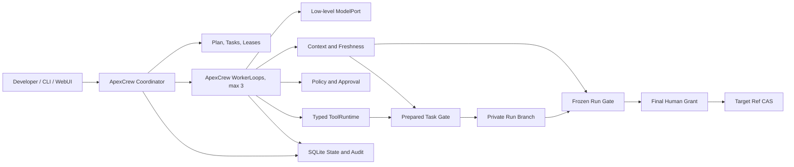

# ApexCrew Specification

> Status: **DRAFT - NOT IMPLEMENTATION-READY**. The user approved the Round 1 problem/scenario design and the Round 2 mechanism/state design on 2026-07-26. Round 3 operations and acceptance requirements, final written-spec approval, `PLAN.md`, and the independent cold-start review are still required before persistent implementation.

Normative terms such as Task Candidate and Run Candidate follow [CONTEXT.md](CONTEXT.md). `MUST`, `MUST NOT`, `SHOULD`, and `MAY` are used in their ordinary requirements sense.

## 1. Product Definition

ApexCrew is a local-first Coding Agent Harness for one developer delegating one hours-long, cross-module change in one existing Git repository. It coordinates at most three ApexCrew-owned Workers and admits code only when context, objective checks, policy, and human approval apply to the exact revision being advanced.

The primary failure is accepting a handoff or check result produced for an earlier dependency or repository revision. The value hypothesis is falsifiable: revision-bound evidence, dependency-aware invalidation, and mandatory revalidation should prevent stale-evidence admission in a scripted cross-module trajectory where an otherwise-identical freshness-disabled harness fails.

A successful Crew Run leaves the returning developer a frozen Run Candidate, fresh run-wide Evidence Bundle, event timeline, and concise summary. The user target ref is unchanged until one final human approval. ApexCrew never pushes.

## 2. Scope

### 2.1 v0.1 includes

- One local user, process, configured repository, and target ref.
- At most three logical Workers and one bounded, human-approved Plan Revision.
- ApexCrew-owned Coordinator and WorkerLoop using a low-level `ModelPort`.
- Typed repository actions, real objective checks, test-feedback correction, worktree isolation, write leases, and serial private promotion.
- SQLite durability, Git-based snapshots, crash reconciliation, revision-bound approvals, and inspectable events.
- Deterministic offline behavior through `ScriptedMockLLM` and Python plus TypeScript fixture repositories.
- A required local WebUI and one real low-level model adapter, whose exact operational choices remain Round 3 work.

### 2.2 v0.1 excludes

- Multiple users or repositories, remote execution, more than three Workers, dynamic agent societies, A2A, Kubernetes, and a plugin marketplace.
- Arbitrary shell access, symbol-level ownership, vector memory, automatic push/release, and unbounded task creation.
- Codex, Claude Code, Gemini CLI, or a high-level Agent framework as the Coordinator, WorkerLoop, or evidence authority.
- An LLM-as-judge correctness gate or a claim that declared dependencies discover every semantic dependency.

## 3. User Stories

1. **US-01 - Approve bounded work.** As a developer, I want the Coordinator to propose a finite Task DAG with dependencies, write scopes, and checks so that I can approve the exact work before any Worker writes.
2. **US-02 - Leave and resume.** As a developer, I want a Crew Run to continue or recover while I am absent so that ordinary failures do not require continuous supervision.
3. **US-03 - Reject old green evidence.** As a developer, I want a dependency change to invalidate affected context and checks so that a green result from an older revision cannot authorize promotion.
4. **US-04 - Correct from objective feedback.** As a developer, I want a Worker to receive structured failing-check evidence and revise its patch within the approved contract so that a normal red-green loop can complete without a new approval.
5. **US-05 - Inspect before integration.** As a developer, I want a frozen Run Candidate, exact evidence, timeline, and summary so that final approval is informed and bound to what will be integrated.
6. **US-06 - Constrain risky effects.** As a developer, I want hard-denied actions to have zero side effects and risky actions to require a frozen, one-use grant so that a vague confirmation cannot authorize changed work.
7. **US-07 - Recover without guessing.** As a developer, I want restart logic to reconcile observable state and pause on uncertain external effects so that recovery does not duplicate or invent success.

Each story is independently demonstrable with `ScriptedMockLLM`; together they form the primary end-to-end journey rather than seven unrelated product modes.

## 4. Architecture And Module Contracts

| Module | Input | Required behavior | Output | Boundary and errors |
|---|---|---|---|---|
| Coordinator | Developer goal, approved Plan Revision, Run events | Advance ready Tasks, cap Workers at three, issue leases, invalidate affected work, serialize private promotions, enforce stop states | Updated Run/Task state and scheduling decisions | MUST NOT call tools on a Worker's behalf or silently change a Plan/Policy Revision; pauses on unknown change, exhausted budget, conflict, or uncertainty |
| WorkerLoop | Task Contract, current Context Capsule, model configuration | Make one low-level completion, validate one typed `ActionEnvelope`, journal and execute one action, return one structured result, repeat within budget | Worker Attempt events, repository changes, check evidence, or terminal status | MUST NOT schedule Workers, mutate its contract, use an external agent loop, or declare promotion success |
| Context/Freshness | Current Run Head or target, Plan/Policy/graph revisions, immutable artifacts | Build bounded capsules, compute dependency fingerprints, classify changes, produce Freshness Assessments | Fresh capsule or FRESH/STALE assessment with reasons | Unknown or unclassifiable change requires conservative global invalidation; stale facts MUST NOT enter model input |
| Policy/Approval | Frozen action/candidate, repository and policy state | Return `ALLOW`, `DENY`, or `REQUIRE_APPROVAL`; validate exact, unexpired, unused grants | Policy decision or Grant Validation | Workspace escape and secret-path access are hard denials; invalid grants have zero authorized side effects |
| ToolRuntime | Validated action, active lease, fixed workspace | Perform the named repository read/write/check action and capture structured feedback | Action result, digests, bounded output, and observed post-state | No arbitrary shell; execution containment, environment filtering, and redaction are finalized in Round 3 |
| Verification/Promotion | Candidate change, expected head, current contracts/checks/policy | Prepare an immutable commit, run required checks, assess freshness, then use lock plus CAS | Promoted private Run Head or frozen Run Candidate | A moved head, incomplete Bundle, stale assessment, conflict, or failed check rejects admission without changing the protected target |
| DurableStore | Domain commands and action intents/results | Atomically persist current state plus append-only audit events and enforce idempotency keys | Recoverable projections and chronological events | SQLite is not a transaction with Git or external systems; recovery MUST reconcile those effects |
| Delivery | User commands and read models | Expose the same harness operations through CLI and local WebUI | Plan review, run status, evidence inspection, approval actions | Round 3 defines auth, credential entry, redaction, usability, and distribution; delivery MUST NOT own alternate domain rules |

Provider SDKs, Git, SQLite, Docker, FastAPI, and OS calls remain behind adapters. The domain core owns state transitions and admission rules.

## 5. Domain And Mechanism Design

### 5.1 Mechanism matrix and primary contribution

| Required dimension | v0.1 coded mechanism | Deterministic minimum proof |
|---|---|---|
| Decision | Coordinator state machine plus the one-action WorkerLoop; low-level model output is data, not control flow | `ScriptedMockLLM` emits malformed, failing, correcting, and terminal actions; tests assert exact transitions and stop decisions |
| Tools/actions | Typed read, search, patch, declared-check, risky-action proposal, and finish dispatch with fixed workspace and structured results | Direct dispatcher tests prove schema rejection, lease/write-set enforcement, and result feedback without a real model |
| Memory/context | SQLite-backed immutable facts, Context Capsules, provenance, dependency fingerprints, and Freshness Assessments | Restart and invalidation tests prove current facts survive, stale facts remain audit history, and stale facts never enter a new request |
| Governance | Immutable Policy Revisions, hard denials, Workspace Leases, frozen Approval Grants, Grant Validation, and candidate CAS | Tests prove escape denial has zero side effects, altered/replayed grants fail, overlapping leases do not run, and target drift blocks integration |
| Feedback | Real checks produce Evidence Receipts; failed results feed the next Worker turn; Task/Run gates require current Evidence Bundles | Both fixtures prove red-to-correction behavior and reject old green evidence under an identical freshness-disabled ablation |
| Configuration | Validated repository identity, Plan/Policy revisions, Task Contracts, checks, budgets, provider settings, and delivery settings | Invalid or unknown fields fail closed; serialized configuration can drive the offline end-to-end scenario |

The **feedback/admission dimension** is the mechanism-dense primary contribution: objective results are not merely returned to one Worker, but bound to prospective Git revisions, invalidated through declared dependencies, excluded from stale context, and revalidated at Task and Run admission gates. Decision, memory, and governance support this claim; they are required foundations rather than competing product directions.

The four coding-domain mechanisms are therefore explicit: typed repository actions, deterministic check feedback, code-enforced risky-action interception/HITL, and durable provenance-bearing context. Removing the real LLM leaves each mechanism executable and testable.

### 5.2 Plan, Task Contract, Policy, and lease

A Plan Revision is immutable and contains a finite Task DAG. Each Task Contract contains a stable Task ID, dependency Task IDs, declared read/dependency path globs, allowed write path globs, required checks as structured `argv`, supplied constraints, and budget references. A Policy Revision is separate from the Plan Revision. Changing either creates a new immutable revision and requires the applicable human approval; neither is edited in place.

The Coordinator schedules only dependency-ready Tasks. Two concurrently active Workspace Leases MUST NOT have potentially overlapping write globs; ambiguous overlap is treated as overlap. A lease binds the Crew Run, Task Contract digest, Worker Attempt, base Run Head, write globs, monotonic generation, issue/expiry times, and status.

A write is authorized only when the lease is `ACTIVE`, unexpired, generation-matched, based on the current admissible Run Head, and the canonical target path remains inside both the configured worktree and allowed write set. Expiry or invalidation during an atomic action does not kill that action. Its observed result is journaled, then the lease becomes unusable and no next write/model action begins.

### 5.3 One-action WorkerLoop

For each turn ApexCrew:

1. Builds a current Context Capsule and low-level model request.
2. Requests one schema-constrained completion from `ModelPort`.
3. Rejects malformed output without executing a tool.
4. Validates exactly one typed action against contract, lease, and policy.
5. Persists the action intent, idempotency key, expected pre-state, and policy decision before any side effect.
6. Executes one tool action and persists its structured result and observed post-state.
7. Adds bounded feedback to the next request or enters a terminal/pause state.

The initial typed set is repository read/search, patch application, declared check execution, risky-action proposal, and finish/fail. Git promotion is Coordinator-owned. A completion cannot contain an action batch or launch another autonomous agent loop.

### 5.4 Dependency invalidation and context freshness

The dependency graph version includes Task edges, declared read/write globs, and check definitions. After a private promotion, ApexCrew compares the old and new Run Heads and maps changed paths to graph inputs.

- If every change maps unambiguously, ApexCrew invalidates the affected nodes and downstream closure.
- An unknown path, rename that cannot be classified, graph mismatch, Plan Revision change, or Policy Revision change conservatively invalidates all non-terminal capsules, receipts/candidates at gates, and active affected work; the Run pauses when human confirmation or replanning is required.
- A running affected Attempt lets its current atomic action settle, transitions to terminal `STALE`, releases/revokes its lease, and cannot hand off. A new Attempt starts from the latest Run Head.
- Immutable Evidence Receipts and Context Capsules remain historical records. Freshness Assessment, not record mutation, determines whether each applies now.
- Stale facts and receipts MUST NOT be injected into a Worker context or counted in an Evidence Bundle.

Declared dependencies are an optimization with a conservative fallback. They cannot prove that every semantic dependency was declared, so final run-wide checks are mandatory.

### 5.5 Two-level prepared-commit gates

**Task gate:** under the Run lock, read current Run Head `H`; apply the Worker change in a neutral worktree to create prepared commit `P` whose parent is `H`; run the current Task Contract checks on `P`; reassess all bindings; then CAS the private Run ref from `H` to `P`. A CAS miss or changed contract/check/policy makes the Task Candidate stale and prevents promotion.

**Run gate:** after all Tasks are promoted, read expected user target `T`; materialize the complete Run change as prepared commit `R` against `T`; run the non-optional run-wide acceptance suite on `R`; freeze the Run Candidate and Evidence Bundle; obtain a human Approval Grant bound to `R`, `T`, evidence, plan, and policy digests; revalidate and CAS the target from `T` to `R`. Target movement rejects the operation and requires preparation, checks, and approval again. No step pushes a ref.

### 5.6 Recovery protocol

On restart, an intent without a committed result is reconciled by action class:

- File/patch actions compare expected content/tree digests. Already-achieved post-state is recorded as success; unchanged pre-state may be retried with the same idempotency key; any third state is a conflict.
- Checks may rerun because their repository side effect is non-authoritative; duplicate attempts collapse under the receipt idempotency key.
- Git ref updates compare the recorded old/prepared/current OIDs. Old means retry is possible, prepared means record success, and a third OID means stale/conflict.
- An effect whose outcome cannot be observed reliably enters `INDETERMINATE` and requires human resolution. It is never automatically replayed.

ApexCrew promises recoverable and explainable state, not universal exactly-once execution across external systems.

## 6. State Model

### 6.1 Crew Run

| From | Event/guard | To |
|---|---|---|
| `DRAFT` | Bounded Plan Revision proposed | `AWAITING_PLAN_APPROVAL` |
| `AWAITING_PLAN_APPROVAL` | Exact Plan Revision approved | `ACTIVE` |
| `ACTIVE` | Every Task promoted and no unresolved invalidation | `VERIFYING_RUN` |
| `VERIFYING_RUN` | Frozen Run Candidate has a complete fresh run-wide Bundle | `READY_FOR_APPROVAL` |
| `READY_FOR_APPROVAL` | Exact Grant validates and target still matches | `APPLYING` |
| `APPLYING` | Target equals prepared OID after CAS/reconciliation | `COMPLETED` |
| Any non-terminal safe state | Manual pause, budget exhaustion, unknown change, or required replan | `PAUSED` |
| `PAUSED` | Human resolves cause and all affected gates are rerun | Prior safe active phase, never directly `APPLYING` |
| Any executing state | Unobservable side-effect outcome | `INDETERMINATE` |
| `INDETERMINATE` | Human records resolution | `PAUSED`, a safe active phase, or `FAILED` |
| Any non-terminal state | Unrecoverable failure / human cancellation | `FAILED` / `CANCELLED` |

`COMPLETED`, `FAILED`, and `CANCELLED` are terminal. Recovery may finish recording an already-completed CAS but cannot otherwise leave a terminal state.

### 6.2 Task and Worker Attempt

A Task follows these legal transitions:

| From | Event/guard | To |
|---|---|---|
| `BLOCKED` | Every dependency Task is `PROMOTED` and its inputs are current | `READY` |
| `READY` | Coordinator issues a non-overlapping active lease and creates an Attempt | `ACTIVE` |
| `ACTIVE` | Attempt succeeds and emits a Task Candidate | `CANDIDATE_READY` |
| `ACTIVE` | Attempt fails/stales and immutable contract plus budget permit retry | `READY` with a new Attempt ID |
| `CANDIDATE_READY` | Candidate CAS promotion succeeds | `PROMOTED` |
| `CANDIDATE_READY` | Candidate becomes stale/conflicted and retry remains permitted | `READY` |
| Any non-terminal Task | Budget exhausted / unrecoverable failure / Plan cancellation | `PAUSED` or terminal `FAILED` / `CANCELLED` |

A promoted Task is not silently rewritten. A new Plan Revision that supersedes its contract explicitly creates replacement work and invalidates affected downstream results.

A Worker Attempt follows these legal transitions:

| From | Event/guard | To |
|---|---|---|
| `CREATED` | Valid lease issued | `LEASED` |
| `LEASED` | Current Capsule built and first action authorized | `RUNNING` |
| `RUNNING` | Worker finishes and requests contract verification | `VERIFYING` |
| `VERIFYING` | Worker-branch checks pass and output is complete | `SUCCEEDED` plus a new Task Candidate |
| `LEASED` / `RUNNING` / `VERIFYING` | Deterministic error, invalidation, cancellation, or uncertain side effect | Terminal `FAILED`, `STALE`, `CANCELLED`, or `INDETERMINATE` respectively |

No terminal Attempt resumes. Retry means a new Attempt ID, Context Capsule, and lease generation; `SUCCEEDED` does not itself authorize promotion.

### 6.3 Candidate and lease

A Task Candidate follows:

| From | Event/guard | To |
|---|---|---|
| `PREPARING` | Prepared commit has expected Run Head parent | `VERIFYING` |
| `VERIFYING` | Complete current Task Evidence Bundle passes | `READY` |
| `READY` | Lock acquired and expected Run Head still matches | `PROMOTING` |
| `PROMOTING` | Private ref CAS/reconciliation equals prepared OID | `PROMOTED` |
| Any non-terminal state | Binding changed / checks denied admission / merge or CAS third-state | Terminal `STALE` / `REJECTED` / `CONFLICT` |

A Run Candidate follows:

| From | Event/guard | To |
|---|---|---|
| `PREPARING` | Complete Run change is materialized against expected target | `VERIFYING` |
| `VERIFYING` | Mandatory run-wide Evidence Bundle is complete and fresh | `READY_FOR_APPROVAL` |
| `READY_FOR_APPROVAL` | Exact Grant Validation passes and target still matches | `APPLYING` |
| `APPLYING` | Target CAS/reconciliation equals prepared OID | `INTEGRATED` |
| Any non-terminal state | Binding changed / checks or Grant reject / merge or CAS third-state | Terminal `STALE` / `REJECTED` / `CONFLICT` |

A fresh preparation creates a new candidate rather than mutating a terminal candidate.

A Workspace Lease follows:

| From | Event/guard | To |
|---|---|---|
| `ACTIVE` | Attempt finishes normally | Terminal `RELEASED` |
| `ACTIVE` | Deadline observed at an action boundary | Terminal `EXPIRED` |
| `ACTIVE` | Contract/head invalidation, cancellation, or policy denial | Terminal `REVOKED` |

It never reactivates and its generation is never reused. Recovery may record the already-observed terminal transition but may not extend a lease implicitly.

## 7. Logical Data Model

| Entity | Identity and essential bindings | Relationships |
|---|---|---|
| Crew Run | Run ID, repo instance, target ref/base OID, current Run Head, current Plan/Policy revisions, state | Owns Tasks, candidates, approvals, and events |
| Plan Revision | Immutable digest, approved DAG, Task Contract digests | One active per Run; supersession invalidates affected work |
| Policy Revision | Immutable digest and approval metadata | Independently versioned; governs actions and grants |
| Task Contract | Task ID/revision, dependencies, read/write globs, check definitions, constraints | Belongs to a Plan Revision; has many Attempts |
| Worker Attempt | Attempt ID, Task digest, base Run Head, state, budget counters | Has one Capsule/lease generation and many actions; may emit one candidate |
| Action Record | Action/idempotency ID, intent, expected pre-state, policy decision, result/post-state | Ordered within an Attempt; append-only audit facts |
| Verification Snapshot | Repo instance/object format, prepared commit and expected parent OIDs, plan/task/graph/policy/environment digests | Subject of receipts and candidates |
| Evidence Receipt | Receipt ID, snapshot/check digests, structured argv, exit/result/output digests, timing | Immutable member of Evidence Bundles |
| Freshness Assessment | Subject digest, assessed head/target and version digests, `FRESH`/`STALE`, reasons | Recomputed at each gate; does not rewrite its subject |
| Task/Run Candidate | Candidate ID, prepared snapshot, change/evidence digests, lifecycle state | Task promotion advances Run Head; Run integration advances target |
| Approval Grant | Grant ID, frozen action/candidate digest, expected target/run, evidence/policy digests, expiry, nonce, consumption | Immutable; checked through separate Grant Validation |
| Workspace Lease | Lease ID/generation, Attempt, base head, write globs, expiry, state | At most one active non-overlapping authorization per write region |

SQLite stores transactional current-state rows and append-only audit events in the same database transaction. Git commit/tree/blob OIDs identify code state. SQLite never stores raw model API secrets, and Git branch names or worktree paths are not evidence identity.

## 8. Deterministic Fixtures And Evaluation

### 8.1 Python money-unit drift

At base `PY-C0`, `fee(12000)` returns integer cents. Task B adds receipt formatting that divides by 100 and passes its focused pytest check. Independently, Task A changes `fee()` to return decimal dollars and is promoted first. The changes merge without text conflict, but their combination renders `$0.03` instead of `$3.00`.

The pricing dependency fingerprint change MUST make B's old Capsule/Receipt inadmissible. Refreshing B on the new Run Head MUST expose the deterministic failure; scripted feedback removes the duplicate conversion; a new prepared snapshot and receipt then pass. Replaying the old receipt MUST return a revision/freshness mismatch.

### 8.2 TypeScript timestamp-unit drift

At base `TS-C0`, session expiry uses epoch milliseconds. Task B adds a countdown and passes Vitest. Task A changes the schema/session API to epoch seconds and is promoted first. Both units remain TypeScript `number`, so `tsc --noEmit` and text merge can succeed while the combined countdown returns `0` instead of `60`.

Changing either declared schema/session input MUST invalidate the old Capsule/Receipt. The refreshed Capsule MUST contain seconds and exclude the verified-fact claim for milliseconds. A focused test fails deterministically before scripted correction and passes only under a new snapshot. An unrelated Markdown change MUST NOT trigger targeted `DEPENDENCY_CHANGED`; an unclassifiable change MUST trigger global fallback.

### 8.3 Primary comparison

Run the identical scripted trajectory, actions, fixtures, checks, and budgets twice. The treatment enables revision binding, dependency invalidation, and mandatory revalidation. The ablation disables those rules and trusts the old green task result. The primary measure is stale candidate admission (expected 0 in treatment and at least 1 in ablation), with extra model turns, checks, and elapsed time reported as costs.

## 9. Approved Acceptance Invariants

- Worker-tip green evidence cannot satisfy a gate for a different prepared parent/revision.
- Unknown change triggers global invalidation; classified change invalidates the affected downstream closure.
- Same tree with a different parent or same OID in a different repository instance is rejected.
- Stale Capsule facts never enter the next model request.
- A failed objective check is returned as structured feedback and can drive a bounded correction.
- A hard-denied action has zero side effects; a modified, expired, consumed, or wrong-revision grant does not authorize execution.
- Target drift after checks or approval causes CAS failure and requires a new candidate, Bundle, and Grant.
- Crash after Git ref update but before SQLite result commit reconciles to one promotion/integration.
- Crash after a check but before receipt commit may rerun the check, but the Bundle counts one idempotent receipt.
- Every core acceptance test runs offline with `ScriptedMockLLM`; no LLM judges correctness.

## 10. Round 3 Requirements Still Open

The following are deliberately unresolved, not implicit implementation freedom:

- Real LLM provider/model, API contract details, credentials, quotas, and environment fingerprint policy.
- Step/turn/token/time/retry/spend budgets and timeout/escalation defaults.
- Command containment, network policy, secret lifecycle, output redaction, threat actors, and residual-risk wording.
- WebUI approval and inspection flows, accessibility/usability targets, CLI parity, and authentication assumptions.
- Windows development support, Linux/Docker distribution target, install/start commands, and CI requirements.
- Structured observability schema, retention/export, performance targets, run-wide command matrix, and final acceptance thresholds.

Round 3 must resolve these items, update this file, and receive explicit user approval. The complete written specification then receives a separate final sign-off before `writing-plans` may begin.
