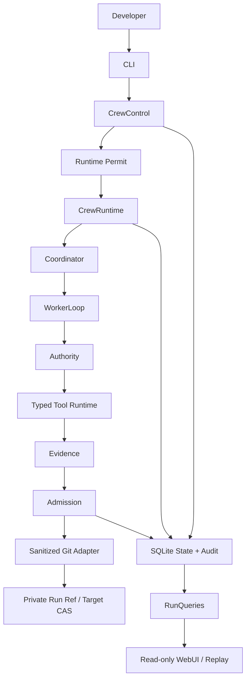

# Harness 与系统边界

## 目标

解释 ApexCrew 为什么是 Coding Agent Harness，而不是仅仅把 prompt、模型和几个工具函数串起来的 Agent demo。本文回答一个核心问题：**模型、用户、Harness、Git 和执行器分别拥有什么能力，谁不能越权？**

## 范围与非目标

v0.1 面向一个开发者、一个本地 Git 仓库和最多三个 ApexCrew Worker。系统协调受限的代码修改，不提供多租户 SaaS、任意远端仓库、任意 shell、任意容器或无限 Agent 集群。

Harness 的目标不是让模型“更聪明”，而是让模型产生的建议只能沿受控路径变成副作用：

```text
goal -> scoped context -> structured model action -> authority decision
     -> durable intent -> typed tool effect -> objective evidence
     -> freshness/admission -> typed Git CAS
```

模型从不直接拥有文件系统、Git ref、Docker、网络、Grant 或 Runtime Permit。它只返回受 schema 限制的动作候选。

## 角色与所有权

| 角色/模块 | 拥有 | 明确不拥有 |
| --- | --- | --- |
| 用户 | 目标、revision 审批、风险动作确认、外部发布决定 | 直接修改内部状态机或绕过命令校验 |
| CLI | 将用户输入转换为类型化命令，组合三个公共接口 | 自行规划、执行 Worker 或修改 Git ref |
| `CrewControl` | 校验命令、写审计、签发一次性 Runtime Permit | 模型循环、工具执行、查询渲染 |
| `CrewRuntime` | 消费 Permit、取得 Run ownership、恢复和驱动阶段 | 自行签发 authority、提供 public step/tick API |
| Coordinator | 规划、Task 依赖、调度、创建 Attempt | 直接写目标 ref、执行任意工具、批准自身动作 |
| WorkerLoop | 一轮模型调用、动作解析、工具反馈 | 调度其他 Worker、宣布最终 Git 集成成功 |
| Authority | Policy、预算、deadline、lease、Grant 判定 | Git/文件副作用、模型判断替代客观检查 |
| Admission | Evidence/Freshness、候选准备、CAS 意图 | provider prompting、CLI approval、任意 shell |
| Adapters | SQLite、Git、Docker、凭据、provider 的受限 I/O | 产品规则、排程、绕过 admission |
| `RunQueries` / WebUI | 脱敏状态投影 | 命令、凭据、模型、Git 或 Runtime |

这种 ownership 分配让关键安全顺序只存在于一个内部模块中。例如，Worker 可以生成 patch，但只有 Authority 可以授权 patch，只有 Admission 可以把经验证的 patch 转成 Git candidate，只有 Git adapter 可以执行 Admission 签发的 typed CAS。

## 系统形状



## 核心不变量

1. 用户命令和 Runtime 执行分开；被接受的命令不等于 Runtime 可以在任意时刻执行。
2. Runtime 必须先取得每 Run ownership，再消费当前 Permit；并发调用不会驱动第二个执行循环。
3. 模型动作必须经结构化解析和 Authority，不会直接映射成 shell 文本或 Git ref 更新。
4. Evidence 必须与候选和 revision 绑定；历史成功结果不能自动证明当前树。
5. Worker 工作区不等于 Target Reservation；Worker 永远不能把目标 ref 当作可写工作目录。
6. 不可观测的外部效果保持 `INDETERMINATE`，不通过默认重试制造虚假成功。

## 源码映射

| 概念 | 源码入口 |
| --- | --- |
| 三个公共接口 | `src/apexcrew/application/__init__.py` |
| 命令控制 | `src/apexcrew/application/control.py` |
| Permit-gated Runtime | `src/apexcrew/application/runtime.py` |
| 应用 composition | `src/apexcrew/application/composition.py` |
| 规划与调度 | `src/apexcrew/domain/coordination.py` |
| Worker loop | `src/apexcrew/domain/worker.py` |
| 权限 | `src/apexcrew/domain/authority.py`、`policy.py` |
| 准入和候选 | `src/apexcrew/domain/admission.py`、`candidate.py` |
| 持久状态 | `src/apexcrew/adapters/state/sqlite.py` |

## 测试映射

- `tests/acceptance/test_application_interfaces.py`：公共接口和交付表面。
- `tests/integration/test_composed_runtime_lifecycle.py`：composition 后的 Runtime 生命周期。
- `tests/contract/test_composition.py`：public bundle 与 adapter graph。
- `tests/contract/test_state_store.py`：持久状态契约。

## 当前状态边界

上述 ownership 是已批准架构。M1-M4 baseline 中有 REAL、SKELETON、STUB 深度差异；R4.3 正在把真实 workspace、patch、candidate 和最终 CAS 闭环逐步补齐。阅读本文时，应以 `PLAN.md` 当前 ledger 判断某个机制是已审查实现、正在实现还是 Planned R4.3。

下一篇：[Control、Runtime 与 Query](02-control-runtime-query.md)。
