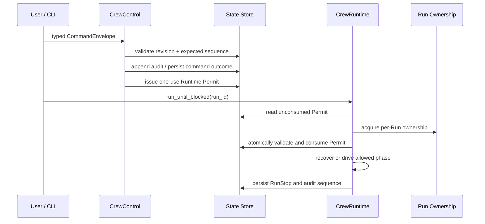

# Control、Runtime 与 Query

## 目标

ApexCrew 的 Run-facing API 只有三个接口：`CrewControl.handle`、`CrewRuntime.run_until_blocked` 和 `RunQueries.get`。本文说明这个不对称设计如何阻止调用者绕过授权顺序。

## 公共接口契约

| 接口 | 输入 | 输出 | 可以做什么 | 不能做什么 |
| --- | --- | --- | --- | --- |
| `CrewControl.handle` | `CommandEnvelope` | `CommandOutcome` | 校验和持久化人类命令，签发内部 Permit 或 Pending Action | 执行模型、工具、Git 候选或查询渲染 |
| `CrewRuntime.run_until_blocked` | `RunId` | `RunStop` | 消费 current Permit，恢复/驱动到下一阻塞点 | self-issue Permit、暴露任意 `step()` |
| `RunQueries.get` | `RunId`、可选 audit sequence | `RunReadModel` | 返回 sequence-consistent 的脱敏投影 | 修改 Run、读取凭据、发起模型请求 |

接口定义位于 `src/apexcrew/application/__init__.py`，实际控制服务在 `application/control.py`，Runtime 在 `application/runtime.py`，查询服务在 `application/queries.py`。

## 源码映射

| 责任 | 源码入口 |
| --- | --- |
| 公共 Protocol | `src/apexcrew/application/__init__.py` |
| Control command boundary | `src/apexcrew/application/control.py` |
| Permit-gated Runtime / recovery | `src/apexcrew/application/runtime.py` |
| Query projection service | `src/apexcrew/application/queries.py` |
| Command/Permit documents | `src/apexcrew/domain/commands.py` |
| Runtime state persistence | `src/apexcrew/adapters/state/sqlite.py` |
| CLI and Web delivery | `src/apexcrew/delivery/cli.py`、`delivery/web.py` |

## 控制到执行的生命周期

Permit 是内部 capability，而非 CLI token。它至少绑定 Run、允许 phase、适用 revision、generation 和预期序列；Runtime 没有 Permit 时返回 `NO_RUNTIME_PERMIT`，存在第二个 owner 时返回 `ALREADY_RUNNING`。

## 为什么 Command 与 Runtime 分开

如果 `approve` 命令直接调用 Coordinator 或 Worker，会出现三个问题：

1. 命令重放可以重复驱动副作用。
2. 命令校验到实际运行之间发生 revision/状态变化时，旧输入仍可能继续执行。
3. Web、测试或其他调用者更容易绕过“先持久化 authority，再执行”的顺序。

把命令处理和 Runtime 分离后，Control 只产生一次性、持久化、可审计的执行资格；Runtime 只接受状态库中当前可消费的资格。

## Runtime 的恢复优先级

`RuntimeService.run_until_blocked` 的真实入口先读取 state 和 unconsumed Permit，再取得 ownership 和消费 Permit。消费后，内部顺序大体为：

1. 如果存在已释放但未下游结算的 model action，恢复该动作。
2. 如果存在未结算 Grant action，先恢复该动作。
3. 如果 Permit 是 terminal administration，驱动精确 cleanup phase。
4. 执行通用 effect recovery；存在人工 resolution barrier 时停止为 `INDETERMINATE`。
5. 如果存在可恢复的 committed model turn，根据 durable binding 恢复。
6. 没有恢复工作时，驱动当前 Permit 允许的 planning、scheduling、integration 或 cleanup phase。

任何未捕获边界异常都会被记录为 Runtime fault，并根据 barrier 分类成 `PAUSED` 或 `INDETERMINATE`；最后无论正常停止还是分类故障，都会持久化 `RunStop`。

完整解释见 [Runtime 与恢复伪代码](pseudocode/02-runtime-recovery.md)。

## Query-only 投影

`RunQueries` 是 delivery 层唯一允许依赖的 Run 读取接口。CLI 的 `show`、loopback WebUI 和静态 replay 只读取 sanitized `RunReadModel`。这意味着 WebUI 没有 `CrewControl`、`CrewRuntime`、provider credential、Git adapter 或 executor 的对象图入口，而不只是“前端没有显示按钮”。

## Stop 语义

| Stop 类别 | 代表含义 | 常见后续动作 |
| --- | --- | --- |
| `NO_RUNTIME_PERMIT` | 当前没有可消费的执行 authority | 用户通过 Control 走合法下一步 |
| `ALREADY_RUNNING` | 另一个 Runtime 已取得 ownership | 等待当前 owner 返回 |
| `AWAITING_PLAN_APPROVAL` | Plan proposal 等待精确批准 | 使用 `approve-plan` |
| `AWAITING_ACTION_APPROVAL` | 高风险 action 等待 Grant | 检查 Pending Action 并使用 `grant` |
| `AWAITING_FINAL_APPROVAL` | Run Candidate 等待最终集成批准 | 预览/提交 `integrate` |
| `PAUSED` | 可诊断停止，但不自动假设外部效果未发生 | 查看状态或执行受控恢复 |
| `INDETERMINATE` | 外部效果不可权威确认 | 人工 resolution 或专用恢复，禁止盲重试 |

## 测试映射

- `tests/integration/test_runtime_permits.py`：Permit 生命周期和 replay。
- `tests/integration/test_runtime_lock_lifecycle.py`：每 Run ownership。
- `tests/integration/test_composed_runtime_lifecycle.py`：composition 下的控制/运行路径。
- `tests/unit/test_replay_web.py`：只读 replay/Web 投影。
- `tests/unit/test_cli.py`：CLI 将命令映射到 public surface。

## 当前状态边界

Runtime Permit 和 public-interface 分离已经在源码中存在。最终 candidate/integration 的完整行为仍受 R4.3 任务 ledger 约束；本文不把当前计划中的 candidate/CAS 目标描述为当前主分支已完成行为。

下一篇：[Coordinator 与 WorkerLoop](03-coordinator-worker-loop.md)。
