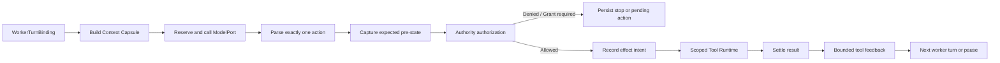

# Coordinator 与 WorkerLoop

## 目标

说明 ApexCrew 如何把“生成一段模型输出”变成一个可恢复、可授权、可反馈的工作循环。Coordinator 负责计划和调度，WorkerLoop 只执行一个 Attempt 的一轮工作；两者不能互相承担对方的 authority。

## Coordinator 的职责

`CoordinatorService` 位于 `src/apexcrew/domain/coordination.py`。它有两种相关但不同的工作：

| 阶段 | 输入 | 主要工作 | 输出 |
| --- | --- | --- | --- |
| Planning | 当前 revision、允许的 planning context、ModelPort | 构造受限请求、持久化 model intent、解析/验证 Plan proposal | 需要批准的 Plan 或可诊断暂停 |
| Scheduling | 已批准 Task graph、Task state、依赖、预算 | 选择一个 dispatchable Task，创建 Attempt/lease，调用 Worker | 一个 `RuntimeDecision` |

Coordinator 不执行 patch/check，不签发 Grant，不更新 target ref，也不把模型文字当作 Plan 成功。Planning 失败、context 超限、模型结果不符合 schema 时，它返回可解释的 pause/invalid decision。

## WorkerLoop 的职责

`WorkerLoopService` 位于 `src/apexcrew/domain/worker.py`。一轮 worker turn 的目标是把一个已绑定的 Attempt 推进到下一次 `RuntimeDecision`，而不是无限循环到“模型说完成”。

## WorkerTurnBinding 为什么重要

Worker 不能仅凭 `task_id` 工作。其 durable binding 包含 Run、Task、Attempt、tranche、lease generation、admissible head、目标安全 digest、credential profile 和 revision 相关信息。每一轮根据这个 binding：

- 构造与 scope/依赖绑定的 Context Capsule。
- 计算 budget reservation 和 deadline。
- 将 model response 绑定到一个 logical turn。
- 对 action 捕获 expected pre-state。
- 以 binding 的 lease、head 和 target safety 进行 authority 判断。

这样，同一个 task 在 head、scope、lease 或 policy 已变化时，旧 Worker 不能把旧上下文的动作写入新状态。

## 结构化反馈循环

模型的第一轮不需要知道工具结果；从第二轮起，`worker_request_with_feedback` 将上一轮的 sanitized tool result 附到模型请求中。反馈是系统事实，而不是模型反思文本：例如 check 的 exit/status、受控错误代码或 patch result。模型可据此从 `check` 转向 `patch`，但仍要重新经历 lease、policy、Grant 和 pre-state 验证。

R4.3-00 的目标是将 demo 的 feedback 行为也建立在真实 WorkerLoop/Tool Runtime 路径上，而不是手写一段假 trace。该任务在顺序 R4.3 分支完成审查；当前 checkout 的未提交文件不自动继承这项完成证据。

## 不能通过模型输出绕过的分支

| 输入情况 | WorkerLoop 行为 |
| --- | --- |
| 模型结果不完整或无 action | 返回 pause/结果状态，不凭空生成工具动作 |
| action schema 不合法 | 记录 malformed action，停止或等待下一授权路径 |
| pre-state 无法捕获 | 不执行工具效果 |
| lease 已过期或 generation 不匹配 | 拒绝，不写 workspace |
| action 需要 Grant | 创建 Pending Action，等待用户精确批准 |
| tool 结果不可确定 | 持久化可恢复状态，不把结果伪装成成功 |
| check 失败 | 形成受限反馈，不自动宣称 task 完成 |

## 源码与测试映射

| 行为 | 源码 | 测试入口 |
| --- | --- | --- |
| Planning request / proposal | `domain/coordination.py` | `tests/integration/test_planning_authorization.py` |
| 调度和 Attempt 创建 | `CoordinatorService.schedule` | `tests/unit/domain/test_planning_loop.py` |
| 一轮 Worker | `WorkerLoopService.run_turn` | `tests/unit/domain/test_worker_loop.py` |
| feedback | `worker_request_with_feedback`、`bounded_worker_feedback` | `tests/integration/test_worker_feedback.py` |
| tool action 验证 | `domain/tools.py`、`domain/worker.py` | `tests/unit/domain/test_tool_validation.py` |
| 组合后的 loop | `application/composition.py` | `tests/integration/test_composed_runtime_lifecycle.py` |

## 当前状态边界

Coordinator/WorkerLoop 的 durable baseline 存在，但 R4.3 正在完成真实 workspace materialization、patch executor、restricted Docker composition、Task Candidate 和 Run Candidate 的最终闭环。不要把 Worker 能产生结构化 action 误称为完整“自动修复并集成”能力。

详细控制流见 [Worker Turn 伪代码](pseudocode/03-worker-turn.md)。
