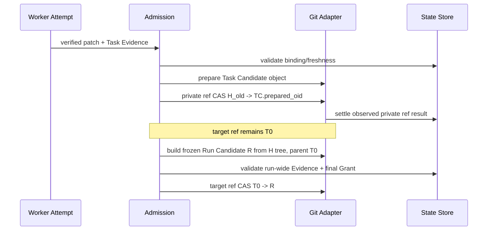

# Git Candidate、私有 Run Head 与 CAS

## 目标

说明 ApexCrew 如何让 Worker 在不直接修改目标分支的前提下准备代码变更，并且让最终目标 ref 最多通过一个受 Grant 约束的 compare-and-swap 更新一次。

## 为什么 Git 是高风险边界

Git ref 更新看似简单，但它会遇到：

- 目标分支在 worker/check 期间被用户或其他进程移动。
- 多个 Task 的修改需要先私有组合，不能逐 Task 发布到目标。
- Worker workspace 可能不是正确 target base，甚至可能被攻击性 repository metadata 路由。
- 进程在 ref 更新前后崩溃，重试必须先观察当前 OID。

因此，ApexCrew 将 Git object preparation、私有候选推进和最终 target CAS 拆成不同阶段。

## 对象模型

```text
T0 = Run 创建时 pinned 的 target ref OID
H  = refs/apexcrew/runs/<run-id> 上的 private Run Head
TC = 一个 Task 的 prepared/verified Task Candidate
R  = 从完整 H tree 构造、first parent == T0 的 frozen Run Candidate
```

目标 ref 在 `R` 通过最终 Gate 前保持为 `T0`。Worker 只能操作 Attempt workspace；Target Reservation 是受锁保护的 no-checkout 证据，不能作为 Worker workspace。

## 目标流程



## Task Candidate 与 Run Candidate 的差别

| 属性 | Task Candidate | Run Candidate |
| --- | --- | --- |
| 覆盖范围 | 一个 Attempt/Task | 整个 Run |
| parent | 当前 private Run Head | pinned target `T0` |
| 可更新的 ref | 仅私有 `refs/apexcrew/runs/<run-id>` | 最终 target ref |
| 需要的 evidence | Task evidence/freshness | 全部 Task + run-wide evidence/freshness |
| 能否消费 final Grant | 否 | 是 |

把两者混为同一对象会让单 Task 的绿色结果越过 run-wide checks 或使私有多提交 history 直接成为目标 ref。

## CAS 的语义

最终集成不是“检查 target 没变，然后 `git update-ref`”。它是携带 expected old OID 的单个 typed effect：

```text
if target_ref == T0:
    target_ref = R
else:
    conflict; do not overwrite another change
```

CAS 只能解决 target head 移动竞态；它不替代 Grant、Evidence、Freshness、Plan validation 或 Target Reservation。Admission 必须先证明确切 candidate 可以被集成，Git adapter 才执行这个封闭请求。

## Git containment

Git adapter 使用封闭 operation types 和结构化 argv，而不是让模型拼接 shell。preflight 拒绝未知 linked worktree、config include、sparse/split index、graft、shallow/partial history、alternates 和外部 Git storage 等 v0.1 不支持形态。对象/ref 读取与写入仍需经 no-follow 和 repository identity 校验。

## 当前状态边界：Observed 与 Planned

baseline 已有 target reservation、typed target CAS、candidate/freshness 概念和对应测试。R4.3-04/05 定义真实 Task Candidate preparation、private promotion、Run Candidate freeze 和最终 CAS 的完整闭环。R4.3-04 的本地实现提交为 `0019165`，R4.3-05 的本地实现提交为 `be9f48d`；两者都仍待独立 review 和 ledger closeout。因此本篇对象流程可以作为已观测的任务工作树行为阅读，但不能写成当前 root、`main` 或 release 的已完成流程。详见 [v0.1 闭环状态](10-v0.1-closure-status.md)。

## 源码与测试映射

| 行为 | 源码 | 测试 |
| --- | --- | --- |
| target reservation/preflight | `adapters/repository/git.py` | `tests/integration/test_target_reservation.py`、`test_git_preflight.py` |
| target CAS | `adapters/repository/target_cas.py` | `tests/unit/adapters/test_target_cas.py` |
| candidate document | `domain/candidate.py`、`domain/admission.py` | `tests/unit/domain/test_candidate.py` |
| Grant finalization | `application/runtime.py`、`domain/authority.py` | `tests/integration/test_grant_consumption.py` |
| R4.3 candidate target | `PLAN.md` R4.3-04/05 | task-branch integration tests |

详细流程见 [Git Candidate 与 Final CAS 伪代码](pseudocode/05-git-final-cas.md)。
