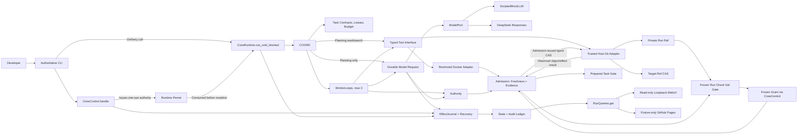

# System Overview

> Historical high-level architecture map, originally updated 2026-07-27 after final written-spec sign-off. The signed `SPEC.md` owns normative behavior. Source, tests, `PLAN.md`, and `AGENT_LOG.md` now provide implementation evidence; use the [Architecture Guide index](README.md) for the current source-mapped explanation and task-status boundary.

## Scope

ApexCrew coordinates one developer goal in one local Git repository with at most three logical Workers. The approved A-Hybrid shape exposes a small command/runtime/query surface while keeping Coordinator, WorkerLoop, Admission, Authority, recovery, and projection as internal deep modules. DeepSeek Responses or `ScriptedMockLLM` returns one low-level completion at a time and never controls tools, approval, scheduling, budgets, or stop conditions. The host control plane is trusted; repository commands are not.

## Responsibilities

| Area | Owns | Must not own |
|---|---|---|
| `CrewControl` | Exact idempotent human commands, one-use Runtime Permit issuance, and typed outcomes | Autonomous model/tool loop, reusable continuation authority, or read-model rendering |
| `CrewRuntime` | Permit-gated recovery followed by Coordinator planning or Coordinator/WorkerLoop execution until an external wait or terminal state | Public tick/step control, self-issued authority, or silent revision changes |
| `RunQueries` | Sequence-consistent sanitized Tier 1 projections or the minimal purge-tombstone variant | Mutation, credentials, Grants/nonces, Tier 2, or quarantined content |
| Coordinator | Bounded read-only Plan proposal, DAG progress, leases, handoff, invalidation, and scheduling serial promotion | Candidate preparation/CAS, Worker tool actions, provider adapter behavior, or arbitrary shell policy |
| WorkerLoop | Context assembly, one model call, structured action parsing, tool feedback, stop decisions | Scheduling other Workers or declaring its own integration success |
| Admission | Exclusive candidate validation/preparation, Verification Snapshots, freshness, Evidence Bundles, prepared gates, and typed private/target CAS issuance | Provider prompting, scheduling, CLI authority, or bypass of a required check/Grant |
| Authority | Policy, Approval Grants, budgets, and lease authorization | Repository side effects or model judgment as authority/progress |
| EffectJournal | Model/tool/ref intent-result durability, reservations, idempotency, Audit Events, recovery classification | Guessing an unobservable result or treating SQLite as a transaction with Git/provider/Docker |
| Adapters | Sanitized Git object/ref effects, restricted commands, persistence, credentials, model completion | Product policy, scheduling, candidate preparation, or admission decisions |
| Delivery | CLI composition and Web/static rendering over the three Run interfaces plus auxiliary bootstrap flows with no Run/repository/model effects | Coordinating internal domain modules or creating alternate rules |

## Non-Negotiable Invariants

1. A Task Candidate may advance the private Run ref only when checks pass on its prepared commit, its Evidence Bundle is fresh, and every promotion-hazard predecessor is already promoted; a waiting Candidate becomes stale when such a predecessor changes its inputs.
2. A Run pins a direct local target branch before planning; v0.1 rejects pre-existing linked-worktree entries, then requires its Target Reservation to remain the sole entry and the target to stay out of the main worktree. Movement, checkout, or registration drift pauses globally, and recovery never replays a CAS into a newly checked-out branch.
3. A Worker reads, searches, checks, and writes only inside approved Task scopes. A Workspace Lease remains admissible across a later Run Head only when every intervening delta is classified outside its read/dependency/write/check sensitivity scope.
4. A risky action executes only when Grant consumption and its exact intent are persisted together. Pause/cancel before consumption invalidates approval-waiting work; an invalid Grant never destroys a still-fresh Candidate.
5. Every model request has a durable pre-dispatch intent and worst-case budget reservation. Unknown outcome enters `INDETERMINATE`; an unapproved returned-model ID is charged but never released to a loop.
6. Restart reconciles a recorded action intent with observable state before retrying. Closed human resolution selects a guarded strategy and cannot assert evidence, CAS success, or admission.
7. Evidence Receipts and Context Capsules remain immutable; a separate Freshness Assessment decides whether they and Task/Run Candidates may be used at a gate or injected into model context.
8. The complete core remains deterministic under `ScriptedMockLLM` and requires no network.
9. Repository-provided commands run only in the digest-pinned restricted executor. The host Git adapter uses non-extensible plumbing plus the closed Target Reservation worktree forms over bound storage; non-Git preflight rejects config includes, sparse/split index, graft/shallow state, and malformed worktree registrations, while raw reachability disables acceleration metadata and hooks, filters, alternates, lazy fetch, or symlink/reparse routes cannot execute or hide history.
10. Coordinator schedules promotion, Admission alone validates/prepares/issues CAS, the Git adapter executes the typed request, and CLI only submits the human command.
11. Plan and Policy freeze at `ACTIVE`; fixed hard denials, host caps, unsupported symlinks, and the effective Secret Path Set cannot be relaxed by a revision.
12. Hard resource ceilings and objective no-progress rules stop new actions without relying on model judgment.
13. Audit authority is allowlisted Tier 1 data. Restricted transcripts never satisfy a gate or enter WebUI/public exports; publication scans the tracked tree and full reachable history for secrets.
14. One Run-owned locked Target Reservation is reused across pre-activation retries; journaled unlock/revalidate/remove cleanup must settle before terminal-only purge, which is exact, tombstone-backed, crash-idempotent, and never invokes Git or reuses a Run ID.
15. Runtime mutation requires a current one-use Permit; direct runtime calls and old accepted-command replays have zero mutation after consumption.
16. The local WebUI is token-protected and loopback-only; the public site contains sanitized deterministic fixture records only, and a purged Run exposes only its minimal tombstone projection.

## Accepted Seams

- `CrewControl.handle`, `CrewRuntime.run_until_blocked`, and `RunQueries.get` are the only Run-facing application interfaces. CLI may use all three; control/runtime composition crosses an internal one-use Runtime Permit, while Web/static delivery receives only `RunQueries`. Doctor/configuration/credential/UI-server bootstrap flows cannot mutate Run or repository state or dispatch model/tool effects.
- `ModelPort` is a true external seam with deterministic scripted and DeepSeek adapters.
- Repository command execution is a containment seam with restricted Docker and test-fake adapters; Git object/ref work stays in a sanitized host adapter, and only Admission may issue its ref effects.
- Durable state is exercised through one domain-facing transaction/event interface with SQLite and in-memory test adapters.
- Clocks/IDs, keyring, and other local-substitutable dependencies remain internal seams; pure rules and state machines receive no speculative adapter.

The A-Hybrid comparison deliberately combines the minimal kernel's small external surface with the dual-reactor design's internal locality. It rejects a giant `execute/read` implementation, a public interface for every rule helper, and a continuation-token façade that could leak command authority into read projections. Acceptance fixtures remain separate Python and TypeScript repositories. The final sentence in the earlier map, which said that source directories would not yet be created, applied to the pre-implementation Stage 4 gate and is now historical; source and tests exist under `src/` and `tests/`.
