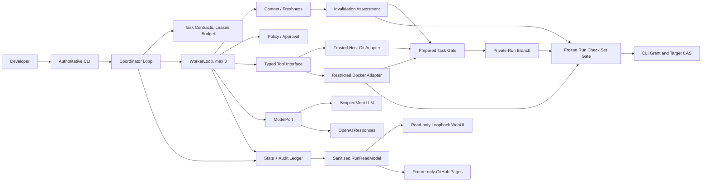

# System Overview

> Architecture companion, updated 2026-07-26 after Round 3 approval. This map explains accepted seams; the draft `SPEC.md` owns normative behavior and remains gated by architecture comparison, independent review, final sign-off, planning, and cold-start review.

## Scope

ApexCrew coordinates one developer goal in one local Git repository with at most three logical Workers. The product owns both decision loops. OpenAI Responses or `ScriptedMockLLM` returns one low-level completion at a time and never controls tools, approval, scheduling, budgets, or stop conditions. The host control plane is trusted; repository commands are not.

## Responsibilities

| Area | Owns | Must not own |
|---|---|---|
| Coordinator | DAG progress, leases, handoff, invalidation, serial integration, pause/resume | Model-provider behavior or arbitrary shell policy |
| WorkerLoop | Context assembly, one model call, structured action parsing, tool feedback, stop decisions | Scheduling other Workers or declaring its own integration success |
| Budget/progress | Hard ceilings, tranche allocation, objective progress, deterministic stop decisions | Model self-assessment or silent limit increases |
| Domain modules | Contracts, revisions, evidence, approvals, state transitions, invariants | Git, SQLite, provider SDK, FastAPI, Docker, or OS calls |
| Adapters | Git/worktrees, restricted commands, persistence, credentials, model completion | Product policy and admission decisions |
| Delivery | CLI commands and sanitized read-model rendering | WebUI mutation/credential paths or alternate domain rules |

## Non-Negotiable Invariants

1. A Task Candidate may advance the private Run Branch only when checks pass on its prepared commit and its Evidence Bundle is fresh for the current Run Head, Plan Revision, dependencies, checks, and policy.
2. A Run Candidate may update the user target only after run-wide checks pass on its frozen prepared commit and a single-use Approval Grant binds that commit and the expected target OID; target movement makes the candidate stale and causes Grant Validation to fail.
3. A Worker writes only through an active Workspace Lease inside the configured repository.
4. A risky action executes only under an unmodified, unexpired, one-use Approval Grant; hard denials never reach the executor.
5. Restart reconciles a recorded action intent with observable state before retrying. An uncertain external side effect becomes `INDETERMINATE` and requires human resolution.
6. Evidence Receipts and Context Capsules remain immutable; a separate Freshness Assessment decides whether they and Task/Run Candidates may be used at a gate or injected into model context.
7. The complete core remains deterministic under `ScriptedMockLLM` and requires no network.
8. Repository commands run only in the digest-pinned restricted executor from a bounded disposable copy of a sanitized, read-only action/Verification Snapshot; host Git effects are typed Coordinator operations and never model-controlled shell.
9. Hard resource ceilings and objective no-progress rules stop new actions without relying on model judgment.
10. Audit authority is allowlisted Tier 1 data. Restricted transcripts never satisfy a gate or enter WebUI/public exports.
11. The local WebUI is token-protected and loopback-only; the public site contains sanitized deterministic fixture records only.

## Accepted Seams

- `ModelPort` is a true external seam with deterministic scripted and OpenAI adapters.
- Repository command execution is a containment seam with restricted Docker and test-fake adapters; Git object/ref work stays in a separate trusted host adapter.
- Durable state is exercised through one domain-facing transaction/event interface with SQLite and in-memory test adapters.
- Commands and queries are different interfaces: CLI invokes commands; local/static WebUI renders sanitized query projections only.

The post-Round-3 architecture comparison will decide how these responsibilities are grouped into deep Python modules. It must not add ports for dependencies that do not actually vary or expose internal test seams as public interfaces. Acceptance fixtures remain separate Python and TypeScript repositories. No source directories are created until specification, planning, and cold-start gates pass.
