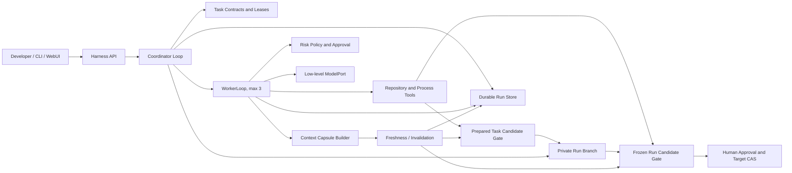

# System Overview

> Initialization architecture, 2026-07-26. This map explains the accepted boundary; the future approved `SPEC.md` will own behavioral requirements and data details.

## Scope

ApexCrew coordinates one developer goal in one local Git repository with at most three logical Workers. The product owns both decision loops. A model provider returns one low-level completion at a time and never controls tools, approval, scheduling, or stop conditions.

## Responsibilities

| Area | Owns | Must not own |
|---|---|---|
| Coordinator | DAG progress, leases, handoff, invalidation, serial integration, pause/resume | Model-provider behavior or arbitrary shell policy |
| WorkerLoop | Context assembly, one model call, structured action parsing, tool feedback, stop decisions | Scheduling other Workers or declaring its own integration success |
| Domain core | Contracts, revisions, evidence, approvals, state transitions, invariants | Git, SQLite, provider SDK, FastAPI, or OS calls |
| Adapters | Git/worktrees, subprocesses, persistence, credentials, model completion | Product policy and acceptance decisions |
| Delivery | CLI/WebUI commands and read models | Alternate business rules |

## Non-Negotiable Invariants

1. A Task Candidate may advance the private Run Branch only when checks pass on its prepared commit and its Evidence Bundle is fresh for the current Run Head, Plan Revision, dependencies, checks, and policy.
2. A Run Candidate may update the user target only after run-wide checks pass on its frozen prepared commit and a single-use Approval Grant binds that commit and the expected target OID; target movement makes both stale.
3. A Worker writes only through an active Workspace Lease inside the configured repository.
4. A risky action executes only under an unmodified, unexpired, one-use Approval Grant; hard denials never reach the executor.
5. Restart reconciles a recorded action intent with observable state before retrying. An uncertain external side effect becomes `INDETERMINATE` and requires human resolution.
6. Evidence Receipts and Context Capsules remain immutable; a separate Freshness Assessment decides whether they may be used at a gate or injected into model context.
7. The complete core remains deterministic under `ScriptedMockLLM` and requires no network.

## Proposed Module Shape

The implementation plan should evaluate, not blindly adopt, `src/apexcrew/core/`, `adapters/`, `bootstrap/`, and `delivery/`. Acceptance fixtures should live outside production modules, with separate Python and TypeScript repositories. No directories are created until specification, planning, and cold-start gates pass.
